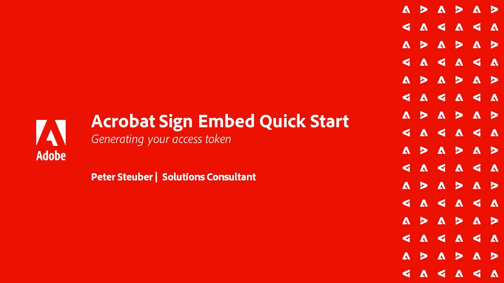

# Acrobat Sign API 자습서

Acrobat Sign API를 사용하면 앱을 만들고 Acrobat Sign UI와 기능을 애플리케이션에 포함시킬 수 있습니다.

## 시작하기

<table style="table-layout:fixed">
<tr>
   <td>
    
    

    <a href="signapi.md"><strong>시작하기</strong></a>
    

    <em>서명 및 기타 정보를 수집하기 위해 응용 프로그램에 Sign API를 포함하는 방법을 알아봅니다.</em>
     
  </td>
  <td>
    
    

     
  </td>
  <td>
    
    

     
  </td>
  <td>
    
    

     
  </td>
</tr>
</table>

## Acrobat Sign 포함된 빠른 시작 안내서

Acrobat Sign의 OEM 버전을 애플리케이션에 임베드하기 시작하는 방법에 대해 알아봅니다. 이 안내서는 해당 응용 프로그램 내에서 서명 프로세스를 구축하고 포함하는 OEM 파트너를 위해 특별히 고안되었습니다.

<table style="table-layout:fixed">
<tr>
 <td>
   
    

   <a href="sign-up-developer-account.md"><strong>개발자 계정 등록</strong></a>
    

    <em>Sign 및 API 기능이 완전히 활성화된 Acrobat Sign용 개발자 계정에 등록하는 방법에 대해 알아봅니다.</em>
     
  </td>
  <td>
   
    

   <a href="creating-your-application.md"><strong>응용 프로그램 만들기</strong></a>
    

    <em>Acrobat Sign에서 응용 프로그램을 만드는 방법 알아보기</em>
     
  </td>
   <td>
   
    

   <a href="creating-an-embed-link.md"><strong>포함 링크 만들기</strong></a>
    

    <em>응용 프로그램이 사용자에 대한 권한을 받는 방법인 OAuth에 대한 포함 링크를 만드는 방법을 알아봅니다</em>
     
  </td>
  <td>
   
    

   <a href="generating-an-access-token.md"><strong>액세스 토큰 생성</strong></a>
    

    <em>Acrobat Sign API로 사용할 수 있는 액세스 토큰을 생성하는 방법에 대해 알아봅니다</em>
     
  </td>
</tr>
<tr>
  <td>
   
    

   <a href="creating-a-transient-document.md"><strong>임시 문서 만들기</strong></a>
    

    <em>Acrobat Sign AP에서 사용할 수 있는 임시 문서를 만드는 방법을 살펴봅니다</em>
     
  </td>
  <td>
    
    

     
  </td>
   <td>
    
    

     
  </td>
  <td>
    
    

     
  </td>
</tr>
</table>
