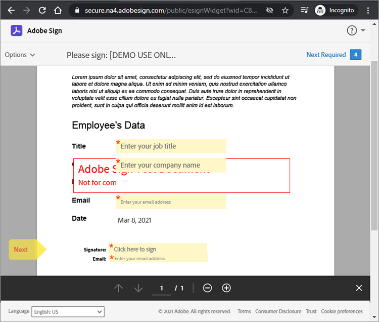

# Adobe Sign API 시작하기


[Acrobat Sign API](https://www.adobe.io/apis/documentcloud/sign.html) 은 서명된 계약을 관리하는 방법을 향상시킬 수 있는 좋은 방법입니다. 개발자는 시스템을 Sign API와 쉽게 통합할 수 있으므로 문서를 업로드하고, 서명을 위해 보내고, 미리 알림을 보내고, 전자 서명을 수집하는 안정적이고 간단한 방법을 사용할 수 있습니다.

## 학습 내용

이 실습 튜토리얼에서는 개발자가 Sign API를 사용하여 [!DNL Adobe Acrobat Services]. [!DNL Acrobat Services] 포함 [Adobe PDF 서비스 API](https://www.adobe.io/apis/documentcloud/dcsdk/pdf-tools.html), [Adobe PDF 임베드 API](https://www.adobe.io/apis/documentcloud/viesdk) (무료) 및 [Adobe 문서 생성 API](https://www.adobe.io/apis/documentcloud/dcsdk/doc-generation.html).

보다 구체적으로, 응용 프로그램에 Acrobat Sign API를 포함하여 보험 양식에 있는 직원 정보와 같은 서명 및 기타 정보를 수집하는 방법을 알아봅니다. 간소화된 HTTP 요청 및 응답이 포함된 일반 단계가 사용됩니다. 이러한 요청은 즐겨 사용하는 언어로 구현할 수 있습니다. 다음을 조합하여 PDF을 만들 수 있습니다 [[!DNL Acrobat Services] API](https://www.adobe.io/apis/documentcloud/dcsdk/)에서 Sign API에 [일시](https://www.adobe.io/apis/documentcloud/sign/docs.html#!adobedocs/adobe-sign/master/overview/terminology.md) 계약서 또는 [위젯](https://www.adobe.io/apis/documentcloud/sign/docs.html#!adobedocs/adobe-sign/master/overview/terminology.md) 있습니다.

## PDF 문서 만들기

먼저 Microsoft Word PDF을 만들고 템플릿으로 저장합니다. 또는 문서 생성 API를 사용하여 파이프라인을 자동화하여 Word에서 만든 템플릿을 업로드한 다음 PDF 문서를 생성할 수 있습니다. 문서 생성 API는 [!DNL Acrobat Services], [6개월 무료 후 종량 과금제로 문서 트랜잭션당 0.05 USD](https://www.adobe.io/apis/documentcloud/dcsdk/pdf-pricing.html).

이 예에서 템플릿은 작성할 몇 개의 서명자 필드가 있는 간단한 문서입니다. 지금 필드의 이름을 지정한 다음 나중에 이 튜토리얼에서 실제 필드를 삽입합니다.


## 유효한 API 액세스 포인트 검색

Sign API를 사용하기 전에 [무료 개발자 계정 만들기](https://acrobat.adobe.com/ca/en/sign/developer-form.html) api에 액세스하려면 문서 교환 및 실행을 테스트하고 전자 메일 기능을 테스트합니다.

Adobe은 &quot;shards&quot;라고 하는 많은 배포 단위로 전 세계에 Acrobat Sign API를 배포합니다. 각 샤드는 NA1, NA2, NA3, EU1, JP1, AU1, IN1 등과 같은 고객의 계정을 제공합니다. 샤드 이름은 지리적 위치에 해당합니다. 이러한 조각은 API 끝점의 기본 URI(액세스 포인트)를 구성합니다.

Sign API에 액세스하려면 먼저 해당 위치에 따라 api.na1.adobesign.com, api.na4.adobesign.com, api.eu1.adobesign.com 등의 계정에 대한 올바른 액세스 지점을 검색해야 합니다.

```
  GET /api/rest/v6/baseUris HTTP/1.1
  Host: https://api.adobesign.com
  Authorization: Bearer {YOUR-INTEGRATION-KEY-HERE}
  Accept: application/json

  Response Body (example):

  {
    "apiAccessPoint": "https://api.na4.adobesign.com/", 
    "webAccessPoint": "https://secure.na4.adobesign.com/" 
  }
```

위의 예에서 는 값을 액세스 포인트로 하는 응답입니다.

>[!IMPORTANT]
>
>이 경우 이후의 모든 Sign API 요청은 해당 액세스 포인트를 사용해야 합니다. 해당 지역에서 지원되지 않는 액세스 포인트를 사용하는 경우 오류가 발생합니다.

## 임시 문서 업로드

Adobe Sign을 사용하면 서명 또는 데이터 수집을 위해 문서를 준비하는 다양한 플로우를 만들 수 있습니다. 응용 프로그램의 흐름에 관계없이 먼저 문서를 업로드해야 하며, 이 작업은 7일 동안만 사용할 수 있습니다. 이후 API 호출은 이 임시 문서를 참조해야 합니다.

POST 요청을 사용하여 문서를 `/transientDocuments` 끝점입니다. multipart 요청은 파일 이름, 파일 스트림 및 문서 파일의 MIME(미디어) 유형으로 구성됩니다. 끝점 응답에는 문서를 식별하는 ID가 포함됩니다.

또한 서명 프로세스가 완료되면 응용 프로그램이 Acrobat Sign에 ping을 수행하기 위한 콜백 URL을 지정하여 응용 프로그램에 알릴 수 있습니다.


```
  POST /api/rest/v6/transientDocuments HTTP/1.1
  Host: {YOUR-API-ACCESS-POINT}
  Authorization: Bearer {YOUR-INTEGRATION-KEY-HERE}
  x-api-user: email:your-api-user@your-domain.com
  Content-Type: multipart/form-data
  File-Name: "Insurance Form.pdf"
  File: "[path]\Insurance Form.pdf"
  Accept: application/json

  Response Body (example):

  {
     "transientDocumentId": "3AAA...BRZuM"
  }
```

## 웹 양식 만들기

웹 양식 (이전에 서명 위젯이라고 함)은 액세스 권한이 있는 모든 사용자가 서명할 수 있는 호스팅된 문서입니다. 웹 양식의 예로는 등록표, 면제 및 많은 사람이 온라인으로 액세스하고 서명하는 기타 문서를 들 수 있습니다.

Sign API를 사용하여 새 웹 양식을 만들려면 먼저 임시 문서를 업로드해야 합니다. 에 대한 POST 요청 `/widgets` 끝점에서 반환된 `transientDocumentId` .

이 예제에서 웹 양식은 `ACTIVE`하지만 다음 세 가지 상태 중 하나로 만들 수 있습니다.

* DRAFT — 웹 양식을 증분적으로 빌드합니다.

* 작성 — 웹 양식에서 양식 필드를 추가하거나 편집합니다.

* 활성 — 웹 양식을 즉시 호스팅합니다.

양식의 참가자에 대한 정보도 정의해야 합니다. 추가 `memberInfos` 속성에는 전자 메일과 같은 참가자에 대한 데이터가 포함됩니다. 현재 이 집합은 둘 이상의 멤버를 지원하지 않습니다. 그러나 웹 양식 작성 시 웹 양식 서명자의 전자 메일을 알 수 없으므로 다음 예제와 같이 전자 메일을 비워 두어야 합니다. 추가 `role` 속성은 `memberInfos` (예: 서명자 및 승인자).

```
  POST /api/rest/v6/widgets HTTP/1.1
  Host: {YOUR-API-ACCESS-POINT}
  Authorization: Bearer {YOUR-INTEGRATION-KEY-HERE}
  x-api-user: email:your-api-user@your-domain.com
  Content-Type: application/json

  Request Body:

  {
    "fileInfos": [
      {
      "transientDocumentId": "YOUR-TRANSIENT-DOCUMENT-ID"
      }
     ],
    "name": "Insurance Form",
      "widgetParticipantSetInfo": {
          "memberInfos": [{
              "email": ""
          }],
      "role": "SIGNER"
      },
      "state": "ACTIVE"
  }

  Response Body (example):

  {
     "id": "CBJ...PXoK2o"
  }
```

웹 양식을 `DRAFT` 또는 `AUTHORING`그런 다음 양식이 응용 프로그램 파이프라인을 통과할 때 해당 상태를 변경합니다. 웹 양식 상태를 변경하려면 [PUT /widgets/{widgetId}/state](https://secure.na4.adobesign.com/public/docs/restapi/v6#!/widgets/updateWidgetState) 끝점입니다.

## 웹 양식 호스팅 URL 읽기

다음 단계는 웹 양식을 호스팅하는 URL을 검색하는 것입니다. /widgets 끝점은 서명 및 기타 양식 데이터를 수집하기 위해 사용자에게 전달하는 웹 양식의 호스팅된 URL을 포함하여 웹 양식 데이터 목록을 검색합니다.

이 끝점은 목록을 반환하므로 `userWidgetList` 웹 양식을 호스팅하는 URL을 가져오기 전에 다음을 수행하십시오.

```
  GET /api/rest/v6/widgets HTTP/1.1
  Host: {YOUR-API-ACCESS-POINT}
  Authorization: Bearer {YOUR-INTEGRATION-KEY-HERE}
  Accept: application/json

  Response Body:

  {
    "userWidgetList": [
      {
        "id": "CBJCHB...FGf",
        "name": "Insurance Form",
        "groupId": "CBJCHB...W86",
        "javascript": "<script type='text/javascript' ...
        "modifiedDate": "2021-03-13T15:52:41Z",
        "status": "ACTIVE",
        "Url":
        "https://secure.na4.adobesign.com/public/esignWidget?wid=CBFCIB...Rag*",
        "hidden": false
      },
      {
        "id": "CBJCHB...I8_",
        "name": "Insurance Form",
        "groupId": "CBJCHBCAABAAyhgaehdJ9GTzvNRchxQEGH_H1ya0xW86",
        "javascript": "<script type='text/javascript' language='JavaScript'
        src='https://sec
        "modifiedDate": "2021-03-13T02:47:32Z",
        "status": "ACTIVE",
        "Url":
        "https://secure.na4.adobesign.com/public/esignWidget?wid=CBFCIB...AAB",
        "hidden": false
      },
      {
        "id": "CBJCHB...Wmc",
```

## 웹 양식 관리

이 양식은 사용자가 채울 PDF 문서입니다. 그러나 사용자가 채워야 하는 필드와 문서 내의 위치를 양식 편집기에 알려주어야 합니다.


위의 문서에는 필드가 아직 표시되지 않습니다. 서명자의 정보, 크기 및 위치를 수집하는 필드를 정의하는 동안 추가됩니다.

이제 [웹 양식](https://secure.na4.adobesign.com/public/agreements/#agreement_type=webform) 을 탭하고 작성한 양식을 찾습니다.


클릭 **편집** 문서 편집 페이지를 엽니다. 사용 가능한 미리 정의된 필드는 오른쪽 패널에 있습니다.


편집기를 사용하여 텍스트 및 서명 필드를 드래그하여 놓을 수 있습니다. 필요한 필드를 모두 추가한 후에는 필드의 크기를 조정하고 정렬하여 양식을 다듬을 수 있습니다. 마지막으로 **저장** 을 눌러 양식을 생성합니다.


## 서명을 위해 웹 양식 보내기

웹 양식을 완료한 후에는 사용자가 채우고 서명할 수 있도록 제출해야 합니다. 양식을 저장하면 URL과 포함된 코드를 보고 복사할 수 있습니다.

**웹 양식 URL 복사**: 검토 및 서명을 위해 이 계약의 호스팅된 버전으로 사용자를 보내려면 이 URL을 사용하십시오. 예를 들면 다음과 같습니다.

[https://secure.na4.adobesign.com/public/esignWidget?wid=CBFCIBAA3..babw\*](https://secure.na4.adobesign.com/public/esignWidget?wid=CBFCIBAA3AAABLblqZhCndYscuKcDMPiVfQlpaGPb-5D7ebE9NUTQ6x6jK7PIs8HCtTzr3HOx8U6D5qqbabw*)

**웹 양식 임베드 코드 복사**: 이 코드를 복사하여 HTML에 붙여넣어 웹 사이트에 계약서를 추가합니다.

예를 들면 다음과 같습니다.

```
<iframe
src="https://secure.na4.adobesign.com/public/esignWidget?wid=CBFC
...yx8*&hosted=false" width="100%" height="100%" frameborder="0"
style="border: 0;
overflow: hidden; min-height: 500px; min-width: 600px;"></iframe>
```


사용자가 호스팅된 버전의 양식에 액세스하면 지정된 대로 필드가 배치된 상태로 먼저 업로드된 임시 문서를 검토합니다.



그런 다음 사용자가 필드를 채우고 양식에 서명합니다.


그런 다음 사용자가 이전에 저장된 서명이나 새 서명으로 문서에 서명합니다.


사용자가 **적용**, Adobe이 전자 메일을 열고 서명을 확인하도록 지시합니다. 확인이 도착할 때까지 서명이 보류 중입니다.


이 인증은 다중 인증을 추가하고 서명 프로세스 보안을 강화합니다.


## 완료된 웹 양식 읽기

이제 사용자가 입력한 양식 데이터를 가져올 차례입니다. 추가 `/widgets/{widgetId}/formData` endpoint는 사용자가 양식에 서명할 때 입력한 데이터를 대화형 양식으로 가져옵니다.

```
GET /api/rest/v6/widgets/{widgetId}/formData HTTP/1.1
Host: {YOUR-API-ACCESS-POINT}
Authorization: Bearer {YOUR-INTEGRATION-KEY-HERE}
Accept: text/csv
```

결과 CSV 파일 스트림에는 양식 데이터가 포함됩니다.

```
Response Body:
"Agreement
name","completed","email","role","first","last","title","company","agreementId",
"email verified","web form signed/approved"
"Insurance Form","","myemail@email.com","SIGNER","John","Doe","My Job Title","My
Company Name","","","2021-03-07 19:32:59"
```

## 계약 만들기

웹 양식 대신 계약을 생성할 수 있습니다. 다음 섹션에서는 Sign API를 사용하여 계약을 관리하는 몇 가지 간단한 단계를 보여 줍니다.

서명 또는 승인을 위해 지정된 수신자에게 문서를 보내면 계약이 만들어집니다. API를 사용하여 계약 상태 및 완료를 추적할 수 있습니다.

다음을 사용하여 계약을 생성할 수 있습니다. [임시 문서](https://helpx.adobe.com/sign/kb/how-to-send-an-agreement-through-REST-API.html), [라이브러리 문서](https://www.adobe.io/apis/documentcloud/sign/docs.html#!adobedocs/adobe-sign/master/samples/send_using_library_doc.md)또는 URL을 입력합니다. 이 예에서 계약은 `transientDocumentId`를 반환합니다.

```
POST /api/rest/v6/agreements HTTP/1.1
Host: {YOUR-API-ACCESS-POINT}
Authorization: Bearer {YOUR-INTEGRATION-KEY-HERE}
x-api-user: email:your-api-user@your-domain.com
Content-Type: application/json
Accept: application/json
Request Body:
{
    "fileInfos": [
      {
      "transientDocumentId": "{transientDocumentId}"
      }
     ],
    "name": "{agreementName}",
    "participantSetsInfo": [
      {
      "memberInfos": [
          {
          "email": "{signerEmail}"
          }
        ],
        "order": 1,
        "role": "SIGNER"
      }
    ],
    "signatureType": "ESIGN",
    "state": "IN_PROCESS"
  }
```

이 예에서 계약은 IN_PROCESS로 생성되지만 세 가지 상태 중 하나로 생성할 수 있습니다.

* 초안 - 계약을 보내기 전에 증분적으로 작성

* 작성 — 계약에서 양식 필드를 추가하거나 편집합니다.

* IN_PROCESS - 계약을 즉시 보냅니다.

계약 상태를 변경하려면 `PUT /agreements/{agreementId}/state` 허용되는 상태 전환 중 하나를 수행할 끝점:

* 초안에서 제작으로

* IN_PROCESS로 작성

* IN_PROCESS에서 취소됨

추가 `participantSetsInfo` 위 속성은 계약에 참여할 것으로 예상되는 사람 및 해당 사용자가 수행하는 작업(서명, 승인, 승인 등)에 대한 전자 메일을 제공합니다. 위의 예에서는 참여자가 한 명만 있습니다. 서명자. 자필 서명은 문서당 4회로 제한됩니다.

웹 양식과 달리, 계약을 생성하면 Adobe이 서명을 위해 계약을 자동으로 전송합니다. 끝점은 계약의 고유 식별자를 반환합니다.


```
  Response Body:

  {
     id (string): The unique identifier of the agreement
  }
```

## 계약 멤버에 대한 정보 검색

계약을 생성하고 나면 `/agreements/{agreementId}/members` 끝점 - 계약 멤버에 대한 정보를 검색합니다. 예를 들어, 참가자가 계약에 서명했는지 여부를 확인할 수 있습니다.

```
GET /api/rest/v6/agreements/{agreementId}/members HTTP/1.1
Host: {YOUR-API-ACCESS-POINT}
Authorization: Bearer {YOUR-INTEGRATION-KEY-HERE}
Accept: application/json
```

결과 JSON 응답 본문에는 참여자에 대한 정보가 포함됩니다.

```
  Response Body:

  {
     "participantSets":[
        {
           "memberInfos":[
              {
                 "id":"CBJ...xvM",
                 "email":"participant@email.com",
                 "self":false,
                 "securityOption":{
                    "authenticationMethod":"NONE"
                 },
                 "name":"John Doe",
                 "status":"ACTIVE",
                 "createdDate":"2021-03-16T03:48:39Z",
                 "userId":"CBJ...vPv"
              }
           ],
           "id":"CBJ...81x",
           "role":"SIGNER",
           "status":"WAITING_FOR_MY_SIGNATURE",
           "order":1
        }
     ],
```

## 계약 미리 알림 보내기

비즈니스 규칙에 따라 특정 날짜 이후에 참가자가 계약에 서명하지 못할 수 있습니다. 계약에 만료 날짜가 있는 경우 해당 날짜가 다가오면 참가자에게 알림을 보낼 수 있습니다.

계약 멤버에게 전화를 건 후 받은 정보를 기준으로 `/agreements/{agreementId}/members` 엔드포인트 마지막 섹션에서 아직 계약에 서명하지 않은 모든 참가자에게 전자 메일 미리 알림을 보낼 수 있습니다.

에 대한 POST 요청 `/agreements/{agreementId}/reminders` 끝점은 `agreementId` 매개 변수.

```
POST /agreements/{agreementId}/reminders HTTP/1.1
Host: {YOUR-API-ACCESS-POINT}
Authorization: Bearer {YOUR-INTEGRATION-KEY-HERE}
x-api-user: email:your-api-user@your-domain.com
Content-Type: application/json
Accept: application/json
  Request Body:

  {
    "recipientParticipantIds": [{agreementMemberIdList}],
    "agreementId": "{agreementId}",
    "note": "This is a reminder that you haven't signed the agreement yet.",
    "status": "ACTIVE"
  }

  Response Body:

  {
     id (string, optional): An identifier of the reminder resource created on the
     server. If provided in POST or PUT, it will be ignored
  }
```

알림 메시지를 게시하면 사용자는 계약 세부 사항과 계약 링크가 포함된 이메일을 수신하게 됩니다.


## 완료된 계약 읽기

웹 양식과 마찬가지로 수신자가 서명한 계약에 대한 세부 정보를 읽을 수 있습니다. 추가 `/agreements/{agreementId}/formData` endpoint는 사용자가 웹 양식에 서명할 때 입력한 데이터를 검색합니다.

```
GET /api/rest/v6/agreements/{agreementId}/formData HTTP/1.1
Host: {YOUR-API-ACCESS-POINT}
Authorization: Bearer {YOUR-INTEGRATION-KEY-HERE}
Accept: text/csv
Response Body:
"completed","email","role","first","last","title","company","agreementId"
"2021-03-16 18:11:45","myemail@email.com","SIGNER","John","Doe","My Job Title","My
Company Name","CBJCHBCAABAA5Z84zy69q_Ilpuy5DzUAahVfcNZillDt"
```

## 다음 단계

Acrobat Sign API를 사용하여 문서, 웹 양식 및 계약을 관리할 수 있습니다. 웹 양식 및 계약서를 사용하여 만든 단순화되고 완전한 워크플로우는 개발자가 모든 언어를 사용하여 이를 구현할 수 있는 일반적인 방식으로 수행됩니다.

Sign API의 작동 방식에 대한 개요는 [API 사용 개발자 안내서](https://www.adobe.io/apis/documentcloud/sign/docs.html#!adobedocs/adobe-sign/master/api_usage.md). 이 설명서에는 문서 전체에서 수행한 여러 단계에 대한 간단한 문서 및 기타 관련 항목이 포함되어 있습니다.

Acrobat Sign API는 여러 계층의 [단일 및 다중 사용자 전자 서명 플랜](https://acrobat.adobe.com/kr/ko/sign/pricing/plans.html)따라서 자신의 요구에 가장 적합한 가격 모델을 선택할 수 있습니다. 지금까지 앱에 Sign API를 손쉽게 통합하는 방법을 살펴보았으므로 이제 다음과 같은 다른 기능에 관심이 있을 수 있습니다 [Acrobat Sign Webhooks](https://www.adobe.io/apis/documentcloud/sign/docs.html#!adobedocs/adobe-sign/master/webhooks.md), 푸시 기반 프로그래밍 모델입니다. Webhooks를 사용하면 응용 프로그램에서 Acrobat Sign 이벤트를 자주 확인할 필요 없이 이벤트가 발생할 때마다 Sign API에서 POST 콜백 요청을 실행하는 HTTP URL을 등록할 수 있습니다. Webhook을 사용하면 실시간 및 즉시 업데이트를 통해 응용 프로그램의 전원을 켜서 강력한 프로그래밍을 수행할 수 있습니다.

자세한 내용은 [종량 과금제](https://www.adobe.io/apis/documentcloud/dcsdk/pdf-pricing.html)6개월 무료 Adobe PDF Services API 평가판 사용 기간이 종료되고 무료 Adobe PDF Embed API가 종료되는 시점

앱에 자동 문서 작성 및 문서 서명과 같은 흥미로운 기능을 추가하려면 [[!DNL Adobe Acrobat Services]](https://www.adobe.io/apis/documentcloud/dcsdk/gettingstarted.html).
