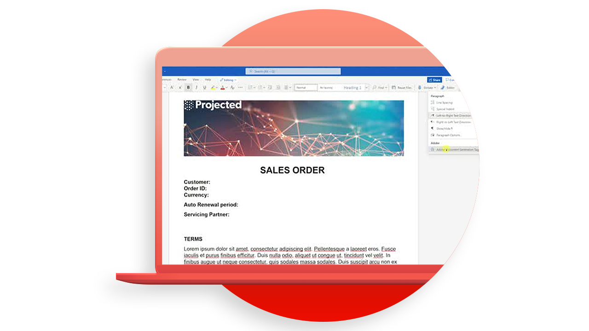
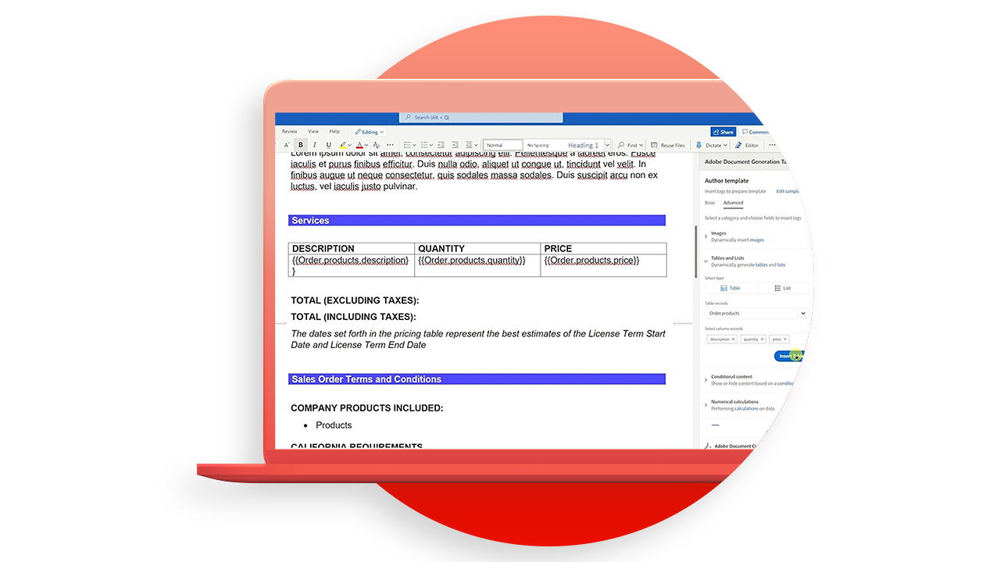

# 문서 생성 API 자습서

문서 생성 API는 Word 템플릿과 JSON 데이터에서 PDF 및 Word 문서를 만듭니다.

>[!NOTE]
>
>문서 생성 API는 PDF 서비스 API에 포함되어 있습니다.

## 템플릿 만들기

문서 생성 API는 최종 문서를 생성하기 위해 입력 데이터와 함께 문서 템플릿(템플릿 태그 포함)을 허용합니다. 데이터 입력에 해당하는 실제 값을 기준으로 문서 템플릿의 모든 템플릿 태그를 동적 내용으로 대체하여 최종 문서를 생성한다.

<table style="table-layout:fixed">
<tr>
 <td>
   
    

   <a href="taggeroverview.md"><strong>Adobe 문서 생성 태거 개요</strong></a>
    

    <em>Adobe 문서 생성 API와 함께 사용하도록 설계된 Adobe 문서 생성 태거의 개요를 살펴봅니다.</em>
     
  </td>
  <td>
   
    

   <a href="taggeraddtexttags.md"><strong>텍스트 태그 추가</strong></a>
    

    <em>Adobe 문서 생성 API에서 사용하기 위해 Adobe 문서 생성 태거를 사용하여 Microsoft Word 템플릿에 텍스트 태그를 추가하는 방법에 대해 알아봅니다</em>
     
  </td>
  <td>
   
    

   <a href="taggeraddimagetags.md"><strong>이미지 태그 추가하기</strong></a>
    

    <em>Adobe 문서 생성 태거를 사용하여 Microsoft Word 템플릿에 이미지 태그를 추가하고 Adobe 문서 생성 API를 사용하여 동적으로 이미지를 문서에 푸시하는 방법을 알아봅니다</em>
     
  </td>
  <td>
   
    

   <a href="taggertables.md"><strong>표 및 목록 태그 추가</strong></a>
    

    <em>Adobe 문서 생성 태그를 사용하여 Microsoft Word 템플릿에 테이블 및 목록 태그를 추가하고 Adobe 문서 생성 API를 사용하여 데이터를 기반으로 테이블 또는 목록 행을 동적으로 추가하는 방법을 알아봅니다</em>
     
  </td>
</tr>
<tr>
  <td>
   
    

   <a href="taggercalculations.md"><strong>숫자 계산 태그 설정</strong></a>
    

    <em>Adobe 문서 생성 태거를 사용하여 Microsoft Word 템플릿에서 숫자 계산 태그를 설정하여 Adobe 문서 생성 API를 사용하여 집계 또는 데이터 값 산수를 계산하는 방법을 알아봅니다.</em>
     
  </td>
  <td>
   
    

   <a href="taggerconditional.md"><strong>조건부 내용 설정</strong></a>
    

    <em>Adobe 문서 생성 태거를 사용하여 Microsoft Word 템플릿의 섹션을 설정하여 Adobe 문서 생성 API를 사용하여 데이터 기반 문서의 섹션을 동적으로 포함하거나 제외하는 방법에 대해 알아봅니다</em>
     
  </td>
  <td>
    
    

     
  </td>
   <td>
    
    

     
  </td>
</tr>
</table>
