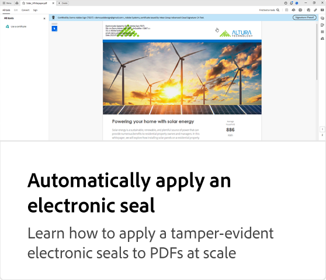

# Adobe PDF 전자 봉인 API Tutorials

Adobe PDF 전자 봉인 API는 [Adobe의 AATL(Approved Trust List)](https://helpx.adobe.com/acrobat/kb/approved-trust-list1.html)에서 특정 TSP(Trust Service Provider)가 발행한 인증서를 사용하여 문서의 규모에 맞게 전자 봉인을 적용합니다. 전자 봉인은 문서의 ID 및 무결성을 확인하는 데 유용합니다. 이는 문서의 크기를 전자 봉인하는 데 사용할 수 있으며 PDF 서비스 API에 포함됩니다.

<table style="table-layout:fixed">
<tr>
  <td>
    
    

      <a href="automatically-apply-electronic-seal.md"><strong>전자 봉인 자동 적용</strong></a>
      

      PDF에게 변조 방지 전자 봉인을 규모에 맞게 적용하는 방법 알아보기
       
  </td>
 <td>
       
       

        
 </td>
 <td>
       
       

        
 </td>
 <td>
       
       

        
 </td>
</tr>
</table>