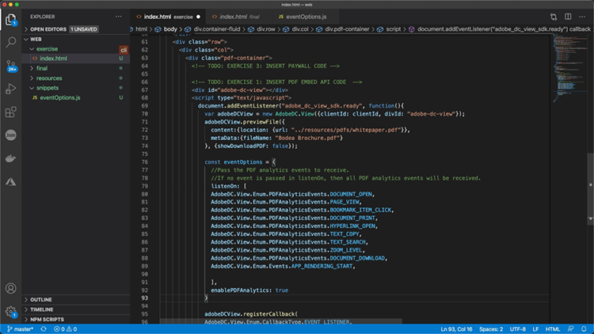

# 온라인 PDF 경험 제어 및 분석 수집

귀사에서 웹 사이트에 PDF을 게시합니까? Adobe PDF 임베드 API를 사용하여 모양을 제어하고, 공동 작업을 활성화하고, PDF 및 검색에 소요되는 시간을 포함하여 사용자가 사용자와 상호 작용하는 방식에 대한 분석을 수집하는 방법을 살펴보십시오. 이 4부로 구성된 실습 튜토리얼을 시작하려면 *PDF 포함 API 시작하기*.

<table style="table-layout:fixed">
<tr>
  <td>
    <a href="controlpdfexperience.md#part1">
        
    </a>
    <div>
    <a href="controlpdfexperience.md#part1"><strong>1부: PDF 포함 API 시작하기</strong></a>
    </div>
  </td>
  <td>
    <a href="controlpdfexperience.md#part2">
        
    </a>
    <div>
    <a href="controlpdfexperience.md#part2"><strong>2부: 웹 페이지에 PDF 포함 API 추가</strong></a>
    </div>
  </td>
  <td>
   <a href="controlpdfexperience.md#part3">
      
   </a>
    <div>
    <a href="controlpdfexperience.md#part3"><strong>파트 3: Analytics API 액세스</strong></a>
    </div>
  </td>
  <td>
   <a href="controlpdfexperience.md#part4">
      
   </a>
    <div>
    <a href="controlpdfexperience.md#part4"><strong>4부: 이벤트를 기반으로 인터랙티브 요소 추가</strong></a>
    </div>
  </td>
</tr>
</table>

## 1부: PDF 포함 API 시작하기 {#part1}

1부에서는 1-3부에 필요한 모든 것을 시작하는 방법을 알아봅니다. API 자격 증명을 가져오는 것으로 시작합니다.

**필요한 기능**

* 튜토리얼 리소스 [다운로드](https://github.com/benvanderberg/adobe-pdf-embed-api-tutorial)
* Adobe ID [여기에서 다운로드](https://accounts.adobe.com/kr/)
* 웹 서버(노드 JS, PHP 등)
* HTML/JavaScript/CSS에 대한 작업 지식

**사용 중인 콘텐츠**

* 기본 웹 서버(노드)
* Visual Studio 코드
* GitHub

### 자격 증명을 가져오는 중

1. 다음으로 이동 [Adobe.io 웹 사이트](https://www.adobe.io/).
1. 클릭 **[!UICONTROL 자세한 내용]** 를 참조하십시오.

   

   그러면 [!DNL Adobe Acrobat Services] 홈 페이지

1. 클릭 **[!UICONTROL 시작하기]** 를 클릭합니다.

   옵션 **시작하기 [!DNL Acrobat Services] API** 에 **새 자격 증명 만들기** 또는 **기존 자격 증명 관리**.

1. 클릭 **[!UICONTROL 시작하기]** 단추 아래쪽 **[!UICONTROL 새 자격 증명 만들기]**.

   

1. 원하는 **[!UICONTROL PDF 포함 API]** 라디오 버튼을 클릭하고 다음 창에서 선택한 자격 증명 이름과 응용 프로그램 도메인을 추가합니다.

   >[!NOTE]
   >
   >이러한 자격 증명은 여기에 나열된 응용 프로그램 도메인에서만 사용할 수 있습니다. 원하는 도메인을 사용할 수 있습니다.

   

1. 클릭 **[!UICONTROL 자격 증명 만들기]**.

   마법사의 마지막 페이지에 클라이언트 자격 증명 세부 정보가 표시됩니다. 나중에 다시 사용할 수 있도록 이 창을 열어 두고 클라이언트 ID(API 키)를 복사합니다.

1. 클릭 **[!UICONTROL 설명서 보기]** 이 API를 사용하는 방법에 대한 자세한 정보가 있는 설명서로 이동합니다.

   

## 2부: 웹 페이지에 PDF 포함 API 추가 {#part2}

2부에서는 PDF 포함 API를 웹 페이지에 쉽게 포함하는 방법을 알아봅니다. Adobe PDF Embed API 온라인 데모를 사용하여 코드를 만들면 됩니다.

### 연습 코드 받기

사용할 코드를 만들었습니다. 사용자 고유의 코드를 사용할 수 있지만 데모는 자습서 리소스의 컨텍스트에 있습니다. 샘플 코드 다운로드 [여기](https://github.com/benvanderberg/adobe-pdf-embed-api-tutorial).

1. 이동 [[!DNL Adobe Acrobat Services] 웹 사이트](https://www.adobe.io/apis/documentcloud/dcsdk/).

   ![스크린샷 [!DNL Adobe Acrobat Services] 웹 사이트](assets/ControlPDF_6.png)

1. 클릭 **[!UICONTROL API]** 내비게이션 막대에서 **[!UICONTROL PDF 포함 API]** 페이지를 클릭합니다.

   

1. 클릭 **[!UICONTROL 데모 사용해 보기]**.

   PDF 포함 API에 대한 개발자 샌드박스가 있는 새 창이 표시됩니다.

   

   여기에서 다양한 보기 모드에 대한 옵션을 확인할 수 있습니다.

1. [전체 창], [크기 컨테이너], [인라인] 및 [라이트박스]에 대해 다른 보기 모드를 클릭합니다.

   

1. 클릭 **[!UICONTROL 전체 창]** 보기 모드, **[!UICONTROL 사용자 정의]** 옵션을 켜거나 끄는 버튼.

   

1. 사용 안 함 **[!UICONTROL 다운로드]** PDF 옵션.
1. 클릭 **[!UICONTROL 코드 생성]** 버튼을 클릭하여 코드 미리 보기를 확인합니다.
1. 복사 **[!UICONTROL 클라이언트 ID]** 1부의 클라이언트 자격 증명 창에서

   

1. 열기 **[!UICONTROL 웹]** -> **[!UICONTROL 리소스]** -> **[!UICONTROL js]** -> **[!UICONTROL dc-config.js]** 파일 이름을 입력합니다.

   clientID 변수가 표시됩니다.

1. 클라이언트 자격 증명을 큰따옴표 사이에 붙여넣어 클라이언트 ID를 자격 증명으로 설정합니다.

1. 개발자 샌드박스 코드 미리 보기로 돌아갑니다.

1. Adobe 스크립트가 있는 두 번째 행을 복사합니다.

   ```
   <script src=https://documentccloud.adobe.com/view-sdk/main.js></script>
   ```

   

1. 코드 편집기로 이동하여 **[!UICONTROL 웹]** -> **[!UICONTROL 운동]** -> **[!UICONTROL index.html]** 있습니다.

1. 스크립트 코드를 `<head>` 18행의 파일에 다음 내용이 포함되어 있습니다. **TODO: 연습 1: EMBED API 스크립트 태그 삽입**.

   

1. 개발자 샌드박스 코드 미리 보기로 돌아가서 다음과 같은 코드의 첫 번째 행을 복사합니다.

   ```
   <div id="adobe-dc-view"></div>
   ```

   

1. 코드 편집기로 이동하여 **[!UICONTROL 웹]** -> **[!UICONTROL 운동]** -> **[!UICONTROL index.html]** 파일을 다시 엽니다.

1. 붙여넣기 `<div>` 코드를 `<body>` 67번 줄에서 **TODO: 연습 1: PDF 포함 API 코드 삽입**.

   

1. 개발자 샌드박스 코드 미리 보기로 돌아가서 `<script>` 아래:

   ```
   <script type="text/javascript">
       document.addEventListener("adobe_dc_view_sdk.ready",             function(){ 
           var adobeDCView = new AdobeDC.View({clientId:                     "<YOUR_CLIENT_ID>", divId: "adobe-dc-view"});
           adobeDCView.previewFile({
               content:{location: {url: "https://documentcloud.                adobe.com/view-sdk-demo/PDFs/Bodea Brochure.                    pdf"}},
               metaData:{fileName: "Bodea Brochure.pdf"}
           }, {showDownloadPDF: false});
       });
   </script>
   ```

1. 코드 편집기로 이동하여 **[!UICONTROL 웹]** -> **[!UICONTROL 운동]** -> **[!UICONTROL index.html]** 파일을 다시 엽니다.

1. 붙여넣기 `<script>` 코드를 `<body>` 파일 이름을 입력합니다. `<div>` 태그의 평균 높이를 사용합니다.

1. 같은 70번 줄 수정 **index.html** 파일에 앞서 만든 clientID 변수가 포함됩니다.

   

1. 같은 72행 수정 **index.html** 로컬 파일을 사용하도록 PDF 파일의 위치를 업데이트하는 파일입니다.

   의 자습서 파일에 사용 가능한 파일이 있습니다. **/resources/pdfs/whitepaper.pdf**.

1. 수정된 파일을 저장하고 웹 사이트에서 **`<your domain>`/summit21/web/exercise/**.

   브라우저 내에서 기술 백서 렌더링이 전체 창 모드로 표시됩니다.

## 파트 3: Analytics API 액세스 {#part3}

PDF을 렌더링하는 PDF 포함 API가 포함된 웹 페이지를 만들었으므로 이제 3부에서 JavaScript PDF을 사용하여 분석을 측정하고 사용자가 분석을 사용하는 방식을 이해하는 방법을 살펴볼 수 있습니다.

### 설명서 찾기

PDF 포함 API의 일부로 사용할 수 있는 다양한 JavaScript 이벤트가 있습니다. 다음에서 액세스할 수 있습니다. [!DNL Adobe Acrobat Services] 참조하십시오.

1. 다음 위치로 이동합니다. [설명서](https://www.adobe.io/apis/documentcloud/dcsdk/docs.html) 사이트로 이동합니다.
1. API의 일부로 사용할 수 있는 다양한 이벤트 유형을 검토합니다. 참조용으로 유용하며 향후 프로젝트에도 도움이 됩니다.

   

1. 웹 사이트에 나열된 샘플 코드를 복사합니다.

   이를 코드의 기초로 사용하고 수정합니다.

   

   ```
   const eventOptions = {
     //Pass the PDF analytics events to receive.
      //If no event is passed in listenOn, then all PDF         analytics events will be received.
   listenOn: [ AdobeDC.View.Enum.PDFAnalyticsEvents.    PAGE_VIEW, AdobeDC.View.Enum.PDFAnalyticsEvents.DOCUMENT_DOWNLOAD],
     enablePDFAnalytics: true
   }
   
   
   adobeDCView.registerCallback(
     AdobeDC.View.Enum.CallbackType.EVENT_LISTENER,
     function(event) {
       console.log("Type " + event.type);
       console.log("Data " + event.data);
     }, eventOptions
   );
   ```

1. 앞서 추가한 코드 섹션을 아래와 같이 찾아 이 코드 다음에 위 코드를 추가합니다. **index.html**:

   

1. 웹 브라우저에서 페이지를 로드하고 콘솔을 열어 PDF 뷰어와 상호 작용할 때 다른 이벤트의 콘솔 출력을 봅니다.

   

   

### 이벤트 캡처를 위한 스위치 추가

이제 console.log에 출력되는 이벤트가 있으므로 이벤트를 기준으로 동작을 변경해 보겠습니다. 이 작업을 수행하려면 switch 예제를 사용합니다.

1. 다음으로 이동 **snippets/eventsSwitch.js** 파일의 내용을 자습서 코드에 복사합니다.

   

1. 이벤트 리스너 함수에 코드를 붙여넣습니다.

   

1. 페이지가 로드되고 PDF 뷰어와 상호 작용할 때 콘솔이 올바르게 출력되는지 확인합니다.

### Adobe Analytics

뷰어에 Adobe Analytics 지원을 추가하려는 경우 웹 사이트에 설명된 지침을 따를 수 있습니다.

>[!IMPORTANT]
>
>웹 페이지에는 이미 Adobe Analytics이 머리글의 페이지에 로드되어 있어야 합니다.

다음 위치로 이동합니다. [Adobe Analytics 설명서](https://www.adobe.com/devnet-docs/dcsdk_io/viewSDK/howtodata.html#adobe-analytics) 웹 페이지에서 Adobe Analytics이 활성화되어 있는지 확인합니다. 지침에 따라 reportSuite를 설정합니다.

### Google Analytics


Adobe PDF 임베드 API는 Adobe Analytics과 바로 통합됩니다. 그러나 모든 이벤트는 JavaScript 이벤트로 사용할 수 있으므로 PDF 이벤트를 캡처하고 ga() 함수를 사용하여 Adobe Analytics에 이벤트를 추가함으로써 Google Analytics과 통합할 수 있습니다.

1. 다음으로 이동 **snippets/eventsSwitchGA.js** Google Analytics과 통합하는 방법을 살펴보십시오.
1. 웹 페이지가 Adobe Analytics을 사용하여 추적되고 웹 페이지에 이미 포함되어 있는 경우 이 코드를 검토하여 예로 사용하십시오.

   

## 4부: 이벤트를 기반으로 인터랙티브 요소 추가 {#part4}

4부에서는 PDF 뷰어 위에 두 번째 페이지를 지나 스크롤한 후 표시되는 페이월을 겹치는 방법을 살펴봅니다.

### 페이월 예제

이 페이지로 이동 [페이월 뒤에 있는 PDF 예](https://www3.technologyevaluation.com/research/white-paper/the-forrester-wave-digital-decisioning-platforms-q4-2020.html). 이 예제에서는 PDF 보기 환경 위에 인터랙티브한 요소를 추가하는 방법을 살펴보겠습니다.

### 페이월 코드 추가

1. snippets/paywallCode.html으로 이동하여 내용을 복사합니다.
1. 검색 대상 `<!-- TODO: EXERCISE 3: INSERT PAYWALL CODE -->` exercise/index.html에 있습니다.

   

1. 복사한 코드를 주석 뒤에 붙여넣습니다.
1. 이동 **snippets/paywallCode.js** 내용을 복사합니다.

   

1. 코드를 해당 위치에 붙여넣습니다.

### Paywall을 사용하여 데모 시도

이제 데모를 볼 수 있습니다.

1. 다시 로드 **index.html** 참조하십시오.
1. 2보다 큰 페이지로 스크롤합니다.
1. 두 번째 페이지 다음에 사용자에게 메시지를 표시하는 대화 상자를 표시합니다.

   

## 추가 리소스

추가 리소스를 찾을 수 있습니다. [여기](https://www.adobe.io/apis/documentcloud/dcsdk/docs.html).
