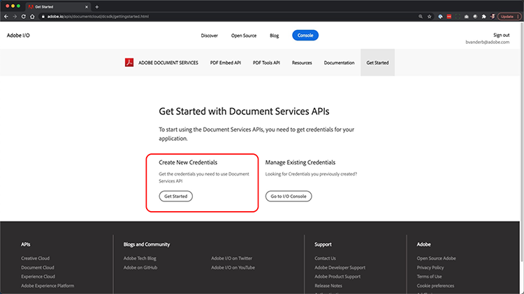
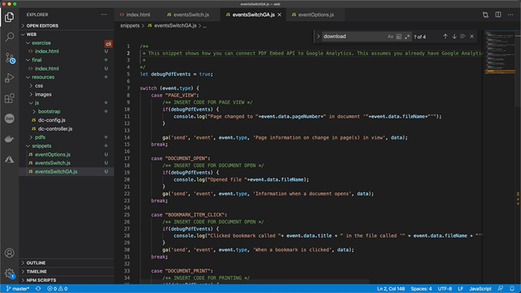
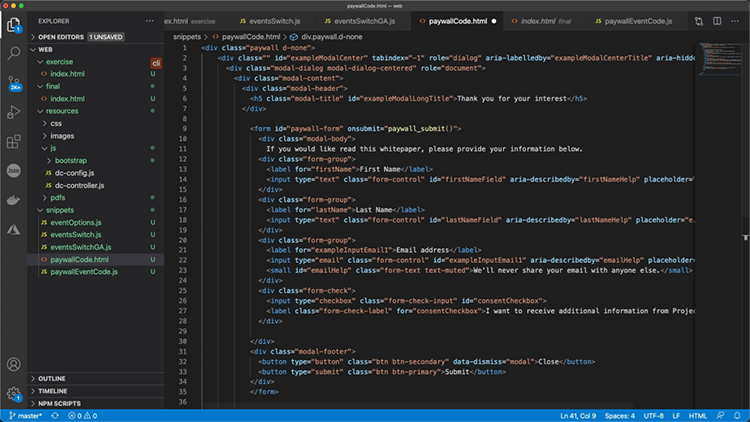

# PDF 온라인 환경을 제어하고 분석을 수집하세요.

귀사에서 웹 사이트에 PDF을 게시합니까? Adobe PDF Embed API를 사용하여 모양을 제어하고, 공동 작업을 활성화하고, PDF과 상호 작용하는 방법(페이지 소요 시간 및 검색 포함)에 대한 분석을 수집하는 방법을 알아보십시오. 4부로 구성된 실습용 튜토리얼을 시작하려면 *PDF 포함 API 시작하기*&#x200B;를 선택하세요.

<table style="table-layout:fixed">
<tr>
  <td>
    <a href="controlpdfexperience.md#part1">
        
    </a>
    <div>
    <a href="controlpdfexperience.md#part1"><strong>1부: PDF 포함 API 시작하기</strong></a>
    </div>
  </td>
  <td>
    <a href="controlpdfexperience.md#part2">
        
    </a>
    <div>
    <a href="controlpdfexperience.md#part2"><strong>2부: 웹 페이지에 PDF 포함 API 추가</strong></a>
    </div>
  </td>
  <td>
   <a href="controlpdfexperience.md#part3">
      
   </a>
    <div>
    <a href="controlpdfexperience.md#part3"><strong>파트 3: Analytics API에 액세스</strong></a>
    </div>
  </td>
  <td>
   <a href="controlpdfexperience.md#part4">
      
   </a>
    <div>
    <a href="controlpdfexperience.md#part4"><strong>파트 4: 이벤트를 기반으로 대화형 기능 추가</strong></a>
    </div>
  </td>
</tr>
</table>

## 1부: PDF Embed API 시작하기 {#part1}

1부에서는 1-3부에 필요한 모든 것을 시작하는 방법을 알아봅니다. API 자격 증명을 가져오는 것으로 시작합니다.

**필요한 항목**

* 튜토리얼 리소스 [다운로드](https://github.com/benvanderberg/adobe-pdf-embed-api-tutorial)
* Adobe ID [여기서 받기](https://account.adobe.com/ko/)
* 웹 서버(노드 JS, PHP 등)
* HTML / JavaScript / CSS에 대한 작업 지식

**사용 중인 항목**

* 기본 웹 서버(노드)
* Visual Studio 코드
* 깃허브

### 자격 증명 가져오기

1. [Adobe.io 웹 사이트](https://developer.adobe.com/)로 이동합니다.
1. 매력적인 문서 환경 빌드에서 **[!UICONTROL 자세히 알아보기]**&#x200B;를 클릭합니다.

   

   그러면 [!DNL Adobe Acrobat Services] 홈 페이지로 이동합니다.

1. 탐색 모음에서 **[!UICONTROL 시작하기]**&#x200B;를 클릭합니다.

   **API [!DNL Acrobat Services]개 시작하기**&#x200B;에서 **새 자격 증명 만들기** 또는 **기존 자격 증명 관리**&#x200B;를 수행하는 옵션이 표시됩니다.

1. **[!UICONTROL 새 자격 증명 만들기]**&#x200B;에서 **[!UICONTROL 시작하기]** 단추를 클릭합니다.

   

1. **[!UICONTROL PDF Embed API]** 라디오 단추를 선택하고 다음 창에서 선택한 자격 증명 이름과 응용 프로그램 도메인을 추가합니다.

   >[!NOTE]
   >
   >이러한 자격 증명은 여기에 나열된 응용 프로그램 도메인에서만 사용할 수 있습니다. 원하는 도메인을 사용할 수 있습니다.

   

1. **[!UICONTROL 자격 증명 만들기]**&#x200B;를 클릭합니다.

   마법사의 마지막 페이지에서는 클라이언트 자격 증명 세부 정보를 제공합니다. 이 창을 열어 두면 나중에 사용할 클라이언트 ID(API 키)를 복사할 수 있습니다.

1. **[!UICONTROL 설명서 보기]**&#x200B;를 클릭하여 이 API 사용 방법에 대한 자세한 정보가 포함된 설명서로 이동합니다.

   

## 2부: 웹 페이지에 PDF Embed API 추가 {#part2}

2부에서는 PDF Embed API를 웹 페이지에 손쉽게 포함하는 방법을 알아봅니다. Adobe PDF Embed API 온라인 데모를 사용하여 코드를 생성하면 됩니다.

### 연습 코드 가져오기

활용할 코드를 만들었습니다. 코드를 직접 사용할 수도 있지만 데모는 튜토리얼 리소스 컨텍스트에 있습니다. 샘플 코드 [여기](https://github.com/benvanderberg/adobe-pdf-embed-api-tutorial)를 다운로드하세요.

1. [[!DNL Adobe Acrobat Services] 웹 사이트](https://developer.adobe.com/document-services/homepage/)&#x200B;(으)로 이동합니다.

   [!DNL Adobe Acrobat Services] 웹 사이트의 

1. 탐색 모음에서 **[!UICONTROL API]**&#x200B;를 클릭한 다음 드롭다운 링크에서 **[!UICONTROL PDF 포함 API]** 페이지로 이동합니다.

   PDF 포함 API 드롭다운의 

1. **[!UICONTROL 데모 사용해 보기]**&#x200B;를 클릭합니다.

   PDF Embed API용 개발자 샌드박스와 함께 새 창이 표시됩니다.

   

   여기에서 다양한 보기 모드에 대한 옵션을 볼 수 있습니다.

1. [전체 창], [크기 컨테이너], [인라인] 및 [Lightbox]에 대해 다른 보기 모드를 클릭합니다.

   

1. 옵션을 켜거나 끄려면 **[!UICONTROL 전체 창]** 보기 모드를 클릭한 다음 **[!UICONTROL 사용자 지정]** 단추를 클릭하세요.

   

1. **[!UICONTROL 다운로드]** PDF 옵션을 비활성화합니다.
1. 코드 미리 보기를 보려면 **[!UICONTROL 코드 생성]** 단추를 클릭하십시오.
1. 파트 1의 클라이언트 자격 증명 창에서 **[!UICONTROL 클라이언트 ID]**&#x200B;을(를) 복사합니다.

   

1. 코드 편집기에서 **[!UICONTROL 웹]** -> **[!UICONTROL 리소스]** -> **[!UICONTROL js]** -> **[!UICONTROL dc-config.js]** 파일을 엽니다.

   clientID 변수가 표시됩니다.

1. 클라이언트 자격 증명을 큰따옴표 사이에 붙여넣어 clientID를 자격 증명으로 설정합니다.

1. 개발자 샌드박스 코드 미리 보기로 돌아갑니다.

1. Adobe 스크립트가 있는 두 번째 줄을 복사합니다.

   ```
   <script src=https://documentccloud.adobe.com/view-sdk/main.js></script>
   ```

   

1. 코드 편집기로 이동하여 **[!UICONTROL 웹]** -> **[!UICONTROL 연습]** -> **[!UICONTROL index.html]** 파일을 엽니다.

1. **TODO: EXERCISE 1: INSERT EMBED API SCRIPT TAG**&#39;라는 주석 아래에서 18행의 `<head>`에 스크립트 코드를 붙여넣습니다.

   스크립트 코드를 붙여넣을 위치의 

1. 개발자 샌드박스 코드 미리 보기로 돌아가서 다음의 첫 번째 코드 줄을 복사합니다.

   ```
   <div id="adobe-dc-view"></div>
   ```

   

1. 코드 편집기로 이동하여 **[!UICONTROL 웹]** -> **[!UICONTROL 연습]** -> **[!UICONTROL index.html]** 파일을 다시 엽니다.

1. **TODO: 연습 1: PDF 포함 API 코드 삽입**&#x200B;이라는 주석 아래 67행의 `<body>`에 `<div>` 코드를 붙여넣습니다.

   

1. 개발자 샌드박스 코드 미리 보기로 돌아가서 아래의 `<script>`에 대한 코드 줄을 복사합니다.

   ```
   <script type="text/javascript">
       document.addEventListener("adobe_dc_view_sdk.ready",             function(){ 
           var adobeDCView = new AdobeDC.View({clientId:                     "<YOUR_CLIENT_ID>", divId: "adobe-dc-view"});
           adobeDCView.previewFile({
               content:{location: {url: "https://documentcloud.                adobe.com/view-sdk-demo/PDFs/Bodea Brochure.                    pdf"}},
               metaData:{fileName: "Bodea Brochure.pdf"}
           }, {showDownloadPDF: false});
       });
   </script>
   ```

1. 코드 편집기로 이동하여 **[!UICONTROL 웹]** -> **[!UICONTROL 연습]** -> **[!UICONTROL index.html]** 파일을 다시 엽니다.

1. `<div>` 태그 아래의 68행에 있는 파일의 `<body>`에 `<script>` 코드를 붙여넣습니다.

1. 이전에 만든 clientID 변수를 포함하도록 동일한 **index.html** 파일의 70행을 수정합니다.

   

1. 로컬 파일을 사용하도록 PDF 파일의 위치를 업데이트하려면 동일한 **index.html** 파일의 72행을 수정하십시오.

   **/resources/pdfs/whitepaper.pdf**&#x200B;의 자습서 파일에 사용할 수 있는 자습서가 있습니다.

1. 수정된 파일을 저장하고 **`<your domain>`/summit21/web/exercise/**(으)로 이동하여 웹 사이트를 미리 봅니다.

   브라우저에서 전체 창 모드로 기술 백서 렌더링이 표시되어야 합니다.

## 3부: Analytics API 액세스 {#part3}

이제 PDF을 렌더링하는 PDF Embed API가 있는 웹 페이지를 성공적으로 만들었으므로, 제3장에서 이제 JavaScript 이벤트를 사용하여 분석을 측정하는 방법을 탐색하여 사용자가 PDF을 사용하는 방식을 이해할 수 있습니다.

### 설명서 찾기

PDF Embed API의 일부로 사용할 수 있는 다양한 JavaScript 이벤트가 있습니다. [!DNL Adobe Acrobat Services] 설명서에서 액세스할 수 있습니다.

1. [설명서](https://developer.adobe.com/document-services/docs/overview) 사이트로 이동합니다.
1. API의 일부로 사용할 수 있는 다양한 이벤트 유형을 검토합니다. 이는 참조에 유용하며 향후 프로젝트에도 도움이 됩니다.

   

1. 웹 사이트에 나열된 샘플 코드를 복사합니다.

   이를 코드의 기준으로 사용하여 수정합니다.

   

   ```
   const eventOptions = {
     //Pass the PDF analytics events to receive.
      //If no event is passed in listenOn, then all PDF         analytics events will be received.
   listenOn: [ AdobeDC.View.Enum.PDFAnalyticsEvents.    PAGE_VIEW, AdobeDC.View.Enum.PDFAnalyticsEvents.DOCUMENT_DOWNLOAD],
     enablePDFAnalytics: true
   }
   
   
   adobeDCView.registerCallback(
     AdobeDC.View.Enum.CallbackType.EVENT_LISTENER,
     function(event) {
       console.log("Type " + event.type);
       console.log("Data " + event.data);
     }, eventOptions
   );
   ```

1. 이전에 추가한 코드 섹션을 아래와 같이 찾아 **index.html**&#x200B;에서 이 코드 뒤에 코드를 추가합니다.

   

1. 웹 브라우저에서 페이지를 로드하고 콘솔을 열어 PDF 뷰어와 상호 작용할 때 다른 이벤트의 콘솔 출력을 봅니다.

   

   

### 이벤트 캡처용 스위치 추가

이제 console.log로 출력되는 이벤트가 있으므로, 어떤 이벤트를 기준으로 동작을 변경해 보겠습니다. 이렇게 하려면 전환 예제를 사용합니다.

1. **snippets/eventsSwitch.js**(으)로 이동하여 튜토리얼 코드에서 파일의 내용을 복사합니다.

   

1. 이벤트 리스너 함수에 코드를 붙여넣습니다.

   

1. 페이지가 로드되고 [PDF 뷰어]와 상호 작용할 때 콘솔이 올바르게 출력되는지 확인합니다.

### Adobe Analytics

Adobe Analytics 지원을 뷰어에 추가하려면 웹 사이트에 설명된 지침을 따르십시오.

>[!IMPORTANT]
>
>웹 페이지 헤더의 페이지에 Adobe Analytics이 이미 로드되어 있어야 합니다.

[Adobe Analytics 설명서](https://www.adobe.com/devnet-docs/dcsdk_io/viewSDK/howtodata.html#adobe-analytics)&#x200B;(으)로 이동하여 웹 페이지에서 이미 Adobe Analytics을 사용하는지 검토합니다. 지침에 따라 reportSuite를 설정합니다.

### Google Analytics


Adobe PDF Embed API 는 Adobe Analytics과 즉시 통합 가능합니다. 그러나 모든 Google Analytics을 JavaScript 이벤트로 사용할 수 있으므로 PDF 이벤트를 캡처하고 ga() 함수를 사용하여 이벤트를 Adobe Analytics에 추가하여 이벤트와 통합할 수 있습니다.

1. **snippets/eventsSwitchGA.js**(으)로 이동하여 Google Analytics과 통합하는 방법을 확인하십시오.
1. Adobe Analytics을 사용하여 웹 페이지가 추적되고 웹 페이지에 이미 포함되어 있는 경우 이 코드를 검토하고 예제로 사용하십시오.

   

## 제4부: 이벤트를 기반으로 인터랙티브 요소 추가 {#part4}

4부에서는 두 번째 페이지를 스크롤한 후 페이월을 PDF 뷰어 위에 레이어로 표시하는 방법을 살펴봅니다.

### Paywall 예제

[페이월 뒤에 있는 PDF 예시](https://www3.technologyevaluation.com/research/white-paper/the-forrester-wave-digital-decisioning-platforms-q4-2020.html)로 이동합니다. 이 예제에서는 PDF 보기 환경 위에 인터랙티브한 요소를 추가하는 방법을 배웁니다.

### 유료화 코드 추가

1. snippets/paywallCode.html으로 이동하여 내용을 복사합니다.
1. exercise/index.html에서 `<!-- TODO: EXERCISE 3: INSERT PAYWALL CODE -->`을(를) 검색합니다.

   

1. 복사된 코드를 주석 뒤에 붙여넣습니다.
1. **snippets/paywallCode.js**(으)로 이동하여 내용을 복사합니다.

   

1. 해당 위치에 코드를 붙여넣습니다.

### Paywall로 데모 사용해 보기

이제 데모를 볼 수 있습니다.

1. 웹 사이트에서 **index.html**&#x200B;을(를) 다시 로드합니다.
1. 아래로 스크롤하여 페이지 > 2로 이동합니다.
1. 두 번째 페이지 이후에 사용자에게 확인 메시지를 표시합니다.

   

## 추가 리소스

[여기](https://developer.adobe.com/document-services/docs/overview)에서 추가 리소스를 찾을 수 있습니다.
