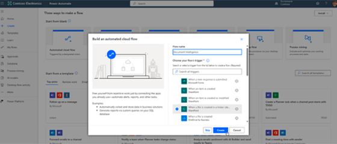

# Adobe PDF 추출 API 튜토리얼

Adobe Sensei의 머신 러닝으로 구동되는 웹 서비스를 통해 모든 PDF의 구조 및 콘텐츠 요소를 잠금 해제하십시오.

>[!NOTE]
>
>PDF 추출 API는 PDF 서비스 API에 포함됩니다.

<table style="table-layout:fixed">
<tr>
  <td>
    
    

      <a href="automate-content-extraction.md"><strong>콘텐츠 추출 자동화</strong></a>
      

      PDF 추출 API를 사용하여 PDF 문서에서 콘텐츠 추출을 자동화하는 방법을 알아보십시오
       
  </td>
 <td>
    
    

      <a href="https://experienceleague.adobe.com/en/docs/events/adobe-developers-live-recordings/2021/oct2021/parsing-pdf"><strong>PDF 구문 분석 - PDF 추출 API를 사용하여 JSON 데이터로 작업하면 손쉽게</strong></a>
      

      Adobe PDF Services API의 PDF 추출 서비스를 사용하여 JSON을 구문 분석하는 것처럼 PDF을 쉽게 만드는 방법에 대해 알아봅니다
       
  </td>
 <td>
       
       

        
 </td>
 <td>
       
       

        
 </td>
</tr>
</table>