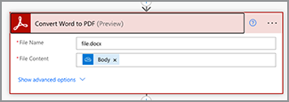

# Microsoft Power Automate에서 첫 번째 플로우 만들기

[Microsoft Services](https://us.flow.microsoft.com/en-us/connectors/shared_adobepdftools/adobe-pdf-services/) 커넥터를 사용하여 [Adobe PDF Power Automate](https://flow.microsoft.com)에서 첫 번째 흐름을 만드는 방법을 알아봅니다.

이 실습용 튜토리얼에서는 다음을 수행하는 방법에 대해 알아봅니다.

* Word 문서를 PDF으로 변환
* PDF 문서를 하나의 PDF으로 결합
* 암호로 PDF 문서 Protect

## 준비

### 필요한 항목

* Adobe PDF 서비스에 대한 **평가판 또는 프로덕션 자격 증명**
Microsoft Power Automate [여기](https://experienceleague.adobe.com/ko/docs/acrobat-services-learn/tutorials/pdfservices/getting-credentials-power-automate)에서 자격 증명을 가져오고 구성하는 방법에 대해 자세히 알아보십시오.
* **프리미엄 커넥터가 포함된 Microsoft Power Automate**
Power Automate [여기](https://docs.microsoft.com/en-us/power-platform/admin/power-automate-licensing/types)의 라이선스 수준을 확인하는 방법에 대해 알아보십시오.
* **OneDrive**
이 자습서에서는 OneDrive 스토리지 커넥터를 사용하지만 모든 스토리지 커넥터를 대체할 수 있습니다.

### 샘플 파일

압축을 풀고 OneDrive에 업로드해야 하는 두 개의 [샘플 파일](assets/sample-assets.zip)이 있습니다.

* WordDocument01.docx
* WordDocument02.docx

### 자격 증명 가져오기

이 튜토리얼을 완료하려면 Adobe PDF Services용 Microsoft Power Automate에서 이미 구성된 자격 증명이 필요합니다. 이 단계를 완료하지 않은 경우 [여기 지침](https://experienceleague.adobe.com/ko/docs/acrobat-services-learn/tutorials/pdfservices/getting-credentials-power-automate)을 참조하세요.

## 1부: 새 플로우 만들기 및 Word를 PDF으로 변환

### 플로우 만들기

이 부분에서는 인스턴트 플로우를 사용하여 [Microsoft Power Automate](https://flow.microsoft.com)에서 새 플로우를 만들고, 매개 변수를 추가하고, OneDrive에서 파일을 가져와 PDF으로 변환합니다.

1. [Microsoft Power Automate](https://flow.microsoft.com)&#x200B;(으)로 이동하고 사용자의 자격 증명으로 로그인합니다.
1. 사이드바에서 **[!UICONTROL 만들기]**&#x200B;를 선택합니다.

   

1. **[!UICONTROL 빠른 흐름]**&#x200B;을 선택합니다.
1. 플로우 이름을 지정합니다.
1. *이 흐름을 트리거하는 방법 선택*&#x200B;에서 **[!UICONTROL 흐름을 수동으로 트리거]**&#x200B;를 선택합니다.
1. **[!UICONTROL 생성]**&#x200B;을 선택합니다.

### 파일의 파일 내용 가져오기

그런 다음 샘플 파일의 파일 내용을 가져옵니다.

>[!PREREQUISITES]
>
>[샘플 파일](assets/sample-assets.zip)을 OneDrive에 업로드하지 않은 경우 압축을 풀고 업로드합니다.


1. [Power Automate](https://flow.microsoft.com)에서 **[!UICONTROL 이상의 새 단계]**&#x200B;를 선택합니다.
1. 검색 창에서 *OneDrive*&#x200B;을(를) 검색합니다.
1. **[!UICONTROL 비즈니스용 OneDrive]** 또는 **[!UICONTROL OneDrive]**&#x200B;를 선택하여 회사 또는 개인 OneDrive 계정을 선택하세요.
1. 검색 창에서 *파일 내용 가져오기*&#x200B;를 검색합니다.
1. **[!UICONTROL 파일]** 필드에서 폴더 아이콘을 선택하여 OneDrive의 *WordDocument01.docx* 파일로 이동합니다.

   

### 파일을 PDF으로 변환

이제 파일 내용이 있으므로 문서를 PDF으로 변환할 수 있습니다.

1. [Power Automate](https://flow.microsoft.com)에서 **[!UICONTROL 이상의 새 단계]**&#x200B;를 선택합니다.
1. 검색 창에서 *Adobe PDF 서비스*&#x200B;를 검색합니다.
1. **[!UICONTROL Adobe PDF 서비스]**&#x200B;를 선택합니다.
1. 검색 창에서 *단어를 PDF으로 변환*&#x200B;을 검색합니다.
1. **[!UICONTROL 파일 이름]**&#x200B;에서 원하는 대로 파일 이름을 지정하되 *.docx*(으)로 끝나야 합니다. 이 확장명은 문서를 Word에서 PDF으로 변환하는 데 필요합니다.
1. **[!UICONTROL 파일 콘텐츠]** 필드에 커서를 놓습니다.
1. **[!UICONTROL 동적 콘텐츠]** 패널을 사용하여 **[!UICONTROL 파일 콘텐츠]**&#x200B;를 선택합니다.

   

### 파일을 OneDrive에 저장

문서가 생성되면 파일을 다시 OneDrive에 저장합니다.

1. [Microsoft Power Automate](https://flow.microsoft.com)에서 **[!UICONTROL 이상의 새 단계]**&#x200B;를 선택합니다.
1. 검색 창에서 *OneDrive*&#x200B;을(를) 검색합니다.
1. **[!UICONTROL 비즈니스용 OneDrive]** 또는 **[!UICONTROL OneDrive]**&#x200B;를 선택하여 회사 또는 개인 OneDrive 계정을 선택하세요.
1. 검색 창에서 *파일 내용 가져오기*&#x200B;를 검색합니다.
1. 검색 창에서 *파일 만들기*&#x200B;를 검색합니다.
1. **[!UICONTROL 파일 만들기]**&#x200B;를 선택합니다.
1. **[!UICONTROL 폴더 경로]** 필드에서 폴더 아이콘을 선택하여 OneDrive에서 파일을 저장할 위치를 지정합니다.
1. **[!UICONTROL 파일 이름]**&#x200B;에서 원하는 대로 파일 이름을 지정하되 *.docx*(으)로 끝나야 합니다. 이 확장명은 문서를 Word에서 PDF으로 변환하는 데 필요합니다.
1. **[!UICONTROL 파일 내용]** 필드에서 **[!UICONTROL 동적 내용]** 패널을 사용하여 PDF 파일 내용 변수를 삽입합니다.

### 플로우 시도

1. 왼쪽 상단에서 **[!UICONTROL 제목 없음]**&#x200B;을 선택하여 플로우의 이름을 바꿉니다.
1. **[!UICONTROL 저장]**&#x200B;을 선택합니다.
1. **[!UICONTROL 테스트]**&#x200B;를 선택합니다.
1. **[!UICONTROL 수동]**&#x200B;을 선택한 다음 **[!UICONTROL 저장 및 테스트]**&#x200B;를 선택합니다.
1. **[!UICONTROL 계속]**&#x200B;을 선택합니다.
1. **[!UICONTROL 흐름 실행]**&#x200B;을 선택합니다.

이제 변환된 PDF이 OneDrive 폴더에 표시됩니다.


## 2부: 템플릿에서 동적 문서 생성

이 다음 파트는 파트 1에서 빌드되며 *Word에서 문서 생성* 템플릿을 사용하여 데이터를 문서에 동적으로 병합합니다.

### 문서 템플릿 검토

OneDrive의 샘플 파일에서 *WordDocument02_.docx*&#x200B;을(를) 엽니다. Word 문서에는 데이터가 문서로 채워지는 위치를 나타내는 여러 가지 텍스트 태그가 있습니다.

### 트리거할 매개 변수 추가

동적 데이터를 문서로 푸시하려면 트리거에 대한 몇 가지 매개 변수를 만들어 값을 묻는 메시지를 표시해야 합니다.

1. 플로우를 편집할 때 **[!UICONTROL 수동으로 플로우 트리거]**&#x200B;를 선택하여 동작을 확장합니다.
1. **[!UICONTROL 입력 추가]**&#x200B;를 선택합니다.
1. **[!UICONTROL 텍스트]**&#x200B;를 선택합니다.
1. *이름* 필드의 이름을 지정합니다.

2-4단계를 반복하여 다음 필드를 추가합니다.

* 성
* 급여


### 템플릿의 파일 콘텐츠 가져오기

문서를 생성하려면 먼저 Word 템플릿의 파일 내용을 가져와야 합니다.

1. Power Automate에서 + **[!UICONTROL 새 단계]**&#x200B;를 선택합니다.
1. 검색 창에서 *OneDrive*&#x200B;을(를) 검색합니다.
1. **[!UICONTROL 비즈니스용 OneDrive]** 또는 **[!UICONTROL OneDrive]**&#x200B;를 선택하여 회사 또는 개인 OneDrive 계정을 선택하세요.
1. 검색 창에서 *파일 내용 가져오기*&#x200B;를 검색합니다.
1. **[!UICONTROL 파일]** 필드에서 폴더 아이콘을 선택하여 OneDrive의 *WordDocument02.docx* 파일로 이동합니다.


### 템플릿에서 문서 생성

1. Power Automate에서 **[!UICONTROL 이상의 새 단계]**&#x200B;을 선택합니다.
1. 검색 창에서 *Adobe PDF 서비스*&#x200B;를 검색합니다.
1. **[!UICONTROL Adobe PDF 서비스]**&#x200B;를 선택합니다.
1. **[!UICONTROL Word 템플릿에서 문서 생성]** 작업을 선택합니다.
1. **[!UICONTROL 템플릿 파일 이름]** 필드에서 원하는 대로 파일 이름을 지정하되 *.docx*(으)로 끝나야 합니다.

#### 데이터 병합

*Word 템플릿에서 문서 생성* 작업을 사용하면 동적 콘텐츠를 사용하여 플로우에서 이전에 만든 다양한 변수의 데이터를 문서에 병합할 수 있습니다.

아래의 JSON 데이터를 **데이터 병합** 필드에 복사합니다.

```
{
    "FirstName": "",
    "LastName": "",
    "Salary": ""
}
```

1. *FirstName* 값에 대한 두 따옴표 사이의 필드에 커서를 놓습니다.
1. **[!UICONTROL 동적 콘텐츠]** 패널을 사용하여 흐름 동작을 수동으로 트리거하는 *이름* 값을 삽입합니다.

   

1. **[!UICONTROL 성]** 및 **[!UICONTROL 급여]** 필드에 대해 7~8단계를 반복합니다.
1. **[!UICONTROL 템플릿 파일 내용]** 필드에서 **[!UICONTROL 동적 내용]** 패널을 사용하여 *파일 내용 가져오기* 단계에서 **[!UICONTROL 파일 내용]** 값을 삽입합니다.


>[!TIP]
>
>*Word 템플릿에서 문서 생성* 작업은 Adobe 문서 생성 API를 사용합니다. 템플릿 작성 방법에 대해 자세히 알아보려면 다음 리소스를 참조하십시오.
>
>* [Adobe 문서 생성에 대해 자세히 알아보기](https://developer.adobe.com/document-services/apis/doc-generation/)
>* Microsoft Word용 [Adobe 문서 생성 Tagger](https://appsource.microsoft.com/en-US/product/office/WA200002654)
>* [Adobe 문서 생성 API 설명서](https://developer.adobe.com/document-services/docs/overview/document-generation-api/)

### 파일을 OneDrive에 저장

문서가 생성되면 파일을 다시 OneDrive에 저장할 수 있습니다.

1. Power Automate에서 **+ [!UICONTROL 새 단계]**&#x200B;를 선택합니다.
1. 검색 창에서 *OneDrive*&#x200B;을(를) 검색합니다.
1. **[!UICONTROL 비즈니스용 OneDrive]** 또는 **[!UICONTROL OneDrive]**&#x200B;를 선택하여 회사 또는 개인 OneDrive 계정을 선택하세요.
1. 검색 창에서 *파일 만들기*&#x200B;를 검색합니다.
1. **[!UICONTROL 파일 만들기]**&#x200B;를 선택합니다.
1. **[!UICONTROL 폴더 경로]** 필드에서 폴더 아이콘을 선택하여 OneDrive에서 파일을 저장할 위치를 지정합니다.
1. **[!UICONTROL 파일 이름]** 필드에서 파일 이름을 설정합니다. 출력물은 PDF 형식이므로 파일 이름은 .pdf 확장명으로 끝나야 합니다.
1. **[!UICONTROL 동적 콘텐츠]** 패널을 사용하여 PDF 파일 콘텐츠 변수를 **[!UICONTROL 파일 콘텐츠]** 필드에 삽입합니다.

### 플로우 시도


1. **[!UICONTROL 저장]**&#x200B;을 선택합니다.
1. **[!UICONTROL 테스트]**&#x200B;를 선택합니다.
1. **[!UICONTROL 수동]**&#x200B;을 선택한 다음 **[!UICONTROL 저장 및 테스트]**&#x200B;를 선택합니다.
1. **[!UICONTROL 계속]**&#x200B;을 선택합니다.
1. *이름*, *성* 및 *급여*&#x200B;의 값을 입력하십시오.
1. **[!UICONTROL 흐름 실행]**&#x200B;을 선택합니다.

이제 OneDrive 폴더에 Word 문서에서 생성된 PDF이 표시됩니다. OneDrive에서 PDF 문서를 열면 데이터가 텍스트 태그 위치에 병합됩니다.


## 파트 3: PDF을 하나로 결합

이제 Word 문서를 만들고 PDF으로 변환했으므로 다음 단계에서는 여러 PDF 문서를 결합하는 것입니다.

>[!NOTE]
>
>이전 작업에서는 문서의 사본을 OneDrive에 파일로 저장했습니다. 병합 PDF과 같은 도구를 사용하려면 OneDrive에 파일을 저장할 필요가 없습니다. 대신 한 작업에서 다음 작업으로 출력을 직접 전달할 수 있습니다. 각 작업 후에 OneDrive에 저장하는 것보다 더 좋습니다. 그러나 데모용으로 이러한 파일을 OneDrive에 저장합니다.

### 병합 PDF 단계 추가

1. 플로우를 편집할 때 **[!UICONTROL + 다음 단계]**&#x200B;를 선택하여 플로우의 끝에 동작을 추가합니다.
1. 검색 창에서 *Adobe PDF 서비스*&#x200B;를 검색합니다.
1. **[!UICONTROL Adobe PDF 서비스]**&#x200B;를 선택합니다.
1. **[!UICONTROL PDF 병합]** 작업을 선택합니다.
1. **[!UICONTROL 병합 PDF 파일 이름]** 필드에 원하는 파일 이름(예:*CombinedDocument.pdf*)을 입력합니다.
1. **[!UICONTROL 파일 내용 -1]** 필드에서 **[!UICONTROL 동적 내용]** 패널을 사용하여 **[!UICONTROL Word를 PDF으로 변환]** 단계에서 *PDF 파일 내용* 값을 삽입합니다.
1. 다음 문서를 추가하려면 **+ [!UICONTROL 새 항목 추가]**&#x200B;를 선택합니다.
1. **[!UICONTROL 파일 콘텐츠 - 2]** 필드에서 **[!UICONTROL 동적 콘텐츠]** 패널을 사용하여 *Word 템플릿에서 문서 생성* 단계에서 **[!UICONTROL 출력 파일 콘텐츠]** 값을 삽입합니다.


### 병합된 PDF을 OneDrive에 저장

문서가 결합되면 문서를 다시 OneDrive에 저장할 수 있습니다.

1. Power Automate에서 **+ [!UICONTROL 새 단계]**&#x200B;를 선택합니다.
1. 검색 창에서 *OneDrive*&#x200B;을(를) 검색합니다.
1. **[!UICONTROL 비즈니스용 OneDrive]** 또는 **[!UICONTROL OneDrive]**&#x200B;를 선택하여 회사 또는 개인 OneDrive 계정을 선택하세요.
1. 검색 창에서 *파일 만들기*&#x200B;를 검색합니다.
1. **[!UICONTROL 파일 만들기]**&#x200B;를 선택합니다.
1. **[!UICONTROL 폴더 경로]** 필드에서 폴더 아이콘을 선택하여 OneDrive에서 파일을 저장할 위치를 지정합니다.
1. **[!UICONTROL 파일 이름]** 필드에서 파일 이름을 설정합니다. 출력물은 PDF 형식이므로 파일 이름은 .pdf로 끝나야 합니다.
1. **[!UICONTROL 파일 내용]** 필드에서 **[!UICONTROL 동적 내용]** 패널을 사용하여 **[!UICONTROL PDF 병합]** 단계에서 *PDF 파일 내용* 값을 삽입합니다.

   

### 플로우 시도

1. **[!UICONTROL 저장]**&#x200B;을 선택합니다.
1. **[!UICONTROL 테스트]**&#x200B;를 선택합니다.
1. **[!UICONTROL 수동]**&#x200B;을 선택한 다음 **[!UICONTROL 저장 및 테스트]**&#x200B;를 선택합니다.
1. **[!UICONTROL 계속]**&#x200B;을 선택합니다.
1. *이름*, *성* 및 *급여*&#x200B;의 값을 입력하십시오.
1. **[!UICONTROL 흐름 실행]**&#x200B;을 선택합니다.

OneDrive 폴더에 첫 번째 및 두 번째 문서의 PDF이 결합된 페이지가 표시됩니다.

## 제4부: Protect PDF 문서

문서를 생성한 후 OneDrive에 저장하기 전에 추가 단계를 포함하여 문서를 편집하지 못하도록 보호할 수 있습니다.

### PDF 보호

1. Power Automate에서 플로우를 편집하는 동안 **[!UICONTROL PDF 병합]** 작업과 **[!UICONTROL 파일 만들기 3]** 작업 사이에 있는 **+**&#x200B;을(를) 선택합니다.

   

1. **[!UICONTROL 동작 추가]**&#x200B;를 선택합니다.
1. 검색 창에서 *Adobe PDF 서비스*&#x200B;를 검색합니다.
1. **[!UICONTROL Adobe PDF 서비스]**&#x200B;를 선택합니다.
1. **[!UICONTROL 보기 중 Protect PDF]** 작업을 선택합니다.
1. **[!UICONTROL 파일 이름]** 필드에서 확장명이 .pdf인 경우 원하는 이름으로 설정합니다.
1. **[!UICONTROL 암호]** 필드를 지정한 암호로 설정하여 문서를 엽니다.
1. **[!UICONTROL 파일 내용]** 필드에서 **[!UICONTROL 동적 내용]** 패널을 사용하여 **[!UICONTROL PDF 병합]** 단계에서 *PDF 파일 내용* 값을 삽입합니다.

### OneDrive에 저장 업데이트

문서가 보호되면 파일을 다시 OneDrive에 저장할 수 있습니다. 이 예제에서는 새 *파일 내용* 값으로 기존의 **파일 만들기 3** 작업을 업데이트하고 있습니다.

1. **[!UICONTROL 파일 만들기 3]** 작업의 **[!UICONTROL 파일 콘텐츠]** 필드에서 커서를 선택합니다.
1. **[!UICONTROL 동적 콘텐츠]** 패널을 사용하여 **보는 중 Protect PDF** 단계에서 *PDF 파일 콘텐츠* 값을 삽입합니다.

### 플로우 시도

1. **[!UICONTROL 저장]**&#x200B;을 선택합니다.
1. **[!UICONTROL 테스트]**&#x200B;를 선택합니다.
1. **[!UICONTROL 수동]**&#x200B;을 선택한 다음 **[!UICONTROL 저장 및 테스트]**&#x200B;를 선택합니다.
1. **[!UICONTROL 계속]**&#x200B;을 선택합니다.
1. *이름*, *성* 및 *급여*&#x200B;의 값을 입력하십시오.
1. **[!UICONTROL 흐름 실행]**&#x200B;을 선택합니다.

OneDrive 폴더에서 이제 문서를 보기 위해 암호를 입력하라는 메시지가 결합된 PDF을 볼 수 있습니다.

## 다음 단계

이 자습서에서는 Word 문서를 PDF으로 변환하고, 데이터를 기반으로 문서를 생성하고, 문서를 병합하고, 암호로 보호합니다. 자세히 알아보려면 Microsoft Power Automate의 Adobe PDF Services 커넥터에서 사용할 수 있는 다른 작업 중 일부를 살펴보십시오.

* Microsoft Power Automate에서 사용할 수 있는 미리 만들어진 템플릿을 봅니다.
* Adobe 기술 블로그의 [기사](https://medium.com/adobetech/tagged/microsoft-power-automate)에서 배우세요.
* Adobe 문서 생성 API에 대해 [설명서](https://developer.adobe.com/document-services/docs/overview/document-generation-api/)를 검토하십시오.
