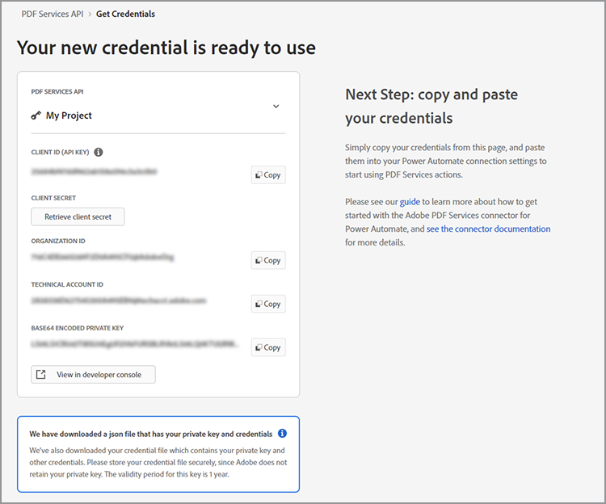

# Microsoft Power Automate 자격 증명 가져오기

[Microsoft Power Automate](https://powerautomate.microsoft.com/ko-kr/)는 시민 개발자와 개발자가 코드를 작성하지 않고도 비즈니스를 개선할 수 있는 강력한 자동화 프로세스를 만들 수 있는 강력한 방법을 제공합니다. [[!DNL Adobe Acrobat Services]](https://developer.adobe.com/document-services)의 일부로 [Adobe PDF Services](https://us.flow.microsoft.com/en-us/connectors/shared_adobepdftools/adobe-pdf-services/) 커넥터를 통해 사용자는 Microsoft Power Automate 내의 Adobe PDF Services API에서 사용할 수 있는 모든 작업을 수행할 수 있습니다.

이 튜토리얼에서는 Adobe PDF 서비스를 사용하거나 테스트하기 위해 자격 증명을 받는 방법에 대해 알아봅니다. 체험판 사용자인지 기존 고객인지에 따라 이 튜토리얼에서는 자격 증명을 얻는 적절한 단계를 안내합니다.

## Microsoft Power Automate 사용자가 Adobe PDF Services 커넥터를 사용하려면 어떻게 해야 합니까?

기존 Microsoft Power Automate 사용자는 Adobe PDF Services에 대해 [평가판 자격 증명을 가져올 수 있습니다](https://www.adobe.com/go/powerautomate_getstarted_kr). 위의 링크는 Microsoft Power Automate 사용자를 위해 이 프로세스를 도와주는 특별 등록 링크입니다.


>[!IMPORTANT]
> 체험판을 위해 로그인하는 경우에는 Enterprise ID이 아닌 Adobe ID을 사용해야 합니다. Adobe PDF Services API의 현재 구독자가 아니고 사용자의 Enterprise ID으로 로그인하려고 하면 기업에서 Adobe PDF Services API를 사용할 수 있는 권한을 보유하고 있지 않기 때문에 권한 오류가 발생할 수 있습니다. 따라서 무료 개인 Adobe ID을 사용하는 것이 좋습니다.
>

1. 로그인 후 새 자격 증명의 이름을 선택하라는 메시지가 표시됩니다. *자격 증명 이름*&#x200B;을 입력하세요.
1. 확인란을 선택하여 개발자 약관에 동의합니다.
1. **[!UICONTROL 자격 증명 만들기]**&#x200B;를 선택합니다.

   

이러한 자격 증명은 다음 다섯 가지 값을 다룹니다.

* 클라이언트 ID(API 키)
* 클라이언트 암호
* 조직 ID
* 기술 계정 ID
* Base64(인코딩된 개인 키)



이러한 모든 값이 포함된 JSON 파일도 자동으로 시스템에 다운로드됩니다. 이 파일의 이름은 `pdfservices-api-pa-credentials.json`이며 다음과 같습니다.

```json
{
 "client_id": "client id value",
 "client_secret": "client secret value",
 "organization_id": "organized id value",
 "account_id": "account id value",
 "base64_encoded_private_key": "base64 version of the private key"
}
```

개인 키의 사본을 다시 가져올 수 없으므로 이 파일을 안전한 위치에 저장하십시오.

### Microsoft Power Automate에서 연결 추가

이제 자격 증명을 만들었으므로 Microsoft Power Automate 플로우에서 사용할 수 있습니다.

1. 사이드바 메뉴에서 **[!UICONTROL 데이터]** 메뉴를 열고 **연결**&#x200B;을 선택합니다.

   

1. **+ [!UICONTROL 새 연결]**&#x200B;을 선택합니다.

1. 다음 화면에는 가능한 연결 유형 목록이 표시됩니다. 오른쪽 상단에 &quot;adobe&quot;를 입력하여 옵션을 필터링합니다.

   

1. **[!UICONTROL Adobe PDF 서비스(미리 보기)]**&#x200B;를 선택합니다.
1. 모달 창에서 이전에 생성한 5개의 값을 모두 입력합니다. 완료되면 **[!UICONTROL 만들기]**&#x200B;를 선택합니다.

   

이제 Microsoft Power Automate에서 Adobe PDF 서비스를 사용할 수 있습니다.

### 자격 증명을 만든 후 자격 증명에 액세스

자격 증명을 이미 만들고 다운로드한 자격 증명을 잘못 배치한 경우 [Adobe Developer Console](https://developer.adobe.com/console)에서 다시 검색할 수 있습니다.

1. [Adobe Developer Console](https://developer.adobe.com/console)에 로그인한 후 먼저 프로젝트를 찾아 선택합니다.
1. *자격 증명* 아래 왼쪽 메뉴에서 **서비스 계정(JWT)**&#x200B;을 선택합니다.

   

1. 다음 다섯 가지 값이 여기에 표시됩니다. *클라이언트 ID*, *클라이언트 암호*, *기술 계정 ID*, *기술 계정 전자 메일* 및 *조직 ID*.

죄송합니다. 이전 개인 키는 다운로드할 수 없지만 &quot;공개/비공개 키 쌍 생성&quot; 버튼을 사용하여 새 키를 생성할 수 있습니다.

## 기존 Adobe PDF Services 자격 증명 사용

[!DNL Adobe Acrobat Services] 웹 사이트에서 생성된 기존 Adobe PDF Services API 자격 증명이 있는 경우 Microsoft Power Automate에서 이를 사용할 수 있습니다. 등록하는 동안 SDK를 다운로드한 경우 기존 자격 증명은 이름이 `pdfservices-api-credentials.json`인 JSON 파일 형태로 제공됩니다. 해당 JSON 파일에는 연결 자격 증명을 만들 때 필요한 5개의 키가 포함되어 있습니다. JSON 파일의 각 값을 해당 연결 필드로 복사합니다.

개인 키 값은 이름이 `private.key`인 두 번째 파일에서 가져옵니다.

위에 설명된 대로 Adobe Developer Console에서 값을 가져올 수도 있습니다.

## [!DNL Adobe Acrobat Services] 사용자가 Microsoft Power Automate로 작업을 시작하려면 어떻게 해야 합니까?

Power Automate 작업을 시작하려면 먼저 <https://powerautomate.microsoft.com>(으)로 이동하여 &quot;무료 시작&quot; 단추를 사용하십시오. Microsoft 계정이 없는 경우에는 만들어야 합니다. 로그인 후 Power Automate 대시보드가 표시됩니다.


이 튜토리얼의 시작 부분에서 설명한 대로 새 플로우를 만들고 단계를 추가한 다음 Adobe PDF 서비스를 찾습니다. 작업을 선택하면 프리미엄 계정이 필요하다는 경고가 표시될 수 있습니다.


위의 스크린샷과 같이 작업 계정으로 전환하거나 새 조직 계정을 설정할 수 있습니다. 작업이 완료되면 Adobe PDF Services 작업을 추가할 수 있습니다.

[!DNL Adobe Acrobat Services]을(를) 사용하여 첫 번째 Microsoft Power Automate 플로우를 만드는 방법에 대한 자세한 내용은 [Microsoft Power Automate에서 첫 번째 워크플로우 만들기](https://experienceleague.adobe.com/en/docs/acrobat-services-learn/tutorials/pdfservices/create-workflow-power-automate)를 참조하십시오.

## 추가 리소스

더 많은 도움이 필요하시면 다음과 같은 추가 리소스 목록을 참조하시기 바랍니다.

* 먼저 Adobe PDF Services Power Automate 문서 <https://docs.microsoft.com/en-us/connectors/adobepdftools/>을(를) 확인하십시오. 이러한 리소스는 여기에서 배운 내용을 보완합니다.
* 예시가 필요하십니까? PDF 서비스를 보여 주는 [Power Automate 템플릿](https://powerautomate.microsoft.com/en-us/connectors/details/shared_adobepdftools/adobe-pdf-services/)을 찾을 수 있습니다.
* 실시간 비디오 콘텐츠 [종이 클립](https://www.youtube.com/playlist?list=PLcVEYUqU7VRe4sT-Bf8flvRz1XXUyGmtF)에는 Power Automate 사용을 시연하는 비디오도 포함되어 있습니다.
* [Adobe 기술 블로그](https://medium.com/adobetech/tagged/microsoft-power-automate)에는 Power Automate를 사용한 작업에 대한 많은 문서가 있습니다.
* 마지막으로 핵심 [PDF 서비스](https://developer.adobe.com/document-services/docs/overview/) 설명서도 참조해야 합니다.
