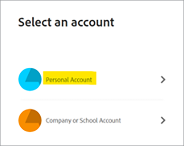

# Adobe PDF Services API 및 .Net 시작하기

개발자는 사용 가능한 모든 웹 서비스에 액세스할 수 있도록 제공되는 샘플 파일을 바로 실행할 수 있으므로 시작할 수 있습니다. 이 자습서는 PDF 서비스 .Net SDK를 사용하여 샘플 실행을 시작하는 모든 단계를 안내합니다.

## 1단계: 자격 증명 얻기 및 샘플 파일 다운로드

첫 번째 단계는 사용 잠금을 해제할 자격 증명(API 키)을 얻는 것입니다. [여기에서 무료 체험판을 등록](https://www.adobe.io/apis/documentcloud/dcsdk/gettingstarted.html)하고 &#39;시작하기&#39;를 클릭하여 새 자격 증명을 만드세요.

무료 체험판을 등록하려면 &#39;개인 계정&#39;을 선택하는 것이 중요합니다.

다음 단계에서는 PDF 서비스 API 서비스를 선택한 다음 자격 증명에 대한 이름 및 설명을 추가합니다.

&#39;개인화된 코드 샘플 만들기&#39; 확인란이 있습니다. 이 옵션을 선택하면 새 자격 증명이 샘플 파일에 자동으로 추가되어 프로젝트에 자격 증명을 추가하는 수동 단계가 저장됩니다.

그런 다음 Node.js 특정 샘플을 받을 언어로 Node.js 를 선택하고 &#39;Create Credentials&#39; 버튼을 클릭합니다.

다운로드하기 위해 로컬 파일 시스템에 저장할 수 있는 PDFToolsSDK-.NetSamples.zip 이라는 .zip 파일을 받게 됩니다.

## 2단계: .Net 환경 설정 및 샘플 코드 실행

1. [.Net SDK](https://dotnet.microsoft.com/learn/dotnet/hello-world-tutorial/install) 다운로드 및 설치
1. 다운로드한 **[!UICONTROL PDFToolsSDK-.NetSamples.zip]**&#x200B;의 압축을 풀고 내용을 압축 해제합니다
1. 샘플 루트 디렉터리 **[!UICONTROL adobe-DC.PDFTools.SDK.NET.Samales]**(으)로 cd
1. 샘플 루트 디렉터리에서 `dotnet build`을(를) 실행합니다

   C:\Temp\PDFToolsAPI\ PDFToolsSDK-.NetSamples\adobe-DC.PDFTools.SDK.NET.Samales>dotnet build

   이제 샘플 파일을 실행할 준비가 되었습니다!

   다음 최종 단계는 Word에서 PDF 만들기 작업으로 첫 번째 샘플을 실행하는 방법을 보여줍니다.

1. 샘플 루트 디렉터리에서 CreatePDFFromDocx 폴더로 디렉터리를 변경하면 CreatePDFFromDocx/

   C:\Temp\PDFToolsAPI\ PDFToolsSDK-.NetSamples\adobe-DC.PDFTools.SDK.NET.Samales>cd CreatePDFFromDocx/

1. `dotnet run CreatePDFFromDocx.csproj` 실행

   C:\Temp\PDFToolsAPI\ PDFToolsSDK-.NetSamples\adobe-DC.PDFTools.SDK.NET.Samales\CreatePDFFromDocx>dotnet run CreatePDFFromDocx.csproj

PDF은 기본적으로 동일한 폴더인 출력에서 지정된 위치에 생성됩니다.

## 마지막 생각

PDF 서비스 API는 공통 워크플로우를 자동화하고 처리 부담을 클라우드로 전환하여 수동 프로세스를 제거하는 데 도움이 됩니다. 모든 브라우저가 PDF을 다르게 취급하는 환경에서 PDF 서비스 API와 함께 Adobe PDF Embed API를 사용하면 플랫폼이나 디바이스에 관계없이 **매번**&#x200B;올바르게 실행 및 표시되는 효율적이고 안정적이며 예측 가능한 프로세스를 만들 수 있습니다.

## 리소스 및 다음 단계

* 추가 도움말 및 지원은 [[!DNL Adobe Acrobat Services] API](https://community.adobe.com/t5/document-cloud-sdk/bd-p/Document-Cloud-SDK?page=1&sort=latest_replies&filter=all) 커뮤니티 포럼을 방문하세요.

* PDF 서비스 API [설명서](https://www.adobe.com/go/pdftoolsapi_doc)

* PDF 서비스 API 질문에 대한 [FAQ](https://community.adobe.com/t5/contentarchivals/contentarchivedpage/message-uid/10726197)

* 라이선스 및 가격에 대한 질문은 [문의하기](https://www.adobe.com/go/pdftoolsapi_requestform)

* 관련 기사

  [새로운 PDF 서비스 API는 문서 작업 과정에 더 많은 기능을 제공합니다](https://community.adobe.com/t5/acrobat-services-api-discussions/new-pdf-tools-api-brings-more-capabilities-for-document-services/m-p/11294170)

  [7월 릴리스 [!DNL Adobe Acrobat Services]: PDF 포함 및 PDF 서비스](https://medium.com/adobetech/july-release-of-adobe-document-services-pdf-embed-and-pdf-tools-17211bf7776d)
