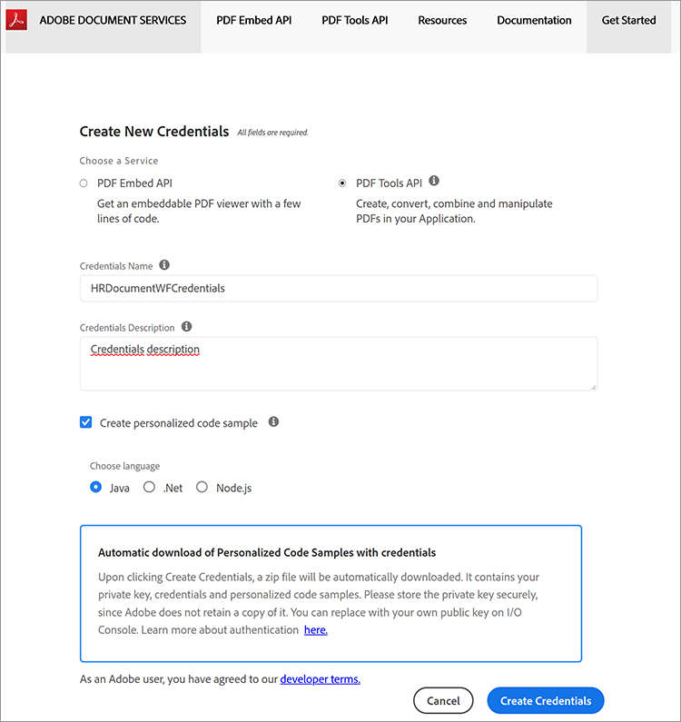
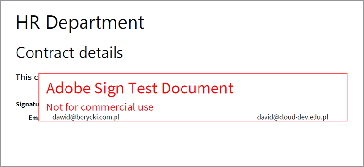

# Java의 HR 문서 워크플로우


많은 사업체들은 재택 근무 직원들에 대한 작업장 계약서처럼 새로운 고용에 관한 서류들을 필요로 한다. 기존에는 기업에서 이러한 문서를 관리 및 보관하기 어려운 형태로 물리적으로 관리했습니다. 전자 문서로 전환하는 경우 PDF 파일은 다른 파일 유형보다 안전하며 수정이 용이하기 때문에 이상적인 선택입니다. 또한 디지털 서명을 지원합니다.

## 학습 내용

이 실습용 튜토리얼에서는 간단한 Java Spring MVC 응용 프로그램에서 로그오프와 PDF을 위해 작업 공간 계약을 저장하는 웹 기반 HR 양식을 구현하는 방법에 대해 알아봅니다.

## 관련 API 및 리소스

* [PDF 서비스 API](https://opensource.adobe.com/pdftools-sdk-docs/release/latest/index.html)

* [Adobe Sign API](https://www.adobe.io/apis/documentcloud/sign.html)

* [프로젝트 코드](https://github.com/dawidborycki/adobe-sign)

## API 자격 증명 생성 중

Adobe PDF Services API 무료 체험판에 등록하여 시작합니다. [Adobe](https://www.adobe.io/apis/documentcloud/dcsdk/gettingstarted.html?ref=getStartedWithServicesSDK) [웹 사이트](https://www.adobe.io/apis/documentcloud/dcsdk/gettingstarted.html?ref=getStartedWithServicesSDK)(으)로 이동하고 *새 자격 증명 만들기*&#x200B;에서 *시작하기* 단추를 클릭합니다. 무료 체험판에서는 6개월에 걸쳐 사용할 수 있는 1,000개의 문서 트랜잭션이 제공됩니다. 다음 페이지(아래 참조)에서 서비스(PDF 서비스 API)를 선택하고 자격 증명 이름(예: HRDocumentWFCredentials)을 설정한 다음 설명을 입력합니다.

언어(이 예제의 경우 Java)를 선택하고 *개인화된 코드 샘플 만들기*&#x200B;를 선택합니다. 마지막 단계에서는 코드 샘플에 API 내에서 앱을 인증하기 위한 개인 키와 함께 사용하는 미리 채워진 pdftools-api-credentials.json 파일이 이미 포함되어 있는지 확인합니다.

마지막으로 *자격 증명 만들기* 단추를 클릭합니다. 이렇게 하면 자격 증명이 생성되고 샘플이 자동으로 다운로드를 시작합니다.



자격 증명이 작동하는지 확인하려면 다운로드한 샘플을 엽니다. IntelliJ IDEA를 사용하고 있습니다. 소스 코드를 열면 IDE(통합 개발 환경)에서 빌드 엔진을 요청합니다. 이 샘플에서는 Maven을 사용하지만 환경 설정에 따라 Gradle로 작업할 수도 있습니다.

다음으로 `mvn clean install` Maven 목표를 실행하여 jar 파일을 빌드합니다.

마지막으로 아래와 같이 CombinePDF 샘플을 실행합니다. 이 코드는 출력 폴더 내에 PDF을 생성합니다.


## Spring MVC 응용 프로그램 만들기

자격 증명이 주어지면 응용 프로그램을 만듭니다. 이 예에서는 스프링 초기화를 사용합니다.

먼저 Java 8 언어 및 Jar 패키지를 사용하도록 프로젝트 설정을 구성합니다(아래 스크린샷 참조).


둘째, Spring Web (Web에서) 및 Thymeleaf (템플릿 엔진에서)를 추가합니다.


프로젝트를 만든 후 pom.xml 파일로 이동하여 pdftools-sdk 및 log4j-slf4j-impl로 종속성 섹션을 보완합니다.

```
<dependencies>
    <dependency>
        <groupId>org.springframework.boot</groupId>
        <artifactId>spring-boot-starter-thymeleaf</artifactId>
    </dependency>
    <dependency>
        <groupId>org.springframework.boot</groupId>
        <artifactId>spring-boot-starter-web</artifactId>
    </dependency>

    <dependency>
        <groupId>org.springframework.boot</groupId>
        <artifactId>spring-boot-starter-test</artifactId>
        <scope>test</scope>
    </dependency>

</dependencies>
```

그런 다음 샘플 코드로 다운로드한 두 개의 파일로 프로젝트의 루트 폴더를 보완합니다.

* pdftools-api-credentials.json

* private.key

## 웹 양식 렌더링

웹 양식을 렌더링하려면 개인 데이터 양식을 렌더링하고 양식 게시를 처리하는 컨트롤러로 응용 프로그램을 수정하십시오. 따라서 먼저 PersonForm 모델 클래스를 사용하여 응용 프로그램을 수정합니다.

```
package com.hr.docsigning;
import javax.validation.constraints.NotNull;
import javax.validation.constraints.Size;

public class PersonForm {
    @NotNull
    @Size(min=2, max=30)
    private String firstName;

    @NotNull
    @Size(min=2, max=30)
    private String lastName;

    public String getFirstName() {
            return this.firstName;
    }


    public void setFirstName(String firstName) {
            this.firstName = firstName;
    }

    public String getLastName() {
           return this.lastName;
    }

    public void setLastName(String lastName) {
            this.lastName = lastName;
    }

    public String GetFullName() {
           return this.firstName + " " + this.lastName;
    }
}
```

이 클래스에는 두 개의 속성(`firstName` 및 `lastName`)이 있습니다. 또한 이 간단한 유효성 검사를 사용하여 2자에서 30자 사이인지 확인합니다.

모델 클래스가 지정된 경우 컨트롤러를 만들 수 있습니다(동반 코드에서 PersonController.java 참조).

```
package com.hr.docsigning;
import org.springframework.stereotype.Controller;
import org.springframework.validation.BindingResult;
import org.springframework.web.bind.annotation.GetMapping;
import org.springframework.web.bind.annotation.PostMapping;
import javax.validation.Valid;


@Controller
public class PersonController {
    @GetMapping("/")
    public String showForm(PersonForm personForm) {
        return "form";
    }
}
```

컨트롤러에는 showForm 메서드가 하나만 있습니다. resources/templates/form.html에서 HTML 템플릿을 사용하여 양식을 렌더링합니다.

```
<html>
<head>
    <link rel="stylesheet" href="https://www.w3schools.com/w3css/4/w3.css">
</head>
 
<body>
<div class="w3-container">
    <h1>HR Department</h1>
</div>
 
<form class="w3-panel w3-card-4" action="#" th:action="@{/}"
        th:object="${personForm}" method="post">
    <h2>Personal data</h2>
    <table>
        <tr>
            <td>First Name:</td>
            <td><input type="text" class="w3-input"
                placeholder="First name" th:field="*{firstName}" /></td>
            <td class="w3-text-red" th:if="${#fields.hasErrors('firstName')}"
                th:errors="*{firstName}"></td>
        </tr>
        <tr>
            <td>Last Name:</td>
            <td><input type="text" class="w3-input"
                placeholder="Last name" th:field="*{lastName}" /></td>
            <td class="w3-text-red" th:if="${#fields.hasErrors('lastName')}"
                th:errors="*{lastName}"></td>
        </tr>
        <tr>
            <td><button class="w3-button w3-black" type="submit">Submit</button></td>
        </tr>
    </table>
</form>
</body>
</html>
```

동적 콘텐츠를 렌더링하기 위해 Thymeleaf 템플릿 렌더링 엔진이 사용됩니다. 따라서 애플리케이션을 실행한 후에는 다음이 표시되어야 합니다.


## 동적 콘텐츠로 PDF 생성하기

이제 개인 데이터 양식을 렌더링한 후 선택한 필드를 동적으로 채워서 가상 계약이 포함된 PDF 문서를 생성합니다. 특히 미리 생성된 계약에 개인 데이터를 채워야 합니다.

여기에서 단순화를 위해 헤더, 하위 헤더 및 문자열 상수 읽기만 있습니다. &quot;이 계약은 \&lt;사람의 전체 이름\>&quot;에 대해 준비되었습니다.

이 목표를 달성하려면 먼저 Adobe의 [동적 HTML에서 PDF 만들기](https://opensource.adobe.com/pdftools-sdk-docs/release/latest/howtos.html#create-a-pdf-from-dynamic-html) 예제를 사용합니다. 이 샘플 코드를 분석하면 동적 HTML 필드 모집단의 과정이 다음과 같이 작동함을 알 수 있습니다.

먼저 정적 콘텐츠와 동적 콘텐츠가 포함된 HTML 페이지를 준비해야 합니다. 동적 부분은 JavaScript를 사용하여 업데이트됩니다. 즉, PDF 서비스 API는 JSON 개체를 HTML에 삽입합니다.

그런 다음 HTML 문서가 로드될 때 호출되는 JavaScript 함수를 사용하여 JSON 속성을 가져옵니다. 이 JavaScript 함수는 선택한 DOM 요소를 업데이트합니다. 다음은 개인 데이터를 보유하면서 span 요소를 채우는 예입니다(동반 코드의 src\\main\\resources\\contract\\index.html 참조).

```
<html>
<head>
    <link rel="stylesheet" href="https://www.w3schools.com/w3css/4/w3.css">
</head>
 
<body onload="updateFullName()">
    <script src="./json.js"></script>
    <script type="text/javascript">
        function updateFullName()
        {
            var document = window.document;
            document.getElementById("personFullName").innerHTML = String(
                window.json.personFullName);
        }
    </script>
 
    <div class="w3-container ">
        <h1>HR Department</h1>
 
        <h2>Contract details</h2>
 
        <p>This contract was prepared for:
            <strong><span id="personFullName"></span></strong>
        </p>
    </div>
</body>
</html>
```

그런 다음 모든 종속 JavaScript 및 CSS 파일이 포함된 HTML을 압축해야 합니다. PDF 서비스 API는 HTML 파일을 허용하지 않습니다. 대신 zip 파일을 입력해야 합니다. 이 경우, 압축 파일을 src\\main\\resources\\contract\\index.zip에 저장합니다.

그런 다음 POST 요청을 처리하는 다른 메서드로 `PersonController`을(를) 보완할 수 있습니다.

```
@PostMapping("/")
public String checkPersonInfo(@Valid PersonForm personForm,
    BindingResult bindingResult) {
    if (bindingResult.hasErrors()) {
        return "form";
    }
 
    CreateContract(personForm);
 
    return "contract-actions";
}
```

위의 방법을 사용하면 제공된 개인 데이터를 사용하여 PDF 계약을 만들고 계약 작업 보기를 렌더링합니다. 후자는 생성된 PDF에 대한 링크 및 PDF 서명을 위한 링크를 제공합니다.

이제 `CreateContract` 메서드가 작동하는 방식을 살펴보겠습니다(전체 목록은 아래에 있음). 메서드는 두 개의 필드에 의존합니다.

* `LOGGER`, log4j에서 모든 예외에 대한 정보를 디버깅합니다.

* `contractFilePath`, 생성된 PDF의 파일 경로를 포함합니다.

`CreateContract` 메서드는 자격 증명을 설정하고 HTML에서 PDF을 만듭니다. 계약에 개인 데이터를 전달하고 채우려면 `setCustomOptionsAndPersonData` 도우미를 사용하십시오. 이 방법은 양식에서 개인의 데이터를 검색한 다음 위에서 설명한 JSON 객체를 통해 생성된 PDF으로 전송합니다.

또한 `setCustomOptionsAndPersonData`에서는 머리글과 바닥글을 사용하지 않도록 설정하여 PDF 모양을 제어하는 방법을 보여 줍니다. 이러한 단계를 완료하면 PDF 파일을 output/contract.pdf에 저장하고 나중에 이전에 생성한 파일을 삭제합니다.

```
private static final Logger LOGGER = LoggerFactory.getLogger(PersonController.class);
private String contractFilePath = "output/contract.pdf"; 
private void CreateContract(PersonForm personForm) {
    try {
        // Initial setup, create credentials instance.
        Credentials credentials = Credentials.serviceAccountCredentialsBuilder()
                .fromFile("pdftools-api-credentials.json")
                .build();

        //Create an ExecutionContext using credentials 
       //and create a new operation instance.
        ExecutionContext executionContext = ExecutionContext.create(credentials);
        CreatePDFOperation htmlToPDFOperation = CreatePDFOperation.createNew();

        // Set operation input from a source file.
        FileRef source = FileRef.createFromLocalFile(
           "src/main/resources/contract/index.zip");
       htmlToPDFOperation.setInput(source);

        // Provide any custom configuration options for the operation
        // You pass person data here to dynamically fill out the HTML
        setCustomOptionsAndPersonData(htmlToPDFOperation, personForm);

        // Execute the operation.
        FileRef result = htmlToPDFOperation.execute(executionContext);

        // Save the result to the specified location. Delete previous file if exists
        File file = new File(contractFilePath);
        Files.deleteIfExists(file.toPath());

        result.saveAs(file.getPath());

    } catch (ServiceApiException | IOException | 
             SdkException | ServiceUsageException ex) {
        LOGGER.error("Exception encountered while executing operation", ex);
    }
}
 
private static void setCustomOptionsAndPersonData(
    CreatePDFOperation htmlToPDFOperation, PersonForm personForm) {
    //Set the dataToMerge field that needs to be populated 
    //in the HTML before its conversion
    JSONObject dataToMerge = new JSONObject();
    dataToMerge.put("personFullName", personForm.GetFullName());
 
    // Set the desired HTML-to-PDF conversion options.
    CreatePDFOptions htmlToPdfOptions = CreatePDFOptions.htmlOptionsBuilder()
        .includeHeaderFooter(false)
        .withDataToMerge(dataToMerge)
        .build();
    htmlToPDFOperation.setOptions(htmlToPdfOptions);
}
```

계약을 생성할 때 고정 계약 조건과 함께 동적 개인별 데이터를 병합할 수도 있습니다. 이렇게 하려면 [정적 HTML에서 PDF 만들기](https://opensource.adobe.com/pdftools-sdk-docs/release/latest/howtos.html#create-a-pdf-from-dynamic-html) 예제를 따르십시오. 또는 [두 PDF 병합](https://opensource.adobe.com/pdftools-sdk-docs/release/latest/howtos.html#create-a-pdf-from-static-html)할 수 있습니다.

## 다운로드할 PDF 파일 표시

이제 사용자가 다운로드할 수 있도록 생성된 PDF에 대한 링크를 제공할 수 있습니다. 이렇게 하려면 먼저 contract-actions.html 파일을 만듭니다(동반 코드의 resources/templates contract-actions.html 참조).

```
<html>
<head>
    <link rel="stylesheet" href="https://www.w3schools.com/w3css/4/w3.css">
</head>
 
<div class="w3-container ">
    <h1>HR Department</h1>
 
    <h2>Contract file</h2>
 
    <p>Click <a href="/pdf">here</a> to download your contract</p>
</div>
</body>
</html>
```

그런 다음 `PersonController` 클래스 내에서 다음과 같이 `downloadContract` 메서드를 구현합니다.

```
@RequestMapping("/pdf")
public void downloadContract(HttpServletResponse response)
{
    Path file = Paths.get(contractFilePath);
 
    response.setContentType("application/pdf");
    response.addHeader(
        "Content-Disposition", "attachment; filename=contract.pdf");

    try
    {
        Files.copy(file, response.getOutputStream());
        response.getOutputStream().flush();
    }
    catch (IOException ex) 
    {
        ex.printStackTrace();
    }
}
```

앱을 실행한 후에는 다음과 같은 플로우가 표시됩니다. 첫 번째 화면에 개인 데이터 양식이 표시됩니다. 테스트하려면 2자에서 30자 사이의 값으로 채웁니다.


*제출* 단추를 클릭하면 양식이 유효성을 검사하고 HTML(resources/contract/index.html)를 기반으로 PDF이 생성됩니다. 애플리케이션은 다른 뷰(계약 상세내역)를 표시하며, 여기서 사용자는 PDF을 다운로드할 수 있습니다.


웹 브라우저에서 렌더링한 PDF 모양은 다음과 같습니다. 즉, 입력한 개인 데이터가 PDF에게 전파됩니다.


## 서명 및 보안 활성화

계약이 준비되면 Adobe Sign에서 승인을 나타내는 디지털 서명을 추가할 수 있습니다. Adobe Sign 인증 은 OAuth와 조금 다르게 작동합니다. 이제 애플리케이션을 Adobe Sign과 통합하는 방법을 살펴보겠습니다. 이렇게 하려면 응용 프로그램에 대한 액세스 토큰을 준비해야 합니다. 그런 다음 Adobe Sign Java SDK를 사용하여 클라이언트 코드를 작성합니다.

인증 토큰을 얻으려면 다음 몇 가지 단계를 수행해야 합니다.

먼저 [개발자 계정](https://acrobat.adobe.com/kr/ko/sign/developer-form.html)을 등록합니다.

[Adobe Sign 포털](https://www.adobe.io/apis/documentcloud/sign/docs.html#!adobedocs/adobe-sign/master/gstarted/create_app.md)에서 CLIENT 응용 프로그램을 만듭니다.

[여기](https://www.adobe.io/apis/documentcloud/sign/docs.html#!adobedocs/adobe-sign/master/gstarted/configure_oauth.md) 및 [여기](https://secure.eu1.adobesign.com/public/static/oauthDoc.jsp)에 설명된 대로 응용 프로그램에 대한 OAuth를 구성하십시오. 클라이언트 ID와 클라이언트 시크릿을 기록합니다. 그런 다음 `https://www.google.com`을(를) 리디렉션 URI로 사용하고 다음 범위를 사용할 수 있습니다.

* user_login: self

* agreement_read: 계정

* agreement_write: account

* agreement_send: 계정

\&lt;CLIENT_ID\> 대신 클라이언트 ID를 사용하여 다음과 같이 URL을 준비합니다.

```
https://secure.eu1.adobesign.com/public/oauth?redirect_uri=https://www.google.com
&response_type=code
&client_id=<CLIENT_ID>
&scope=user_login:self+agreement_read:account+agreement_write:account+agreement_send:account
```

웹 브라우저에 위의 URL을 입력합니다. google.com으로 리디렉션되고 코드는 주소 표시줄에 code=\&lt;YOUR_CODE\>로 표시됩니다.
예:

```
https://www.google.com/?code=<YOUR_CODE>&api_access_point=https://api.eu1.adobesign.com/&web_access_point=https://secure.eu1.adobesign.com%2F
```

\&lt;YOUR_CODE\> 및 api_access_point에 지정된 값을 확인합니다.

액세스 토큰을 제공하는 HTTP POST 요청을 보내려면 클라이언트 ID, \&lt;YOUR_CODE\> 및 api_access_point 값을 사용합니다. [Postman](https://helpx.adobe.com/sign/kb/how-to-create-access-token-using-postman-adobe-sign.html) 또는 cURL을 사용할 수 있습니다.

```
curl --location --request POST "https://**api.eu1.adobesign.com**/oauth/token"
\\

\--data-urlencode "client_secret=**\<CLIENT_SECRET\>**" \\

\--data-urlencode "client_id=**\<CLIENT_ID\>**" \\

\--data-urlencode "code=**\<YOUR_CODE\>**" \\

\--data-urlencode "redirect_uri=**https://www.google.com**" \\

\--data-urlencode "grant_type=authorization_code"
```

샘플 응답은 다음과 같습니다.

```
{
    "access_token":"3AAABLblqZhByhLuqlb-…",
    "refresh_token":"3AAABLblqZhC_nJCT7n…",
    "token_type":"Bearer",
    "expires_in":3600
}
```

access_token을 메모합니다. 클라이언트 코드를 승인하려면 필요합니다.

## Adobe Sign Java SDK 사용

액세스 토큰이 준비되면 REST API 호출을 Adobe Sign으로 전송할 수 있습니다. 이 프로세스를 단순화하려면 Adobe Sign Java SDK를 사용합니다. 소스 코드는 [Adobe GitHub 저장소](https://github.com/adobe-sign/AdobeSignJavaSdk)에서 사용할 수 있습니다.

이 패키지를 애플리케이션과 통합하려면 코드를 복제해야 합니다. 그런 다음 Maven 패키지(mvn 패키지)를 만들고 프로젝트에 다음 파일을 설치합니다(adobe-sign-sdk 폴더의 컴패니언 코드에서 찾을 수 있음).

* target/swagger-java-client-1.0.0.jar

* target/lib/gson-2.8.1.jar

* target/lib/gson-fire-1.8.0.jar

* target/lib/hamcrest-core-1.3.jar

* target/lib/junit-4.12.jar

* target/lib/logging-interceptor-2.7.5.jar

* target/lib/okhttp-2.7.5.jar

* target/lib/okio-1.6.0.jar

* target/lib/swagger-annotations-1.5.15.jar

IntelliJ IDEA에서는 *프로젝트 구조*(파일/프로젝트 구조)를 사용하여 해당 파일을 종속성으로 추가할 수 있습니다.

## 서명을 위해 PDF 보내기

서명을 위해 계약을 전송할 준비가 되었습니다. 이렇게 하려면 먼저 보내기 요청에 대한 다른 하이퍼링크로 contract-details.html을 보완합니다.

```
<html>
<head>
    <link rel="stylesheet" href="https://www.w3schools.com/w3css/4/w3.css">
</head>
 
<div class="w3-container ">
    <h1>HR Department</h1>
 
    <h2>Contract file</h2>
 
    <p>Click <a href="/pdf"> here</a> to download your contract</p>
 
    
</div>
</body>
</html>
```

그런 다음 `sendContractMethod`을(를) 구현하는 다른 컨트롤러 `AdobeSignController`을(를) 추가합니다(동반 코드 참조). 이 방법은 다음과 같이 작동합니다.

먼저 `ApiClient`을(를) 사용하여 API 끝점을 가져옵니다.

```
ApiClient apiClient = new ApiClient();

//Default baseUrl to make GET /baseUris API call.
String baseUrl = "https://api.echosign.com/";
String endpointUrl = "/api/rest/v6";
apiClient.setBasePath(baseUrl + endpointUrl);

// Provide an OAuth Access Token as "Bearer access token" in authorization
String authorization = "Bearer ";

// Get the baseUris for the user and set it in apiClient.
BaseUrisApi baseUrisApi = new BaseUrisApi(apiClient);
BaseUriInfo baseUriInfo = baseUrisApi.getBaseUris(authorization);
apiClient.setBasePath(baseUriInfo.getApiAccessPoint() + endpointUrl);
```

그런 다음 이 방법은 contract.pdf 파일을 사용하여 임시 문서를 만듭니다.

```
// Get PDF file
String filePath = "output/";
String fileName = "contract.pdf";
File file = new File(filePath + fileName);
String mimeType = "application/pdf";
 
//Get the id of the transient document.
TransientDocumentsApi transientDocumentsApi =
    new TransientDocumentsApi(apiClient);
TransientDocumentResponse response = transientDocumentsApi.createTransientDocument(authorization,
    file, null, null, fileName, mimeType);
String transientDocumentId = response.getTransientDocumentId();
```

그런 다음 계약을 만들어야 합니다. 이렇게 하려면 contract.pdf 파일을 사용하고 계약 상태를 IN_PROCESS로 설정하여 파일을 즉시 보냅니다. 또한 전자 서명을 선택합니다.

```
// Create AgreementCreationInfo
AgreementCreationInfo agreementCreationInfo = new AgreementCreationInfo();
 
// Add file
FileInfo fileInfo = new FileInfo();
fileInfo.setTransientDocumentId(transientDocumentId);
agreementCreationInfo.addFileInfosItem(fileInfo);
 
// Set state to IN_PROCESS, so the agreement is be sent immediately
agreementCreationInfo.setState(AgreementCreationInfo.StateEnum.IN_PROCESS);
agreementCreationInfo.setName("Contract");
agreementCreationInfo.setSignatureType(AgreementCreationInfo.SignatureTypeEnum.ESIGN);
```

다음으로, 다음과 같이 계약 수신자를 추가합니다. 여기에 두 명의 수신자를 추가합니다(직원 및 관리자 섹션 참조).

```
// Provide emails of recipients to whom agreement is be sent
// Employee
ParticipantSetInfo participantSetInfo = new ParticipantSetInfo();
ParticipantSetMemberInfo participantSetMemberInfo = new ParticipantSetMemberInfo();
participantSetMemberInfo.setEmail("");
participantSetInfo.addMemberInfosItem(participantSetMemberInfo);
participantSetInfo.setOrder(1);
participantSetInfo.setRole(ParticipantSetInfo.RoleEnum.SIGNER);
agreementCreationInfo.addParticipantSetsInfoItem(participantSetInfo);
 
// Manager
participantSetInfo = new ParticipantSetInfo();
participantSetMemberInfo = new ParticipantSetMemberInfo();
participantSetMemberInfo.setEmail("");
participantSetInfo.addMemberInfosItem(participantSetMemberInfo);
participantSetInfo.setOrder(2);
participantSetInfo.setRole(ParticipantSetInfo.RoleEnum.SIGNER);
agreementCreationInfo.addParticipantSetsInfoItem(participantSetInfo);
```

마지막으로 Adobe Sign Java SDK에서 `createAgreement` 메서드를 사용하여 계약을 전송합니다.

```
// Create agreement using the transient document.
AgreementsApi agreementsApi = new AgreementsApi(apiClient);
AgreementCreationResponse agreementCreationResponse = agreementsApi.createAgreement(
    authorization, agreementCreationInfo, null, null);
 
System.out.println("Agreement sent, ID: " + agreementCreationResponse.getId());
```

이 코드를 실행하면 계약 서명 요청과 함께 `<email_address>)`(으)로 코드에 지정된 주소로 전자 메일이 전송됩니다. 이 전자 메일에는 수신자를 Adobe Sign 포털로 보내 서명을 수행하도록 하는 하이퍼링크가 포함되어 있습니다. Adobe Sign 개발자 포털에서 문서(아래 그림 참조)를 볼 수 있으며 [getAgreementInfo](https://github.com/adobe-sign/AdobeSignJavaSdk/blob/master/docs/AgreementsApi.md#getAgreementInfo) 메서드를 사용하여 서명 프로세스를 프로그래밍 방식으로 추적할 수도 있습니다.

마지막으로, 다음 [예](https://github.com/adobe/pdfservices-java-sdk-samples/tree/master/src/main/java/com/adobe/pdfservices/operation/samples/protectpdf)에 표시된 것처럼 PDF 서비스 API를 사용하여 PDF을 암호로 보호할 수도 있습니다.



## 다음 단계

보시다시피 퀵 스타트를 활용하면 간단한 웹 양식을 구현하여 Adobe PDF Services API로 Java에서 승인된 PDF을 만들 수 있습니다. Adobe PDF API는 기존 클라이언트 애플리케이션에 원활하게 통합됩니다.

예를 들어 수신자가 원격으로 안전하게 서명할 수 있는 양식을 만들 수 있습니다. 여러 개의 서명이 필요한 경우 워크플로우에서 일련의 사용자에게 양식을 자동으로 라우팅할 수도 있습니다. 직원 온보딩 경험이 개선되어 인사부에서 여러분을 사랑할 것입니다.

[[!DNL Adobe Acrobat Services]](https://www.adobe.io/apis/documentcloud/dcsdk/)을(를) 확인하여 지금 응용 프로그램에 많은 PDF 기능을 추가하세요.
