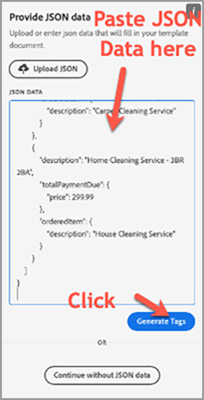

# 영업 프로세스 가속화


백서에서 계약 및 계약에 이르기까지 구매 과정 동안 수많은 문서가 필요합니다. 이 튜토리얼에서는 [[!DNL Adobe Acrobat Services]](https://developer.adobe.com/document-services/)이(가) 이 여정 동안 문서 경험을 통합하여 판매를 가속화하는 방법에 대해 알아봅니다.

## 데이터에서 계약 및 판매 주문 생성

판매 계약서, 계약서 및 기타 문서는 특정 기준에 따라 크게 달라질 수 있습니다. 예를 들어 판매 계약에는 특정 국가 또는 주에 있거나 특정 제품을 계약의 일부로 포함하는 등 고유한 기준에 따라 특정 약관만 포함될 수 있습니다. 이러한 문서를 수동으로 만들거나 다양한 템플릿 변형을 유지하면 변경 내용을 수동으로 검토하는 데 드는 법적 비용이 크게 증가할 수 있습니다.

[Adobe 문서 생성 API](https://developer.adobe.com/document-services/apis/doc-generation/)를 사용하면 CRM 또는 기타 데이터 시스템에서 데이터를 가져와 해당 데이터를 기반으로 판매 문서를 동적으로 생성할 수 있습니다.

## 자격 증명 가져오기

무료 Adobe PDF Services 자격 증명을 등록하여 시작합니다.

1. 자격 증명을 등록하려면 [여기](https://documentcloud.adobe.com/dc-integration-creation-app-cdn/main.html)로 이동하세요.
1. Adobe ID을 사용하여 로그인합니다.
1. 자격 증명 이름을 설정합니다(예: 판매 계약 데모).

   

1. 샘플 코드를 다운로드할 언어를 선택합니다(예: Node.js).
1. **[!UICONTROL 개발자 약관]**&#x200B;에 동의하려면 선택하세요.
1. **[!UICONTROL 자격 증명 만들기]**&#x200B;를 선택합니다.
샘플 파일, pdfservices-api-credentials.json 및 인증을 위한 private.key가 포함된 ZIP 파일로 파일이 컴퓨터에 다운로드됩니다.

   

1. **[!UICONTROL Microsoft Word 추가 기능 받기]**&#x200B;를 선택하거나 [AppSource](https://appsource.microsoft.com/en-cy/product/office/WA200002654)&#x200B;(으)로 이동하여 설치하십시오.

   >[!NOTE]
   >
   >Word 추가 기능을 설치하려면 Microsoft 365 내에 추가 기능을 설치할 수 있는 권한이 있어야 합니다. 권한이 없는 경우 Microsoft 365 관리자에게 문의하십시오.

## 내 데이터

특정 데이터 시스템에서 데이터를 가져오는 경우 해당 데이터를 JSON 데이터로 출력하거나 고유한 스키마를 생성해야 합니다. 이 시나리오에서는 다음과 같이 미리 생성된 샘플 데이터 세트를 사용합니다.

```
{
    "salesOrder": {
        "comment": "Make sure to call 555-555-1234 when you arrive. The front door is broken."
    },
    "company": {
        "name":"Home Services Co.",
        "address": {
            "city": "Homestead",
            "state": "NY",
            "zip": "14623",
            "streetAddress": "123 Demohome Street"
        }
    },
    "customer": {
        "address": {
            "city": "Seattle",
            "state": "WA",
            "zip": "98052",
            "streetAddress": "20341 Whitworth Institute 405 N. Whitworth"
        },
        "email": "mailto:jane-doe@xyz.edu",
        "jobTitle": "Professor",
        "name": "Jane Doe",
        "telephone": "(425) 123-4567",
        "url": "http://www.janedoe.com"
    },
    "tax": {
        "state":"WA",
        "rate": 0.08
    },
    "referencesOrder": [
        {
            "description": "Carpet Cleaning Service - 3BR 2BA",
            "totalPaymentDue": {
                "price": 359.54
            },
            "orderedItem": {
                "description": "Carpet Cleaning Service"
            }
        },
        {
            "description": "Home Cleaning Service - 3BR 2BA",
            "totalPaymentDue": {
                "price": 299.99
            },
            "orderedItem": {
                "description": "House Cleaning Service"
            }
        }
    ]
}
```

## 문서에 기본 태그 추가

이 시나리오에서는 [여기](https://github.com/benvanderberg/adobe-document-generation-samples/blob/main/SalesOrder/Exercise/SalesOrder_Base.docx?raw=true)에서 다운로드할 수 있는 판매 주문 문서를 사용합니다.


1. Microsoft Word에서 *SalesOrder.docx* 샘플 문서를 엽니다.
1. 문서 생성 플러그인이 설치된 경우 리본에서 **[!UICONTROL 문서 생성]**&#x200B;을 선택합니다. 리본에 [문서 생성]이 표시되지 않는 경우에는 다음 지침을 따르십시오.
1. **[!UICONTROL 시작하기]**&#x200B;를 선택합니다.
1. 위에 작성된 JSON 예제 데이터를 *JSON 데이터* 필드에 복사합니다.

   

그런 다음 [문서 생성 태그] 패널로 이동하여 문서에 태그를 배치합니다.

1. 바꿀 텍스트를 선택합니다(예: *회사 이름*).
1. *문서 생성 Tagger* 패널에서 &quot;name&quot;을(를) 검색합니다.
1. 태그 목록에서 company(회사) 아래에 있는 name(이름)을 선택합니다.
1. **[!UICONTROL 텍스트 삽입]**&#x200B;을 선택합니다.

   

   태그가 JSON의 경로 아래에 있으므로 이 프로세스는 `{{company.name}}`이라는 태그를 배치합니다.

   ```
   {
   …
   "company": {
       "name":"Home Services Co.",
       …
   },
   …
   }
   ```

번지 주소, 도시, 주, 우편 번호 등과 같은 문서의 추가 태그에 대해 이 작업을 반복합니다.

## 생성된 문서 미리 보기

Microsoft Word에서 바로 샘플 JSON 데이터를 기반으로 생성된 문서를 미리 볼 수 있습니다.

1. *문서 생성 Tagger* 패널에서 **[!UICONTROL 문서 생성]**&#x200B;을 선택합니다. 처음으로 Adobe ID으로 로그인하라는 메시지가 표시될 수 있습니다. **[!UICONTROL 로그인]**&#x200B;을 선택하고 자격 증명으로 로그인하라는 메시지를 완료합니다.

   

1. **[!UICONTROL 문서 보기]**&#x200B;를 선택합니다.

   

1. 문서 결과를 미리 볼 수 있는 브라우저 창이 열립니다.

   

원본 샘플 데이터의 데이터로 대체된 문서의 태그를 확인할 수 있습니다.


## 템플릿에 테이블 추가

다음 시나리오에서는 제품 목록을 문서의 표에 추가합니다.

1. 테이블을 배치해야 하는 위치에 커서를 삽입합니다.
1. *문서 생성 Tagger* 패널에서 **[!UICONTROL 고급]**&#x200B;을 선택합니다.
1. **[!UICONTROL 테이블 및 목록]**&#x200B;을 확장합니다.
1. *테이블 레코드* 필드에서 모든 제품 항목을 나열하는 배열인 *referencesOrder*&#x200B;을(를) 선택합니다.
1. 열 레코드 선택 필드에 *설명* 및 *totalPaymentDue.price* 필드를 포함하도록 입력합니다.
1. **[!UICONTROL 표 삽입]**&#x200B;을 선택합니다.

   

Microsoft Word의 다른 테이블과 마찬가지로 스타일, 크기 및 기타 매개 변수에 맞게 테이블을 편집합니다.

## 숫자 계산 추가

숫자 계산을 사용하면 배열과 같은 데이터 모음을 기반으로 합계 및 기타 계산을 계산할 수 있습니다. 이 시나리오에서는 소계를 계산할 필드를 추가합니다.

1. 소계 제목 옆의 *$0.00*&#x200B;을(를) 선택합니다.
1. *[!UICONTROL 문서 생성 Tagger]* 패널에서 **[!UICONTROL 숫자 계산]**&#x200B;을 확장합니다.
1. *[!UICONTROL 계산 유형 선택]*&#x200B;에서 **[!UICONTROL 집계]**&#x200B;를 선택합니다.
1. *[!UICONTROL 유형 선택]*&#x200B;에서 **[!UICONTROL 합계]**&#x200B;를 선택합니다.
1. *[!UICONTROL 레코드 선택]*&#x200B;에서 **[!UICONTROL ReferencesOrder]**&#x200B;를 선택합니다.
1. *[!UICONTROL 집계를 수행할 항목 선택]&#x200B;**에서 &#x200B;** [!UICONTROL totalPaymentsDue.price]**&#x200B;를 선택합니다.
1. **[!UICONTROL 계산 삽입]**&#x200B;을 선택합니다.

이 프로세스에는 값의 합계를 제공하는 계산 태그가 삽입됩니다. JSONata 계산을 사용하여 더 많은 고급 계산을 수행할 수 있습니다. 예를 들면 다음과 같습니다.

* 소계: `${{expr($sum(referencesOrder.totalPaymentDue.price))}}`
referencesOrder.totalPaymentDue.price의 합계를 계산합니다.

* 판매세: `${{expr($sum(referencesOrder.totalPaymentDue.price)*0.08)}}`
가격을 계산하고 8%를 곱하여 세금을 계산합니다.

* 총 기한: `${{expr($sum(referencesOrder.totalPaymentDue.price)*1.08)}}`
가격과 배수를 1.08로 계산하여 소계 + 세금을 계산합니다.

## 조건부 용어 추가

조건부 섹션에서는 특정 조건이 충족되는 경우 문장이나 단락만 포함할 수 있습니다. 이 시나리오에서는 특정 상태와 일치하는 섹션만 포함됩니다.

1. 문서에서 *캘리포니아 개인정보취급방침*&#x200B;이라는 섹션을 찾습니다.
1. 커서가 있는 섹션을 선택합니다.

   

1. *[!UICONTROL 문서 생성 Tagger]*&#x200B;에서 **[!UICONTROL 고급]**&#x200B;을 선택합니다.
1. **[!UICONTROL 조건부 콘텐츠]**&#x200B;를 확장합니다.
1. *[!UICONTROL 레코드 선택]* 필드에서 **[!UICONTROL customer.address.state]**&#x200B;를 검색하고 선택합니다.
1. *[!UICONTROL 연산자 선택]* 필드에서 **=**&#x200B;을(를) 선택합니다.
1. *[!UICONTROL 값 필드]*&#x200B;에 *CA*&#x200B;을(를) 입력합니다.
1. **[!UICONTROL 조건 삽입]**&#x200B;을 선택합니다.

California 섹션은 customer.address.state = CA인 경우에만 생성된 문서에 나타납니다.

그런 다음 WASHINGTON PRIVACY STATEMENTS 섹션을 선택하고 위의 단계를 반복하여 값 CA를 WA로 바꿉니다.

## 동적 이미지 추가

문서 생성 API를 사용하면 데이터에서 동적으로 이미지를 삽입할 수 있습니다. 이는 다양한 하위 브랜드가 있고 로고, 인물 이미지 또는 이미지를 변경하여 특정 산업과 더욱 관련성 있게 만들려는 경우 유용합니다.

이미지는 데이터 또는 base64 콘텐츠의 URL로 전달될 수 있습니다. 이 예제에서는 URL을 사용합니다.

1. 이미지를 포함할 위치에 커서를 놓습니다.
1. *[!UICONTROL 문서 생성 Tagger]* 패널에서 **[!UICONTROL 고급]**&#x200B;을 선택합니다.
1. **[!UICONTROL 이미지]**&#x200B;를 확장합니다.
1. *[!UICONTROL 태그 선택]* 필드에서 **[!UICONTROL 로고]**&#x200B;를 선택합니다.
1. *[!UICONTROL 선택적 대체 텍스트]* 필드에 설명(예: 로고)을 입력합니다. 이 프로세스는 다음과 같은 이미지 자리 표시자를 삽입합니다.

   

하지만 레이아웃에 이미 있는 이미지에 대해 이미지를 동적으로 설정하고자 한다면 다음과 같은 방법으로 작업을 수행할 수 있습니다.

1. 삽입된 자리 표시자 이미지를 마우스 오른쪽 버튼으로 클릭합니다.

   

1. **[!UICONTROL 대체 텍스트 편집]**&#x200B;을 선택합니다.
1. 패널에서 다음과 같은 텍스트를 복사합니다.
   `{ "location-path": "logo", "image-props": { "alt-text": "Logo" }}`
1. 문서에서 동적으로 만들 다른 이미지를 선택합니다.

   

1. 이미지를 마우스 오른쪽 단추로 클릭하고 **[!UICONTROL 대체 텍스트 편집]**&#x200B;을 선택합니다.
1. 패널에 값을 붙여넣습니다.

이 프로세스는 이미지를 데이터의 로고 변수에 있는 이미지로 바꿉니다.

## Acrobat Sign용 태그 추가

Adobe Acrobat Sign을 사용하면 문서에 전자 서명을 캡처할 수 있습니다. Acrobat Sign에서는 필드를 웹 인터페이스에 끌어다 놓을 수 있는 간편한 방법을 제공하지만 텍스트 태그를 사용하여 서명 및 기타 필드 배치를 제어할 수도 있습니다. Adobe 문서 생성 Tagger를 사용하면 이러한 텍스트 태그 필드를 쉽게 배치할 수 있습니다.

1. 샘플 문서에서 서명이 필요한 위치로 이동합니다.
1. 서명이 필요한 위치에 커서를 삽입합니다.
1. *[!UICONTROL Adobe 문서 생성 Tagger]* 패널에서 **[!UICONTROL Adobe Sign]**&#x200B;을(를) 선택합니다.
1. *[!UICONTROL 수신자 수 지정]* 필드에서 수신자 수를 설정합니다(이 예에서는 1임).
1. *[!UICONTROL 수신자]* 필드에서 **[!UICONTROL 서명자-1]**&#x200B;을(를) 선택합니다.
1. *[!UICONTROL 필드]* 유형에서 **[!UICONTROL 서명]**&#x200B;을 선택합니다.
1. **[!UICONTROL Adobe Sign 텍스트 태그 삽입]**&#x200B;을 선택합니다.

문서에 태그 삽입


Acrobat Sign은 날짜 필드와 같이 배치할 수 있는 여러 유형의 필드를 제공합니다.

1. *필드* 유형에서 **[!UICONTROL 날짜]**&#x200B;를 선택합니다.
1. 커서를 문서의 날짜 위치 위로 이동합니다.
1. **[!UICONTROL Adobe Sign 텍스트 태그 삽입]**&#x200B;을 선택합니다.


## 계약 생성

이제 문서에 태그를 지정했으며 이동할 준비가 되었습니다. 다음 섹션에서는 Node.js에 대해 Document Generation API 샘플을 사용하여 문서를 생성하는 방법을 살펴보지만, 이 방법은 모든 언어에서 작동합니다.

자격 증명을 등록할 때 다운로드된 pdfservices-node-sdk-samples-master를 엽니다. pdfservices-api-credentials.json 및 private.key 파일이 이 파일에 포함되어야 합니다.

1. Npm 설치를 사용하여 종속성을 설치하려면 터미널 을 엽니다.
1. sample data.json을 resources 폴더에 복사합니다.
1. Word 템플릿을 resources 폴더에 복사합니다.
1. generate-salesOrder.js라는 샘플 폴더의 루트 디렉터리에 새 파일을 만듭니다.

```
const PDFServicesSdk = require('@adobe/pdfservices-node-sdk');
const fs = require('fs');
const path = require('path');

var dataFileName = path.join('resources', '<INSERT JSON FILE');
var outputFileName = path.join('output', 'salesOrder_'+Date.now()+".pdf");
var inputFileName = path.join('resources', '<INSERT DOCX>');

//Loads credentials from the file that you created.
const credentials =  PDFServicesSdk.Credentials
    .serviceAccountCredentialsBuilder()
    .fromFile("pdfservices-api-credentials.json")
    .build();

// Setup input data for the document merge process
const jsonString = fs.readFileSync(dataFileName),
jsonDataForMerge = JSON.parse(jsonString);

// Create an ExecutionContext using credentials
const executionContext = PDFServicesSdk.ExecutionContext.create(credentials);

// Create a new DocumentMerge options instance
const documentMerge = PDFServicesSdk.DocumentMerge,
documentMergeOptions = documentMerge.options,
options = new documentMergeOptions.DocumentMergeOptions(jsonDataForMerge, documentMergeOptions.OutputFormat.PDF);

// Create a new operation instance using the options instance
const documentMergeOperation = documentMerge.Operation.createNew(options)

// Set operation input document template from a source file.
const input = PDFServicesSdk.FileRef.createFromLocalFile(inputFileName);
documentMergeOperation.setInput(input);

// Execute the operation and Save the result to the specified location.
documentMergeOperation.execute(executionContext)
.then(result => result.saveAsFile(outputFileName))
.catch(err => {
    if(err instanceof PDFServicesSdk.Error.ServiceApiError
        || err instanceof PDFServicesSdk.Error.ServiceUsageError) {
        console.log('Exception encountered while executing operation', err);
    } else {
        console.log('Exception encountered while executing operation', err);
    }
});
```

1. `<INSERT JSON FILE>`을(를) /resources의 JSON 파일 이름으로 바꿉니다.
1. `<INSERT DOCX>`을(를) DOCX 파일의 이름으로 바꿉니다.
1. 실행하려면 터미널을 사용하여 generate-salesOrder.js 노드를 실행합니다.

출력 파일은 문서가 올바르게 생성된 /output 폴더에 있어야 합니다.

## 기타 옵션

문서가 생성되면 다음과 같은 추가 작업을 수행할 수 있습니다.

* 암호로 문서 보안
* 큰 이미지가 있는 경우 PDF 압축
* 문서에 전자 서명 캡처

사용 가능한 다른 작업에 대해 자세히 알아보려면 샘플 파일의 /src 폴더에 있는 스크립트를 참조하십시오. 또한 다양한 동작의 문서를 검토하여 더 자세히 알아볼 수 있습니다.

## 추가 사용 사례

[!DNL Adobe Acrobat Services]을(를) 사용하면 디지털 문서 워크플로우를 통해 판매 주기의 많은 부분을 간소화할 수 있습니다.

* Adobe PDF Embed API 를 사용하여 웹 사이트에 백서 및 기타 콘텐츠를 포함하는 동시에 시청률에 대한 분석을 측정하고 수집할 수 있습니다
* Acrobat Sign을 사용하여 생성된 계약에서 전자 서명을 캡처합니다
* Adobe PDF Extract API를 사용하여 PDF 문서에서 계약 데이터 추출

## 추가 학습

더 자세히 알아보고 싶으신가요? [!DNL Adobe Acrobat Services]을(를) 사용하는 몇 가지 추가 방법을 살펴보십시오.

* [설명서](https://developer.adobe.com/document-services/docs/overview/)에서 자세히 알아보기
* Adobe Experience League에서 더 많은 튜토리얼 보기
* /src 폴더의 샘플 스크립트를 사용하여 PDF 활용 방법을 확인하십시오
* 최신 팁과 요령을 보려면 [Adobe 기술 블로그](https://medium.com/adobetech/tagged/adobe-document-cloud)를 팔로우하세요.
* [종이 클립(월간 라이브 스트림)](https://www.youtube.com/playlist?list=PLcVEYUqU7VRe4sT-Bf8flvRz1XXUyGmtF)을 구독하여 [!DNL Adobe Acrobat Services] 사용 자동화에 대해 알아보십시오.
=======
* [설명서](https://developer.adobe.com/document-services/docs/overview/)에서 자세히 알아보기
* Adobe Experience League에서 더 많은 튜토리얼 보기
* /src 폴더의 샘플 스크립트를 사용하여 PDF 활용 방법을 확인하십시오
* 최신 팁과 요령을 보려면 [Adobe 기술 블로그](https://medium.com/adobetech/tagged/adobe-document-cloud)를 팔로우하세요.
* [종이 클립(월간 라이브 스트림)](https://www.youtube.com/playlist?list=PLcVEYUqU7VRe4sT-Bf8flvRz1XXUyGmtF)을 구독하여 [!DNL Adobe Acrobat Services] 사용 자동화에 대해 알아보세요.
