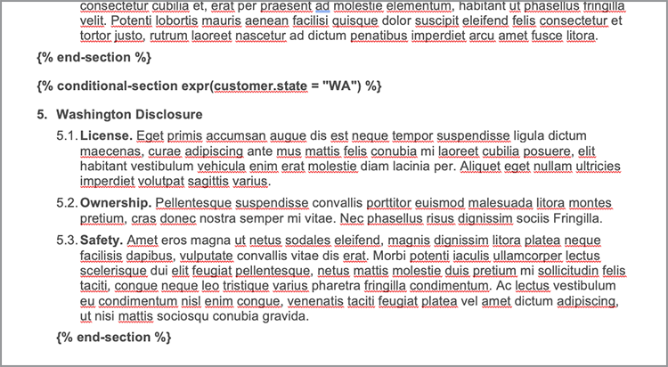
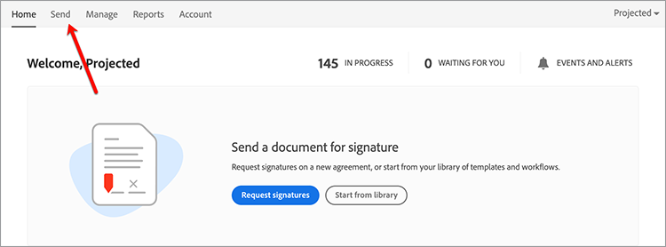

# 법적 작업 과정 자동화


이상적인 시나리오에서는 계약 조건이 수정 없이 수락됩니다. 그러나 종종 계약을 사용자 정의해야 하며, 사용자 정의의 경우 법적 검토가 필요합니다. 법적 검토는 상당한 비용을 발생시키고 계약 조건 전달 프로세스를 늦춥니다. 승인된 언어에 따라 변경되는 사전 정의된 템플릿을 사용하면 법무 팀이 계약 약관을 관리하고 보다 안전하게 실행하는 데 도움이 됩니다.

이 튜토리얼에서는 주마다 다른 법적 계약을 사용합니다. 이러한 변형을 처리하기 위해 특정 기준이 충족될 때만 포함되는 조건부 섹션이 있는 계약 템플릿이 만들어집니다. 생성된 문서는 Word 또는 PDF 문서일 수 있습니다. Adobe PDF Services API 또는 Acrobat Sign을 사용하여 문서를 보호하는 몇 가지 방법도 살펴볼 수 있습니다.

## 자격 증명 가져오기

무료 Adobe PDF Services 자격 증명을 등록하여 시작합니다.

1. 자격 증명을 등록하려면 [여기](https://documentcloud.adobe.com/dc-integration-creation-app-cdn/main.html)로 이동하세요.
1. Adobe ID을 사용하여 로그인합니다.
1. 자격 증명 이름을 설정합니다.

   

1. 샘플 코드를 다운로드할 언어를 선택합니다(예: Node.js).
1. **[!UICONTROL 개발자 약관]**&#x200B;에 동의하려면 선택하세요.
1. **[!UICONTROL 자격 증명 만들기]**를 선택합니다.
샘플 파일, pdfservices-api-credentials.json 및 인증을 위한 private.key가 포함된 ZIP 파일로 파일이 컴퓨터에 다운로드됩니다.

   

1. **[!UICONTROL Microsoft Word 추가 기능 받기]**&#x200B;를 선택하거나 [AppSource](https://appsource.microsoft.com/en-cy/product/office/WA200002654)(으)로 이동하여 설치하십시오.

   >[!NOTE]
   >
   >Word 추가 기능을 설치하려면 Microsoft 365 내에 추가 기능을 설치할 수 있는 권한이 있어야 합니다. 권한이 없는 경우 Microsoft 365 관리자에게 문의하십시오.

## 내 데이터

이 시나리오에서는 문서를 생성하고 특정 섹션이 포함되는지 여부를 알리는 데 도움이 되는 정보가 전달됩니다.

```
{
    "customer": {
        "name": "Home Services Company",
        "street": "123 Any Street",
        "city": "Anywhere",
        "state": "CA",
        "zip": "12345",
        "country":"USA",
        "signer": {
            "email": "johnnyechostone@gmail.com",
            "firstName": "John",
            "lastName": "Echostone"
        }
    },
    "company": {
        "name": "Projected Consultants",
        "signer": {
            "email": "maryburostone@gmail.com",
            "firstName": "Mary",
            "lastName": "Burostone"
        }
    },
    "conditions": {
        "includeGeneralTerms": true,
        "includeConsumerDiscloure": true
    }
}
```

데이터에는 고객, 고객의 이름, 서명 주체, 고객이 속한 상태 등에 대한 정보가 있습니다. 또한 계약을 생성하는 회사에 대한 정보 섹션과 계약의 특정 섹션을 포함하는 데 사용되는 조건 플래그가 있습니다.

## 문서에 기본 태그 추가

이 시나리오에서는 [여기](https://github.com/benvanderberg/adobe-document-generation-samples/blob/main/Agreement/exercise/TermsAndConditions_Sample.docx?raw=true)에서 다운로드할 수 있는 약관 문서를 사용합니다.


1. Microsoft Word에서 *TermsAndConditions.docx* 샘플 문서를 엽니다.
1. [문서 생성](https://appsource.microsoft.com/en-cy/product/office/WA200002654) 플러그인이 설치된 경우 리본에서 **[!UICONTROL 문서 생성]**&#x200B;을 선택합니다. 리본에 [문서 생성]이 표시되지 않는 경우에는 다음 지침을 따르십시오.
1. **[!UICONTROL 시작하기]**&#x200B;를 선택합니다.
1. 위에 작성된 JSON 예제 데이터를 JSON 데이터 필드에 복사합니다.

   

*문서 생성 태그* 패널로 이동하여 문서에 태그를 배치합니다.

## 회사 이름 삽입

1. 바꿀 텍스트를 선택합니다. 이 시나리오에서는 문서의 열기 섹션에 있는 회사를 교체합니다.
1. *문서 생성 Tagger*&#x200B;에서 &quot;name&quot;을(를) 검색합니다.
1. 회사에서 *이름*&#x200B;을(를) 선택합니다.

   문서 생성 Tagger에서 이름을 검색하는 

1. **[!UICONTROL 텍스트 삽입]**&#x200B;을 선택합니다.

태그가 JSON의 해당 경로 아래에 있으므로 `{{company.name}}`이라는 태그가 배치됩니다.

```
{
    "company": {
        "name": "Projected Consultants",
        ...
    }
    ...
}
```

그런 다음 CUSTOMER 텍스트의 열기 섹션에서 이 단계를 반복합니다. **단계 1-4**&#x200B;를 반복하여 CUSTOMER를 고객 아래의 &#39;이름&#39;으로 바꿉니다. 출력은 `{{customer.name}}`이어야 하며 텍스트가 고객 개체 아래에서 나온다는 것을 나타냅니다.

Adobe 문서 생성 API를 사용하면 머리글과 바닥글 및 서명 제목이 이동해야 하는 맨 마지막 부분에 태그를 포함할 수도 있습니다.

바닥글에 있는 회사 및 고객 텍스트에 대해 **단계 1-4**&#x200B;로 이 프로세스를 다시 반복합니다.


마지막으로 **1~4**&#x200B;단계를 반복하여 서명 페이지의 고객 섹션 아래에 있는 이름과 성을 각각 `{{customer.signer.firstName}}` 및 `{{customer.signer.lastName}}`에 대한 태그로 바꾸어야 합니다. 문서가 생성될 때 태그가 바뀌기 때문에 태그가 길고 다음 줄로 리플로우되어도 걱정하지 마십시오.

문서의 시작 부분과 바닥글은 다음과 같이 표시됩니다.

* 시작 섹션:


* 바닥글:


* 서명 페이지:


이제 태그가 문서에 배치되었으므로 생성된 계약을 미리 볼 수 있습니다.

## 생성된 문서 미리 보기

Microsoft Word에서 바로 샘플 JSON 데이터를 기반으로 생성된 문서를 미리 볼 수 있습니다.

1. *문서 생성 Tagger*&#x200B;에서 **[!UICONTROL 문서 생성]**&#x200B;을 선택합니다.
1. 처음으로 Adobe ID으로 로그인하라는 메시지가 표시될 수 있습니다. **[!UICONTROL 로그인]**&#x200B;을 선택하고 자격 증명으로 로그인하라는 메시지를 완료합니다.

   

1. **[!UICONTROL 문서 보기]**&#x200B;를 선택합니다.

   

1. 문서 결과를 미리 볼 수 있는 브라우저 창이 열립니다.

   

## 각 상태에 대한 조건부 용어 추가

다음 섹션에서는 특정 입력 데이터 기준에 따라 특정 섹션만 포함하도록 설정합니다. 샘플 문서에서 섹션 4와 5는 특정 상태에만 적용됩니다. 이 시나리오의 경우 고객이 해당 상태에 있을 때 상태별 약관만 포함되어야 합니다. 또한 Microsoft Word에서 번호 매기기를 제거하는 경우 해당 섹션을 포함하지 않아야 합니다. 문서 생성 API의 조건부 콘텐츠 기능을 사용하여 이 항목에 태그를 지정합니다.


1. 문서에서 캘리포니아 공개 섹션과 모든 하위 글머리 기호를 선택합니다.

   

1. *[!UICONTROL 문서 생성 Tagger]*&#x200B;에서 **[!UICONTROL 고급]**&#x200B;을 선택합니다.
1. **[!UICONTROL 조건부 콘텐츠]**&#x200B;를 확장합니다.
1. *[!UICONTROL 레코드 선택]* 필드에서 **[!UICONTROL customer.state]**&#x200B;을(를) 검색하고 선택합니다.
1. *[!UICONTROL 연산자 선택]* 필드에서 **=**&#x200B;을(를) 선택합니다.
1. *[!UICONTROL 값]* 필드에 *CA*&#x200B;을(를) 입력합니다.
1. **[!UICONTROL 조건 삽입]**&#x200B;을 선택합니다.

이제 섹션 앞에는 조건부 섹션 태그라는 태그가 있습니다. 태그를 추가할 때 조건부 섹션 태그가 번호 매기기 줄로 추가되었을 수 있습니다. 태그 앞에 백간격을 두어 제거할 수 있습니다. 그렇지 않으면 문서가 생성될 때 태그가 없었던 것처럼 항목에 번호가 매겨집니다. 조건부 섹션이 `` 태그로 끝납니다.


*워싱턴 공개* 섹션에 대해 **단계 1-7**&#x200B;을 반복하여 *CA* 값을 *WA*(으)로 변경하여 고객의 상태가 워싱턴인 경우에만 섹션이 표시됨을 나타냅니다.



## 조건부 섹션을 사용하여 테스트

조건부 섹션이 준비되면 **문서 생성**&#x200B;을 선택하여 문서를 미리 볼 수 있습니다.

문서를 생성할 때 포함된 섹션은 데이터 기준을 충족하는 섹션뿐입니다. 아래 예제에서 주는 CA와 같았으므로 캘리포니아 섹션만 포함됩니다.


또 다른 주목할 만한 변경 사항은 후속 섹션인 서비스 및 소프트웨어의 사용에 대한 번호 매기기가 번호 5를 갖는다는 것입니다. 이는 워싱턴 섹션이 생략되면 번호 매기기가 계속된다는 것을 의미한다.


고객이 캘리포니아가 아닌 워싱턴주에 있을 때 템플릿이 올바르게 작동하는지 테스트하려면 다음과 같이 템플릿의 샘플 데이터를 변경합니다.

1. *문서 생성 Tagger*&#x200B;에서 **[!UICONTROL 입력 데이터 편집]**&#x200B;을 선택합니다.

   

1. **[!UICONTROL 편집]**&#x200B;을 선택합니다.

1. JSON 데이터에서 *CA*&#x200B;을(를) *WA*(으)로 변경합니다.

   

1. **[!UICONTROL 태그 생성]**&#x200B;을 선택합니다.
1. **[!UICONTROL 문서 생성]**&#x200B;을 선택하여 문서를 다시 생성합니다.

문서에는 워싱턴 주 섹션만 포함됩니다.


## 조건부 문장 추가

조건부 섹션과 마찬가지로 특정 조건이 충족될 때 포함되는 특정 문장도 가질 수 있습니다. 이러한 사례에서 반환정책은 캘리포니아와 워싱턴이 서로 다르다.

1. 섹션 3.1에서 첫 번째 문장 &quot;워싱턴 주에서 구매할 때, 하나는 전체 환불을 위해 원래 거래 30 일 이내에 이메일을 통해 반환해야합니다.&quot;를 선택합니다.
1. *[!UICONTROL 문서 생성 Tagger]*&#x200B;에서 **[!UICONTROL 고급]**&#x200B;을 선택합니다.
1. **[!UICONTROL 조건부 콘텐츠]**&#x200B;를 확장합니다.
1. *[!UICONTROL 콘텐츠 형식]*&#x200B;에서 **[!UICONTROL 구문]**&#x200B;을 선택합니다.
1. *[!UICONTROL 레코드 선택]* 필드에서 **[!UICONTROL customer.state]**&#x200B;을(를) 검색하고 선택합니다.
1. *[!UICONTROL 연산자 선택]* 필드에서 **=**&#x200B;을(를) 선택합니다.
1. *[!UICONTROL 값]* 필드에 *CA*&#x200B;을(를) 입력합니다.
1. **[!UICONTROL 조건 삽입]**&#x200B;을 선택합니다.

태그 이름은 같지만 구문 과 섹션 의 주요 차이점은 구문에 새 줄이 포함되지 않은 섹션이 있다는 것입니다. condition-section 태그와 -end-section 태그는 동일한 단락에 있어야 합니다.


## Acrobat Sign용 태그 추가

Acrobat Sign에서는 서명을 받을 계약서를 보내거나 웹 환경에 포함시켜 다른 사용자가 쉽게 보고 서명하도록 할 수 있습니다. Microsoft Word의 Adobe 문서 생성 Tagger를 사용하면 Acrobat Sign으로 문서를 보내기 전에 문서에 쉽게 사전 태그를 지정할 수 있으므로 서명이 항상 적절한 위치에 배치됩니다. 이 시나리오에서는 서명할 위치와 문서의 날짜를 지정해야 하는 서명자가 두 명 있습니다.

1. 고객이 서명해야 하는 위치로 이동합니다.
1. 서명을 배치할 위치에 커서를 놓습니다.

   

1. *[!UICONTROL 문서 생성 Tagger]*&#x200B;에서 **[!UICONTROL Adobe Sign]**&#x200B;을(를) 선택합니다.
1. *[!UICONTROL 수신자 수 지정]* 필드에서 수신자 수를 설정합니다(이 예에서는 2를 사용함).
1. *[!UICONTROL 수신자]* 필드에서 **[!UICONTROL 서명자-1]**&#x200B;을(를) 선택합니다.
1. *[!UICONTROL 필드]* 유형에서 **[!UICONTROL 서명]**&#x200B;을 선택합니다.
1. **[!UICONTROL Adobe Sign 텍스트 태그 삽입]**&#x200B;을 선택합니다.

   문서 생성 Tagger에 Adobe Sign 텍스트 태그 삽입

>[!NOTE]
>
>**Adobe Sign 텍스트 태그 삽입** 단추가 누락된 것으로 나타나면 아래로 스크롤합니다.

이렇게 하면 첫 번째 서명자가 서명해야 하는 위치에 서명 필드가 배치됩니다.


다음으로 서명할 때 자동으로 채워지는 서명자를 위한 데이터 필드를 배치합니다.

1. 날짜를 배치할 위치로 커서를 이동합니다.

   

1. 필드 유형을 날짜로 설정합니다.
1. **[!UICONTROL Adobe Sign 텍스트 태그 삽입]**&#x200B;을 선택합니다.

배치된 Date 태그가 다소 깁니다. `{{Date 3_es_:signer1:date:format(mm/dd/yyyy):font(size=Auto)}}`. Acrobat Sign 텍스트 태그는 문서 생성 태그와는 다른 동일한 줄에 유지되어야 합니다. `:format()` 및 `font()` 매개 변수는 선택 사항이므로 이 시나리오에서는 태그를 `{{Date 3_es_:signer1:date}}`(으)로 줄일 수 있습니다.

*회사 서명* 섹션 위의 단계를 반복합니다. 이렇게 하려면 받는 사람 필드를 **서명자-2**(으)로 변경해야 합니다. 그렇지 않으면 모든 서명 필드가 동일한 사람에게 할당됩니다.

## 계약 생성

이제 문서에 태그를 지정했으며 이동할 준비가 되었습니다. 다음 섹션에서는 Node.js 용 문서 생성 API 샘플을 사용하여 문서를 생성하는 방법을 알아봅니다. 이러한 샘플은 모든 언어에서 작동합니다.

자격 증명을 등록할 때 다운로드한 pdfservices-node-sdk-samples-master 파일을 엽니다. 이러한 파일에는 pdfservices-api-credentials.json 및 private.key 파일이 포함됩니다.

1. `npm install`을(를) 사용하여 종속성을 설치하려면 **[!UICONTROL 터미널]**&#x200B;을 여십시오.
1. 샘플 *data.json*&#x200B;을(를) *resources* 폴더에 복사합니다.
1. 만든 Word 템플릿을 *resources* 폴더에 복사합니다.
1. *generate-salesOrder.js*&#x200B;이라는 샘플 폴더의 루트 디렉터리에 새 파일을 만듭니다.

   ```
   const PDFServicesSdk = require('@adobe/pdfservices-node-sdk').
   const fs = require('fs');
   const path = require('path');
   
   var dataFileName = path.join('resources', '<INSERT JSON FILE');
   var outputFileName = path.join('output', 'salesOrder_'+Date.now()+".pdf");
   var inputFileName = path.join('resources', '<INSERT DOCX>');
   
   //Loads credentials from the file that you created.
   const credentials =  PDFServicesSdk.Credentials
      .serviceAccountCredentialsBuilder()
      .fromFile("pdfservices-api-credentials.json")
      .build();
   
   // Setup input data for the document merge process
   const jsonString = fs.readFileSync(dataFileName),
   jsonDataForMerge = JSON.parse(jsonString);
   
   // Create an ExecutionContext using credentials
   const executionContext = PDFServicesSdk.ExecutionContext.create(credentials);
   
   // Create a new DocumentMerge options instance
   const documentMerge = PDFServicesSdk.DocumentMerge,
   documentMergeOptions = documentMerge.options,
   options = new documentMergeOptions.DocumentMergeOptions(jsonDataForMerge, documentMergeOptions.OutputFormat.PDF);
   
   // Create a new operation instance using the options instance
   const documentMergeOperation = documentMerge.Operation.createNew(options)
   
   // Set operation input document template from a source file.
   const input = PDFServicesSdk.FileRef.createFromLocalFile(inputFileName);
   documentMergeOperation.setInput(input);
   
   // Execute the operation and Save the result to the specified location.
   documentMergeOperation.execute(executionContext)
   .then(result => result.saveAsFile(outputFileName))
   .catch(err => {
      if(err instanceof PDFServicesSdk.Error.ServiceApiError
         || err instanceof PDFServicesSdk.Error.ServiceUsageError) {
         console.log('Exception encountered while executing operation', err);
      } else {
         console.log('Exception encountered while executing operation', err);
      }
   });
   ```

1. `<JSON FILE>`을(를) /resources의 JSON 파일 이름으로 바꿉니다.
1. `<INSERT DOCX>`을(를) DOCX 파일의 이름으로 바꿉니다.
1. 실행하려면 **[!UICONTROL 터미널]**&#x200B;을(를) 사용하여 `generate-salesOrder.js` 노드를 실행하십시오.

출력 파일은 문서가 올바르게 생성된 /output 폴더에 있습니다.

아래 줄을 변경하여 형식을 변경할 수 있습니다. 이 문서를 다른 사람이 Word에서 편집하거나 계약 검토를 위해 보낼 경우 DOCX 형식이 유용합니다.

PDF:

```
options = new documentMergeOptions.DocumentMergeOptions(jsonDataForMerge,
documentMergeOptions.OutputFormat.PDF);
```

단어:

```
options = new documentMergeOptions.DocumentMergeOptions(jsonDataForMerge, documentMergeOptions.OutputFormat.DOCX);
```

또한 PDF 또는 DOCX 출력 형식의 경우 출력 파일의 이름을 각각 .pdf 또는 .docx 로 변경해야 합니다.

```
var outputFileName = path.join('output', 'salesOrder_'+Date.now()+".docx");
```

## 서명을 위해 계약 보내기

[Adobe Acrobat Sign](https://www.adobe.com/kr/sign.html)을 사용하면 한 명 이상의 수신자에게 계약을 보내 문서를 보고 서명하도록 할 수 있습니다. 서명할 문서를 전송하기 위한 사용하기 쉬운 사용자 환경과 함께 Word, PDF, HTML 및 기타 형식을 가져와 서명을 위해 전송할 수 있는 REST API도 사용할 수 있습니다.

아래 예에서는 REST API 설명서 페이지를 사용하여 이전에 생성된 문서를 가져와 서명을 위해 전송하는 방법을 설명합니다. 먼저 Acrobat Sign 웹 인터페이스를 통해 수행하는 방법과 REST API를 사용하여 수행하는 방법에 대해 알아봅니다.

## Acrobat Sign 계정 받기

Acrobat Sign 계정이 없는 경우 개발자 계정을 등록하고 설명서를 [여기](https://developer.adobe.com/adobesign-api/)에서 검토한 다음 **개발자 계정 등록**&#x200B;을 선택하십시오. 양식을 작성하고 확인 이메일을 수신하라는 메시지가 표시됩니다. 암호를 설정하고 Acrobat Sign에 로그인할 수 있는 웹 사이트로 이동하게 됩니다.

## 웹 인터페이스에서 계약 전송

1. 탐색 모음에서 **[!UICONTROL 보내기]**&#x200B;를 선택합니다.

   

1. *수신자* 필드에서 두 개의 전자 메일 주소를 지정합니다. Acrobat Sign 계정과 연결되지 않은 이메일 주소를 사용하는 것이 좋습니다.

   

1. **[!UICONTROL 계약 이름]** 및 **[!UICONTROL 메시지]**&#x200B;를 설정합니다.
1. **[!UICONTROL 파일 추가]**&#x200B;를 선택하고 컴퓨터에서 생성된 파일을 업로드합니다.
1. **[!UICONTROL 서명 필드 미리 보기 및 추가]**&#x200B;를 선택합니다.
1. **[!UICONTROL 다음]**&#x200B;을 선택합니다.
1. 서명 페이지로 스크롤하면 태그를 기반으로 배치된 서명 필드를 확인할 수 있습니다.

   

1. **[!UICONTROL 보내기]**&#x200B;를 선택합니다.
1. 이메일에 보고 서명할 수 있는 링크가 포함된 메시지가 나타납니다.

   

1. **[!UICONTROL 검토 및 서명]**&#x200B;을 선택합니다.
1. **[!UICONTROL 계속]**&#x200B;을 선택하여 사용 약관에 동의합니다.
1. **[!UICONTROL 시작]**&#x200B;을 선택하여 서명해야 하는 위치로 이동합니다.

   

1. **[!UICONTROL 서명하려면 여기를 클릭]**&#x200B;을 선택하세요.

   의 스크린샷

1. 서명을 입력합니다.

   

1. **[!UICONTROL 적용]**&#x200B;을 선택합니다.
1. **[!UICONTROL 서명하려면 클릭]**&#x200B;을 선택합니다.

전자 메일이 다음 서명자에게 전송됩니다. 9~16단계를 반복하여 두 번째 서명자를 조회하고 서명합니다.

계약이 완료되면 서명된 계약서 사본이 이메일을 통해 각 당사자에게 전송됩니다. 또한 **관리** 페이지의 Acrobat Sign 웹 인터페이스에서 서명된 계약을 검색할 수 있습니다.


다음으로 REST API 설명서를 통해 동일한 시나리오를 수행하는 방법에 대해 알아봅니다.

## 자격 증명 가져오기

1. [Acrobat Sign REST 설명서](https://secure.na1.adobesign.com/public/docs/restapi/v6)(으)로 이동합니다.
1. *transientDocuments* 및 [POST /transientDocuments](https://benprojecteddemo.na1.adobesign.com/public/docs/restapi/v6#!/transientDocuments/createTransientDocument)을 확장합니다.
1. **[!UICONTROL OAUTH ACCESS-TOKEN]**&#x200B;을 선택합니다.

   

1. *agreement_write*, *agreement_sign*, *widget_write* 및 *library_write*&#x200B;에 대한 OAUTH 권한을 확인합니다.
1. **[!UICONTROL 승인]**&#x200B;을 선택합니다.
1. Acrobat Sign 계정으로 로그인하라는 팝업이 표시됩니다. 로그인 사용자 관리자의 사용자 이름과 암호입니다.
1. REST 설명서에 대한 액세스를 허용하라는 메시지가 표시됩니다. **[!UICONTROL 액세스 허용]**&#x200B;을 선택합니다.

그런 다음 전달자 토큰이 **인증** 필드에 추가됩니다.

Acrobat Sign에 대한 인증 토큰을 만드는 방법에 대해 자세히 알아보려면 [여기](https://opensource.adobe.com/acrobat-sign/developer_guide/helloworld.html)에 설명된 단계를 따르십시오.

## 임시 문서 업로드

인증 토큰이 이전 단계에서 추가되었기 때문에 API를 호출하려면 문서를 업로드해야 합니다.

1. *파일* 필드에서 이전 단계에서 생성된 PDF 문서를 업로드합니다.

   

1. **[!UICONTROL 사용해 보기!]**&#x200B;를 선택합니다.
1. **[!UICONTROL 응답 본문]**&#x200B;에서 *transientDocumentId* 값을 복사합니다.

*transientDocumentId*&#x200B;은(는) 후속 API 호출에서 참조할 수 있도록 Acrobat Sign에 임시로 저장된 문서를 참조하는 데 사용됩니다.

## 서명을 위해 전송

문서가 업로드되면 서명을 위해 계약서를 전송해야 합니다.

1. 계약 섹션 및 POST 계약 섹션을 확장합니다.
1. *AgreementInfo* 필드에서 다음 JSON으로 채웁니다.

   ```
   {
   "fileInfos": [
      {
         "transientDocumentId": "3AAABLblqZhAJeoswpyslef8_toTGT1WgBLk3TlhfJXy_uSLlKyre2hjF0-J1meBDn0PlShk0uQy6JghlqEoqXNnskq7YawteF6QWtHefP9wN2CW_Xbt0O9kq1tkpznG0a5-mEm4bYAV1FGOnD1mt_ooYdzKxm7KzTB11DLX2-81Zbe2Z1suy7oXiWNR3VSb-zMfIb5D4oIxF8BiNfN0q08RwT108FcB1bx4lekkATGld3nRbf8ApVPhB72VNrAIF0F1rAFBWTtfgvBKZaxrYSyZq73R_neMdvZEtxWTk5fii_bLVe7VdNZMcO55sofH61eQC_QIIsoYswZP4rw6dsTa68ZRgKUNs"
      }
   ],
   "name": "Terms and Conditions",
   "participantSetsInfo": [
      {
         "memberInfos": [
         {
            "email": "adobesigndemo+customer@outlook.com"
         }
         ],
         "order": 1,
         "role": "SIGNER"
      },
      {
         "memberInfos": [
            {
               "email": "adobesigndemo+company@outlook.com"
            }
         ],
         "order": 1,
         "role": "SIGNER"
         }
   ],
   "signatureType": "ESIGN",
   "state": "IN_PROCESS"
   }
   ```

1. **[!UICONTROL 사용해 보기!]**&#x200B;를 선택합니다.

**계약 POST API**&#x200B;에서 계약의 ID를 반환합니다. JSON 모델 스키마에 대한 템플릿을 가져오려면 **최소 모델 스키마**&#x200B;를 선택합니다. 매개 변수의 전체 목록은 **전체 모델 스키마** 섹션에서 사용할 수 있습니다.

## 계약 상태 확인

계약 ID가 있으면 계약 상태를 보낼 수 있습니다.

1. **[!UICONTROL GET /agreements/{agreementId}]**&#x200B;을 확장합니다.
1. 추가 OAUTH 범위가 필요할 수 있으므로 **[!UICONTROL OAUTH-ACCESS-TOKEN]**&#x200B;을 다시 선택하십시오.
1. 이전 API 호출 응답의 agreementId를 agreementId 필드에 복사합니다.
1. **[!UICONTROL 사용해 보기!]**&#x200B;를 선택합니다.

이제 해당 계약에 대한 정보가 있습니다.

```
{
    "id": "CBJCHBCAABAAc6LyP4SVuKXP_pNstzIzyripanRdz4IB",
    "name": "Terms and Conditions",
    "groupId": "CBJCHBCAABAAoyMb1yIgczAGhBuJeHf99mglPtM7ElEu",
    "type": "AGREEMENT",
    "participantSetsInfo": [
      {
        "id": "CBJCHBCAABAAzZE-IcHHkt05-AVbxas4Jz7DUl3oEBO6",
        "memberInfos": [
          {
            "email": "adobesigndemo+customer@outlook.com",
            "id": "CBJCHBCAABAAyWgMMReqbxUFM7ctI5xz16c2kOmEy-IQ",
            "securityOption": {
              "authenticationMethod": "NONE"
            }
          }
        ],
        "role": "SIGNER",
        "order": 1
      },
      {
        "id": "CBJCHBCAABAAaRHz3gY2W0w5n_6pj1GMMuZAfhBihc1j",
        "memberInfos": [
          {
            "email": "adobesigndemo+company@outlook.com",
            "id": "CBJCHBCAABAAOZQwjPwJXFiX8YDKPYtzMpftsmxYrIo9",
            "securityOption": {
              "authenticationMethod": "NONE"
            }
          }
        ],
        "role": "SIGNER",
        "order": 1
      }
    ],
    "senderEmail": "adobesigndemo+new@outlook.com",
    "createdDate": "2022-03-22T02:59:36Z",
    "lastEventDate": "2022-03-22T02:59:41Z",
    "signatureType": "ESIGN",
    "locale": "en_US",
    "status": "OUT_FOR_SIGNATURE",
    "documentVisibilityEnabled": true,
    "hasFormFieldData": false,
    "hasSignerIdentityReport": false,
    "documentRetentionApplied": false
  }
```

업데이트가 변경되었을 때 알림을 받는 보다 효율적인 방법은 [여기](https://opensource.adobe.com/acrobat-sign/developer_guide/webhookapis.html)에서 자세히 알아볼 수 있는 Webhook을 사용하는 것입니다.

## 서명된 문서 저장

문서에 서명한 후에는 GET /agreements/combinedDocument 파일을 사용하여 검색할 수 있습니다.

1. **[!UICONTROL GET /agreements/{agreementId}/combinedDocument]**&#x200B;를 확장합니다.
1. **[!UICONTROL agreementId]**&#x200B;을(를) 이전 API 호출에서 제공된 *agreementId*(으)로 설정합니다.
1. **[!UICONTROL 사용해 보기!]**&#x200B;를 선택합니다.

attachSupportingDocuments 및 attachAuditReport 매개 변수를 사용하여 감사 보고서 또는 지원 문서를 첨부하는 추가 매개 변수를 설정할 수 있습니다.

**응답 본문**&#x200B;에서 이 응답 본문을 컴퓨터에 다운로드하여 원하는 위치에 저장할 수 있습니다.

## 기타 옵션

문서를 생성하여 서명을 위해 전송하는 것 외에도 추가 작업을 사용할 수 있습니다.

예를 들어 문서에 서명이 없는 경우 Adobe PDF 서비스 API는 계약이 생성된 후 문서를 변형할 수 있는 다음과 같은 다양한 방법을 제공합니다.

* 암호로 문서 보안
* 큰 이미지가 있는 경우 PDF 압축
* 사용 가능한 다른 작업에 대해 자세히 알아보려면 Adobe PDF Services API의 샘플 파일에 있는 /src 폴더에 있는 스크립트를 참조하십시오. 사용할 수 있는 다양한 작업에 대한 문서를 검토하여 더 자세히 알아볼 수도 있습니다.

또한 Acrobat Sign에서는 다음과 같은 몇 가지 추가 기능을 제공합니다.

* 응용 프로그램에 서명 경험 포함
* 서명자에 대한 ID 확인 방법 추가
* 전자 메일 알림 설정 구성
* 계약의 일부로 개별 문서 다운로드

## 추가 학습

더 자세히 알아보고 싶으신가요? [!DNL Adobe Acrobat Services]을(를) 사용하는 몇 가지 추가 방법을 살펴보십시오.

* [설명서](https://developer.adobe.com/document-services/docs/overview/)에서 자세히 알아보기
* Adobe Experience League에서 더 많은 튜토리얼 보기
* /src 폴더의 샘플 스크립트를 사용하여 PDF 사용 방법을 확인하십시오
* 최신 팁과 요령을 보려면 [Adobe 기술 블로그](https://medium.com/adobetech/tagged/adobe-document-cloud)를 팔로우하세요.
* [종이 클립(월간 라이브 스트림)](https://www.youtube.com/playlist?list=PLcVEYUqU7VRe4sT-Bf8flvRz1XXUyGmtF)을 구독하여 [!DNL Adobe Acrobat Services] 사용 자동화에 대해 알아보십시오.
