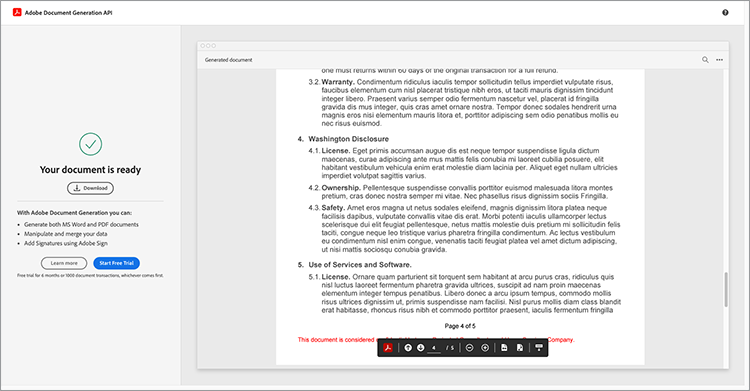

# 법률 워크플로우 자동화


이상적인 시나리오에서 계약 조건은 수정 없이 수락됩니다. 그러나 종종 계약서에는 맞춤화가 필요하며 맞춤화를 사용하려면 법적 검토가 필요합니다. 법률 검토를 통해 상당한 비용이 발생하고 계약 조건 제공 프로세스가 느려집니다. 승인된 언어를 기반으로 변경되는 사전 정의된 템플릿을 사용하면 법률 팀에서 계약 조건을 보다 안전하게 관리하고 실행할 수 있습니다.

이 자습서에서는 주마다 다른 법적 계약을 사용합니다. 이러한 변화를 해결하기 위해 조건부 섹션이 있는 계약 템플릿이 만들어지며, 이 템플릿은 특정 기준이 충족되는 경우에만 포함됩니다. 생성된 문서는 Word 또는 PDF 문서가 될 수 있습니다. Adobe PDF 서비스 API 또는 Acrobat Sign을 사용하여 문서를 보호하는 몇 가지 방법을 알아볼 수도 있습니다.

## 자격 증명 가져오기

무료 Adobe PDF 서비스 자격 증명을 등록하여 시작합니다.

1. 탐색 [여기](https://documentcloud.adobe.com/dc-integration-creation-app-cdn/main.html) 자격 증명을 등록하려면
1. Adobe ID으로 로그인합니다.
1. 자격 증명 이름을 설정합니다.

   

1. 샘플 코드를 다운로드할 언어를 선택합니다(예: Node.js).
1. 동의 확인 **[!UICONTROL 개발자 약관]**.
1. 선택 **[!UICONTROL 자격 증명 만들기]**.
샘플 파일, pdfservices-api-credentials.json 및 인증을 위한 private.key가 포함된 ZIP 파일로 파일이 컴퓨터에 다운로드됩니다.

   

1. 선택 **[!UICONTROL Microsoft Word 추가 기능 다운로드]** 또는 [AppSource](https://appsource.microsoft.com/en-cy/product/office/WA200002654) 설치합니다.

   >[!NOTE]
   >
   >Word 추가 기능을 설치하려면 Microsoft 365 내에서 추가 기능을 설치할 권한이 있어야 합니다. 권한이 없는 경우 Microsoft 365 관리자에게 문의하십시오.

## 데이터

이 시나리오에서는 문서 생성에 도움이 되고 특정 섹션이 포함되어야 하는지 여부를 알리는 정보가 전달됩니다.

```
{
    "customer": {
        "name": "Home Services Company",
        "street": "123 Any Street",
        "city": "Anywhere",
        "state": "CA",
        "zip": "12345",
        "country":"USA",
        "signer": {
            "email": "johnnyechostone@gmail.com",
            "firstName": "John",
            "lastName": "Echostone"
        }
    },
    "company": {
        "name": "Projected Consultants",
        "signer": {
            "email": "maryburostone@gmail.com",
            "firstName": "Mary",
            "lastName": "Burostone"
        }
    },
    "conditions": {
        "includeGeneralTerms": true,
        "includeConsumerDiscloure": true
    }
}
```

데이터에는 고객, 고객 이름, 서명 대상, 현재 상태 등에 대한 정보가 있습니다. 또한 계약을 생성하는 회사에 대한 정보 섹션과 계약의 특정 섹션을 포함하는 데 사용되는 조건 플래그가 있습니다.

## 문서에 기본 태그 추가

이 시나리오는 다운로드할 수 있는 약관 문서를 사용합니다 [여기](https://github.com/benvanderberg/adobe-document-generation-samples/blob/main/Agreement/exercise/TermsAndConditions_Sample.docx?raw=true).


1. 열기 *TermsAndConditions.docx* Microsoft Word의 샘플 문서.
1. 만약 [문서 생성](https://appsource.microsoft.com/en-cy/product/office/WA200002654) 플러그인이 설치되어 있습니다. **[!UICONTROL 문서 생성]** 있습니다. 리본에 문서 생성이 표시되지 않으면 다음 지침을 따르십시오.
1. 선택 **[!UICONTROL 시작하기]**.
1. 위에 기록된 JSON 샘플 데이터를 JSON 데이터 필드에 복사합니다.

   

다음 위치로 이동합니다. *문서 생성 태거* 패널에 태그를 배치할 수 있습니다.

## 회사 이름 삽입

1. 바꿀 텍스트를 선택합니다. 이 시나리오에서는 문서의 열기 섹션에서 COMPANY를 대체합니다.
1. In *문서 생성 태거*&#x200B;에서 &quot;name&quot;을 검색합니다.
1. 회사에서 *이름*.

   

1. 선택 **[!UICONTROL 텍스트 삽입]**.

그러면 라는 태그가 `{{company.name}}` 태그가 JSON에서 해당 경로 아래에 있기 때문입니다.

```
{
    "company": {
        "name": "Projected Consultants",
        ...
    }
    ...
}
```

그런 다음 CUSTOMER 텍스트의 열기 섹션에서 이 단계를 반복합니다. 반복 **1~4단계**&#x200B;에서 CUSTOMER를 customer 아래의 &quot;이름&quot;으로 바꿉니다. 출력 `{{customer.name}}`텍스트가 고객 개체 아래에서 나온다는 것을 반영합니다.

Adobe 문서 생성 API를 사용하면 머리글 및 바닥글 내에서 그리고 서명 제목이 이동하는 맨 끝에 태그를 포함할 수 있습니다.

이 과정을 **1~4단계** 바닥글에 있는 COMPANY 및 CUSTOMER 텍스트의 경우


마지막으로 **1-4단계를 반복합니다** 서명 페이지의 [고객] 섹션 아래에 있는 이름 및 성을 `{{customer.signer.firstName}}` 및 `{{customer.signer.lastName}}` 있습니다. 태그가 길고 문서가 생성될 때 태그가 바뀌므로 다음 줄로 리플로우되어도 걱정하지 마십시오.

문서의 시작 부분과 바닥글은 다음과 같이 표시됩니다.

* 시작 섹션:


* 바닥글:


* 서명 페이지:


태그가 문서에 배치되면 생성된 계약을 미리 볼 준비가 됩니다.

## 생성된 문서 미리 보기

Microsoft Word에서 바로 샘플 JSON 데이터를 기반으로 생성된 문서를 미리 볼 수 있습니다.

1. In *문서 생성 태거*, 선택 **[!UICONTROL 문서 생성]**.
1. 처음으로 Adobe ID으로 로그인하라는 메시지가 표시될 수 있습니다. 선택 **[!UICONTROL 로그인]** 자격 증명으로 로그인하라는 메시지가 표시됩니다.

   

1. 선택 **[!UICONTROL 문서 보기]**.

   

1. 문서 결과를 미리 볼 수 있는 브라우저 창이 열립니다.

   

## 각 상태에 조건 용어 추가

다음 단원에서는 특정 입력 데이터 조건을 기준으로 포함할 특정 섹션만 설정합니다. 샘플 문서에서 섹션 4와 5는 특정 상태에만 관련됩니다. 이 시나리오의 경우 고객이 해당 상태에 있을 때만 상태별 조항을 포함해야 합니다. 또한 Microsoft Word의 번호 매기기를 제거하는 경우 해당 섹션이 포함되지 않습니다. 문서 생성 API의 조건부 내용 기능을 사용하여 이 내용에 태그를 지정하십시오.


1. 문서에서 캘리포니아 공개 섹션 및 모든 하위 글머리 기호를 선택합니다.

   

1. In *[!UICONTROL 문서 생성 태거]*, 선택 **[!UICONTROL 고급]**.
1. 확장 **[!UICONTROL 조건부 내용]**.
1. In *[!UICONTROL 레코드 선택]* 필드, 검색 및 선택 **[!UICONTROL customer.state]**.
1. In *[!UICONTROL 연산자 선택]* 필드, 선택 **=**.
1. In *[!UICONTROL 값]* 필드, 유형 *CA*.
1. 선택 **[!UICONTROL 조건 삽입]**.

이제 섹션이 조건부 섹션 태그라는 일부 태그로 둘러싸입니다. 태그를 추가할 때 조건부 섹션 태그가 번호 있는 줄로 추가되었을 수 있습니다. 태그 앞에 백스페이싱을 적용하여 이 값을 제거할 수 있습니다. 그렇지 않으면 문서를 생성할 때 태그가 없는 것처럼 항목의 번호가 지정됩니다. 조건부인 섹션은 `` 태그의 평균 높이를 사용합니다.


**1-7단계를 반복합니다** 의 경우 *워싱턴 디스클로저* 섹션, 대체 *CA* 값 *WA* 이 섹션은 고객의 상태가 Washington인 경우에만 표시됩니다.


## 조건 섹션을 사용한 테스트

조건부 섹션이 만들어지면 **문서 생성**.

문서를 생성할 때 포함된 섹션은 데이터 조건을 충족하는 섹션뿐입니다. 아래 예에서는 주가 CA와 동일하기 때문에 캘리포니아 섹션만 포함됩니다.


또 다른 주목할 만한 변경 사항은 후속 섹션인 서비스 및 소프트웨어 사용에 대한 번호 지정에 숫자 5가 있다는 것입니다. 이는 워싱턴 섹션이 생략된 경우 넘버링이 계속된다는 것을 의미한다.


고객이 캘리포니아가 아닌 워싱턴주에 있을 때 템플릿이 올바르게 작동하는지 테스트하려면 템플릿에 대한 샘플 데이터를 변경합니다.

1. In *문서 생성 태거*, 선택 **[!UICONTROL 입력 데이터 편집]**.

   

1. 선택 **[!UICONTROL 편집]**.

1. JSON 데이터에서 *CA* 에 *WA*.

   

1. 선택 **[!UICONTROL 태그 생성]**.
1. 선택 **[!UICONTROL 문서 생성]** 를 클릭하여 문서를 다시 생성합니다.

이 문서에는 워싱턴 주 섹션만 포함되어 있습니다.



## 조건문 추가

조건 섹션과 마찬가지로 특정 조건이 충족될 때 포함되는 특정 문장을 가질 수도 있습니다. 이 예시의 경우 반환정책은 캘리포니아와 워싱턴이 다르다.

1. 3.1절에서 첫 번째 문장인 &quot;워싱턴주에서 구매하는 경우 전체 환불을 위해서는 최초 거래 후 30일 이내에 MAIL을 통해 반품해야 한다&quot;를 선택합니다.
1. In *[!UICONTROL 문서 생성 태거]*, 선택 **[!UICONTROL 고급]**.
1. 확장 **[!UICONTROL 조건부 내용]**.
1. 아래 *[!UICONTROL 콘텐츠 형식]*, 선택 **[!UICONTROL 구]**.
1. In *[!UICONTROL 레코드 선택]* 필드, 검색 및 선택 **[!UICONTROL customer.state]**.
1. In *[!UICONTROL 연산자 선택]* 필드, 선택 **=**.
1. In *[!UICONTROL 값]* 필드, 유형 *CA*.
1. 선택 **[!UICONTROL 조건 삽입]**.

태그의 이름은 동일하지만 구와 섹션의 주된 차이점은 구에 새 줄이 포함되지 않은 섹션이 있다는 것입니다. condition-section 태그와 -end-section 태그는 같은 단락에 있어야 합니다.


## Acrobat Sign용 태그 추가

Acrobat Sign을 사용하면 서명할 계약을 보내거나 다른 사람이 쉽게 보고 서명할 수 있도록 웹 환경에 포함할 수 있습니다. Microsoft Word의 Adobe 문서 생성 태거를 사용하면 Acrobat Sign으로 문서를 보내기 전에 손쉽게 문서에 태그를 미리 지정할 수 있으므로 항상 정확한 위치에 서명을 배치할 수 있습니다. 이 시나리오에서는 문서에 서명하고 날짜를 지정하기 위해 두 명의 서명자가 필요합니다.

1. 고객이 서명해야 하는 위치로 이동합니다.
1. 서명이 필요한 위치에 커서를 놓습니다.

   

1. In *[!UICONTROL 문서 생성 태거]*, 선택 **[!UICONTROL Adobe Sign]**.
1. In *[!UICONTROL 수신자 수 지정]* 필드에 수신자의 수를 설정합니다(이 예제에서는 2를 사용합니다).
1. In *[!UICONTROL 수신자]* 필드, 선택 **[!UICONTROL Signer-1]**.
1. In *[!UICONTROL 필드]* 문자, 선택 **[!UICONTROL 서명]**.
1. 선택 **[!UICONTROL Adobe Sign 텍스트 태그 삽입]**.

   

>[!NOTE]
>
>만약 **Adobe Sign 텍스트 태그 삽입** 단추가 없는 것 같습니다. 아래로 스크롤하십시오.

그러면 첫 번째 서명자가 서명해야 하는 서명 필드가 표시됩니다.


그런 다음 서명자가 서명할 때 자동으로 채워지는 서명자에 대한 데이터 필드를 배치합니다.

1. 날짜를 배치할 위치로 커서를 이동합니다.

   

1. 필드 유형을 날짜로 설정합니다.
1. 선택 **[!UICONTROL Adobe Sign 텍스트 태그 삽입]**.

배치된 Date 태그가 다소 깁니다. `{{Date 3_es_:signer1:date:format(mm/dd/yyyy):font(size=Auto)}}`. Acrobat Sign 텍스트 태그는 문서 생성 태그와 다른 동일한 행에 유지되어야 합니다. 추가 `:format()` 및 `font()` 매개 변수는 선택 사항이므로 이 시나리오에서는 태그를 `{{Date 3_es_:signer1:date}}`.

위 단계를 반복합니다. *회사 서명* 섹션을 참조하십시오. 이렇게 하려면 수신자 필드를 **Signer-2**&#x200B;그렇지 않으면 모든 서명 필드가 동일한 개인에게 할당됩니다.

## 계약서 생성

문서에 태그를 지정했으므로 이제 시작할 준비가 되었습니다. 다음 단원에서는 Node.js용 문서 생성 API 샘플을 사용하여 문서를 생성하는 방법을 알아봅니다. 이 샘플은 모든 언어로 작동합니다.

자격 증명을 등록할 때 다운로드한 pdfservices-node-sdk-samples-master 파일을 엽니다. 이러한 파일에는 pdfservices-api-credentials.json 및 private.key 파일이 포함됩니다.

1. 파일을 **[!UICONTROL 터미널]** 종속성을 설치하려면 `npm install`.
1. 샘플 복사 *data.json* 에 *리소스* 있습니다.
1. 만든 Word 템플릿을 *리소스* 있습니다.
1. 샘플 폴더의 루트 디렉토리에 라는 새 파일을 생성합니다 *generate-salesOrder.js*.

   ```
   const PDFServicesSdk = require('@adobe/pdfservices-node-sdk').
   const fs = require('fs');
   const path = require('path');
   
   var dataFileName = path.join('resources', '<INSERT JSON FILE');
   var outputFileName = path.join('output', 'salesOrder_'+Date.now()+".pdf");
   var inputFileName = path.join('resources', '<INSERT DOCX>');
   
   //Loads credentials from the file that you created.
   const credentials =  PDFServicesSdk.Credentials
      .serviceAccountCredentialsBuilder()
      .fromFile("pdfservices-api-credentials.json")
      .build();
   
   // Setup input data for the document merge process
   const jsonString = fs.readFileSync(dataFileName),
   jsonDataForMerge = JSON.parse(jsonString);
   
   // Create an ExecutionContext using credentials
   const executionContext = PDFServicesSdk.ExecutionContext.create(credentials);
   
   // Create a new DocumentMerge options instance
   const documentMerge = PDFServicesSdk.DocumentMerge,
   documentMergeOptions = documentMerge.options,
   options = new documentMergeOptions.DocumentMergeOptions(jsonDataForMerge, documentMergeOptions.OutputFormat.PDF);
   
   // Create a new operation instance using the options instance
   const documentMergeOperation = documentMerge.Operation.createNew(options)
   
   // Set operation input document template from a source file.
   const input = PDFServicesSdk.FileRef.createFromLocalFile(inputFileName);
   documentMergeOperation.setInput(input);
   
   // Execute the operation and Save the result to the specified location.
   documentMergeOperation.execute(executionContext)
   .then(result => result.saveAsFile(outputFileName))
   .catch(err => {
      if(err instanceof PDFServicesSdk.Error.ServiceApiError
         || err instanceof PDFServicesSdk.Error.ServiceUsageError) {
         console.log('Exception encountered while executing operation', err);
      } else {
         console.log('Exception encountered while executing operation', err);
      }
   });
   ```

1. 바꾸기 `<JSON FILE>` JSON 파일의 이름을 /resources에 추가합니다.
1. 바꾸기 `<INSERT DOCX>` 를 반환합니다.
1. 실행하려면 **[!UICONTROL 터미널]** 노드 실행 `generate-salesOrder.js`.

출력 파일은 문서가 올바르게 생성된 /output 폴더에 있습니다.

아래 줄을 변경하여 형식을 변경할 수 있습니다. DOCX 형식은 이 문서를 다른 사람이 Word에서 편집하거나 계약 검토를 위해 보낼 때 유용합니다.

PDF:

```
options = new documentMergeOptions.DocumentMergeOptions(jsonDataForMerge,
documentMergeOptions.OutputFormat.PDF);
```

Word:

```
options = new documentMergeOptions.DocumentMergeOptions(jsonDataForMerge, documentMergeOptions.OutputFormat.DOCX);
```

또한 출력 파일의 이름을 PDF 또는 DOCX 출력 형식에 대해 각각 .pdf 또는 .docx로 변경해야 합니다.

```
var outputFileName = path.join('output', 'salesOrder_'+Date.now()+".docx");
```

## 서명을 위해 계약 보내기

[Adobe Acrobat Sign](https://www.adobe.com/kr/sign.html) 계약을 한 명 또는 여러 명의 수신자에게 보내 문서를 보고 서명하도록 할 수 있습니다. 서명을 위해 문서를 보내는 사용하기 쉬운 사용자 환경과 함께 Word, PDF, HTML 및 기타 형식을 가져와서 서명을 위해 보낼 수 있는 REST API를 사용할 수 있습니다.

아래 예제에서는 REST API 설명서 페이지를 사용하여 이전에 생성된 문서를 가져와서 서명을 위해 전송하는 방법을 보여 줍니다. 먼저 Acrobat Sign 웹 인터페이스를 통해 이를 수행하는 방법과 REST API를 사용하여 이를 수행하는 방법을 알아봅니다.

## Acrobat Sign 계정 가져오기

Acrobat Sign 계정이 없는 경우에는 개발자 계정을 등록하고 설명서를 검토하십시오 [여기](https://developer.adobe.com/adobesign-api/)및 선택 **개발자 계정 등록**. 양식을 작성하고 확인 이메일을 수신하라는 메시지가 표시됩니다. 이렇게 하면 Acrobat Sign에 로그인할 수 있는 웹 사이트로 이동하여 암호와 계정을 설정해야 합니다.

## 웹 인터페이스에서 계약 보내기

1. 선택 **[!UICONTROL 전송]** 을 클릭합니다.

   

1. In *수신자* 필드에 두 개의 전자 메일 주소를 지정합니다. Acrobat Sign 계정과 연결되지 않은 이메일 주소를 사용하는 것이 좋습니다.

   

1. 설정 **[!UICONTROL 계약 이름]** 및 **[!UICONTROL 메시지]**.
1. 선택 **[!UICONTROL 파일 추가]** 컴퓨터에서 생성된 파일을 업로드합니다.
1. **[!UICONTROL 서명 필드 미리 보기 및 추가]**&#x200B;를 선택합니다.
1. **[!UICONTROL 다음]**&#x200B;을 선택합니다.
1. 서명 페이지로 스크롤하면 태그를 기반으로 배치된 서명 필드를 볼 수 있습니다.

   

1. **[!UICONTROL 보내기]**&#x200B;를 선택합니다.
1. 전자 메일에 보기 및 서명 링크가 포함된 메시지가 나타납니다.

   

1. 선택 **[!UICONTROL 검토 및 서명]**.
1. 선택 **[!UICONTROL 계속]** 를 클릭하십시오.
1. 선택 **[!UICONTROL 시작]** 서명해야 하는 위치로 이동합니다.

   

1. 선택 **[!UICONTROL 서명하려면 여기를 클릭하십시오.]**.

   

1. 서명을 입력합니다.

   

1. 선택 **[!UICONTROL 적용]**.
1. 선택 **[!UICONTROL 클릭하여 서명]**.

다음 서명자에게 전자 메일이 전송됩니다. 9-16단계를 반복하여 두 번째 서명자를 보고 서명합니다.

계약이 완료되면 계약의 서명된 사본이 이메일을 통해 각 당사자에게 전송됩니다. 또한 서명된 계약은 의 Acrobat Sign 웹 인터페이스에서 검색할 수 있습니다. **관리** 페이지를 엽니다.


다음으로 REST API 설명서를 통해 동일한 시나리오를 수행하는 방법에 대해 알아봅니다.

## 자격 증명 가져오기

1. 다음으로 이동 [Acrobat Sign REST 설명서](https://secure.na1.adobesign.com/public/docs/restapi/v6).
1. 확장 *transientDocuments* 및 [POST /transientDocuments](https://benprojecteddemo.na1.adobesign.com/public/docs/restapi/v6#!/transientDocuments/createTransientDocument).
1. 선택 **[!UICONTROL OAUTH ACCESS-TOKEN]**.

   

1. 에 대한 OAUTH 권한 확인 *agreement_write*, *agreement_sign*, *widget_write*&#x200B;및 *library_write*.
1. 선택 **[!UICONTROL 인증]**.
1. Acrobat Sign 계정으로 로그인하라는 메시지가 팝업을 통해 표시됩니다. 사용자 로그인 관리자의 사용자 이름 및 암호
1. REST 문서에 대한 액세스를 허용하라는 메시지가 표시됩니다. 선택 **[!UICONTROL 액세스 허용]**.

그러면 전달자 토큰이 **인증** 필드에 표시됩니다.

Acrobat Sign 인증 토큰을 만드는 방법에 대해 자세히 알아보려면 다음 단계를 따르십시오 [여기](https://opensource.adobe.com/acrobat-sign/developer_guide/helloworld.html).

## 임시 문서 업로드

인증 토큰은 이전 단계에서 추가되므로 API 호출을 수행하려면 문서를 업로드해야 합니다.

1. In *파일* 필드, 이전 단계에서 생성된 PDF 문서를 업로드합니다.

   

1. 선택 **[!UICONTROL 시도해 보세요!]**.
1. In **[!UICONTROL 응답 본문]**, 복사 *transientDocumentId* 값입니다.

추가 *transientDocumentId* 후속 API 호출에서 참조할 수 있도록 Acrobat Sign에 임시로 저장된 문서를 참조하는 데 사용됩니다.

## 서명을 위해 전송

문서가 업로드되면 서명을 받을 계약서를 보내야 합니다.

1. 계약 섹션 및 POST 계약 섹션을 확장합니다.
1. 에 *AgreementInfo* 필드에 다음 JSON으로 채웁니다.

   ```
   {
   "fileInfos": [
      {
         "transientDocumentId": "3AAABLblqZhAJeoswpyslef8_toTGT1WgBLk3TlhfJXy_uSLlKyre2hjF0-J1meBDn0PlShk0uQy6JghlqEoqXNnskq7YawteF6QWtHefP9wN2CW_Xbt0O9kq1tkpznG0a5-mEm4bYAV1FGOnD1mt_ooYdzKxm7KzTB11DLX2-81Zbe2Z1suy7oXiWNR3VSb-zMfIb5D4oIxF8BiNfN0q08RwT108FcB1bx4lekkATGld3nRbf8ApVPhB72VNrAIF0F1rAFBWTtfgvBKZaxrYSyZq73R_neMdvZEtxWTk5fii_bLVe7VdNZMcO55sofH61eQC_QIIsoYswZP4rw6dsTa68ZRgKUNs"
      }
   ],
   "name": "Terms and Conditions",
   "participantSetsInfo": [
      {
         "memberInfos": [
         {
            "email": "adobesigndemo+customer@outlook.com"
         }
         ],
         "order": 1,
         "role": "SIGNER"
      },
      {
         "memberInfos": [
            {
               "email": "adobesigndemo+company@outlook.com"
            }
         ],
         "order": 1,
         "role": "SIGNER"
         }
   ],
   "signatureType": "ESIGN",
   "state": "IN_PROCESS"
   }
   ```

1. 선택 **[!UICONTROL 시도해 보세요!]**.

**POST 계약 API** 계약의 ID를 반환합니다. JSON 모델 스키마에 대한 템플릿을 가져오려면 **최소 모델 스키마**. 매개 변수의 전체 목록은 **전체 모델 스키마** 섹션을 참조하십시오.

## 계약 상태 확인

계약 ID가 있으면 계약 상태를 보낼 수 있습니다.

1. 확장 **[!UICONTROL GET /agreements/{agreementId}]**.
1. 추가 OAUTH 범위가 필요할 수 있으므로 **[!UICONTROL OAUTH-ACCESS-TOKEN]** 다시
1. 이전 API 호출 응답의 agreementId를 agreementId 필드에 복사합니다.
1. 선택 **[!UICONTROL 사용하기!]**.

이제 당신은 그 협정에 관한 정보를 얻습니다.

```
{
    "id": "CBJCHBCAABAAc6LyP4SVuKXP_pNstzIzyripanRdz4IB",
    "name": "Terms and Conditions",
    "groupId": "CBJCHBCAABAAoyMb1yIgczAGhBuJeHf99mglPtM7ElEu",
    "type": "AGREEMENT",
    "participantSetsInfo": [
      {
        "id": "CBJCHBCAABAAzZE-IcHHkt05-AVbxas4Jz7DUl3oEBO6",
        "memberInfos": [
          {
            "email": "adobesigndemo+customer@outlook.com",
            "id": "CBJCHBCAABAAyWgMMReqbxUFM7ctI5xz16c2kOmEy-IQ",
            "securityOption": {
              "authenticationMethod": "NONE"
            }
          }
        ],
        "role": "SIGNER",
        "order": 1
      },
      {
        "id": "CBJCHBCAABAAaRHz3gY2W0w5n_6pj1GMMuZAfhBihc1j",
        "memberInfos": [
          {
            "email": "adobesigndemo+company@outlook.com",
            "id": "CBJCHBCAABAAOZQwjPwJXFiX8YDKPYtzMpftsmxYrIo9",
            "securityOption": {
              "authenticationMethod": "NONE"
            }
          }
        ],
        "role": "SIGNER",
        "order": 1
      }
    ],
    "senderEmail": "adobesigndemo+new@outlook.com",
    "createdDate": "2022-03-22T02:59:36Z",
    "lastEventDate": "2022-03-22T02:59:41Z",
    "signatureType": "ESIGN",
    "locale": "en_US",
    "status": "OUT_FOR_SIGNATURE",
    "documentVisibilityEnabled": true,
    "hasFormFieldData": false,
    "hasSignerIdentityReport": false,
    "documentRetentionApplied": false
  }
```

업데이트가 변경될 때 알림을 받는 보다 효율적인 방법은 Webhook를 사용하는 것입니다. Webhook에서 자세한 내용을 확인할 수 있습니다 [여기](https://opensource.adobe.com/acrobat-sign/developer_guide/webhookapis.html.

## 서명된 문서 저장

문서가 서명되면 GET /agreements/combinedDocument 파일을 사용하여 검색할 수 있습니다.

1. 확장 **[!UICONTROL GET /agreements/{agreementId}/combinedDocument]**.
1. 설정 **[!UICONTROL agreementId]** 에 *agreementId* 이전 API 호출에서 제공되었습니다.
1. 선택 **[!UICONTROL 사용하기!]**.

attachSupportingDocuments 및 attachAuditReport 매개 변수를 사용하여 감사 보고서나 지원 문서를 첨부하기 위한 추가 매개 변수를 설정할 수 있습니다.

에 **응답 본문**&#x200B;그런 다음 컴퓨터에 다운로드하고 원하는 위치에 저장할 수 있습니다.

## 기타 옵션

문서를 생성하고 서명을 위해 전송하는 것 외에도 추가 작업을 사용할 수 있습니다.

예를 들어, 문서에 서명이 없는 경우, Adobe PDF 서비스 API는 계약서가 생성된 후 다음과 같이 문서를 변형할 수 있는 다양한 방법을 제공합니다.

* 암호로 문서 보호
* 큰 이미지가 있는 경우 PDF 압축
* 사용 가능한 다른 작업에 대해 자세히 알아보려면 Adobe PDF 서비스 API용 샘플 파일의 /src 폴더에 있는 스크립트를 참조하십시오. 사용할 수 있는 다양한 작업에 대한 설명서를 검토하여 자세히 알아볼 수도 있습니다.

또한 Acrobat Sign은 다음과 같은 몇 가지 추가 기능을 제공합니다.

* 응용 프로그램에 서명 경험 포함
* 서명자의 ID 확인 방법 추가
* 전자 메일 알림 설정 구성
* 계약의 일부로 개별 개별 문서 다운로드

## 추가 학습

더 많은 것을 배우고 싶습니까? 사용할 수 있는 몇 가지 추가 방법을 살펴보십시오 [!DNL Adobe Acrobat Services]:

* 자세한 내용은 [설명서](https://developer.adobe.com/document-services/docs/overview/)
* Adobe Experience League 튜토리얼 더 보기
* /src 폴더의 샘플 스크립트를 사용하여 PDF 사용 방법을 확인합니다.
* 팔로우 [Adobe 기술 블로그](https://medium.com/adobetech/tagged/adobe-document-cloud) 최신 팁 및 요령
* 구독 대상 [종이 클립(월별 라이브 스트림)](https://www.youtube.com/playlist?list=PLcVEYUqU7VRe4sT-Bf8flvRz1XXUyGmtF) 자동화에 대해 더 알아보기 [!DNL Adobe Acrobat Services].
