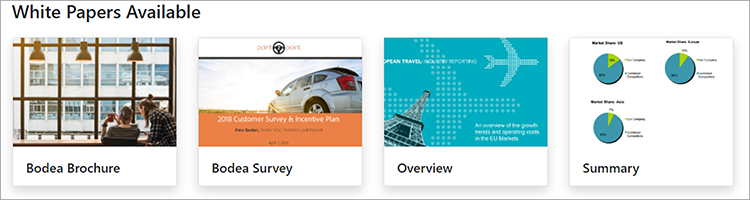
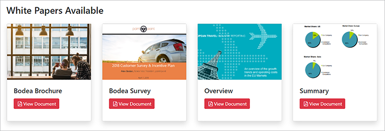

# 디지털 문서 게시


전자 문서는 어디에나 있습니다. 사실 전 세계적으로 [조 개의 PDF](https://itextpdf.com/en/blog/technical-notes/do-you-know-how-many-pdf-documents-exist-world)이 있을 것이며, 이 숫자는 매일 증가합니다. 웹 페이지에 PDF 뷰어를 포함하면 HTML 및 CSS를 다시 디자인하거나 웹 사이트 액세스를 방해하지 않고도 문서를 볼 수 있습니다.

인기 있는 시나리오를 살펴보겠습니다. 회사에서 [웹 사이트에 백서](https://www.adobe.io/apis/documentcloud/dcsdk/digital-content-publishing.html)를 게시합니다.
자신의 앱과 서비스에 대한 컨텍스트를 제공합니다. 이 웹사이트의 마케터는 사용자가 PDF 기반 콘텐츠와 상호 작용하는 방식을 더 잘 이해하고 웹 페이지 및 브랜드와 통합하기를 원합니다. 백서를 다운로드할 수 있는 사용자를 제어하여 [제어된 콘텐츠](https://whatis.techtarget.com/definition/gated-content-ungated-content#:~:text=Gated%20content%20is%20online%20materials,about%20their%20jobs%20and%20organizations.)로 게시하기로 결정했습니다.

## 학습 내용

이 실습용 튜토리얼에서는 [Adobe PDF Embed API](https://www.adobe.io/apis/documentcloud/dcsdk/pdf-embed.html)를 사용하여 웹 페이지에 포함된 PDF 문서를 표시하는 방법을 살펴보세요. 이 API는 무료이고 사용하기 쉽습니다. 다음 예제에서는 일부 JavaScript, Node.js, Express.js, HTML 및 CSS를 사용합니다. [GitHub](https://www.google.com/url?q=https://github.com/marcelooliveira/EmbedPDF/tree/main/pdf-app&amp;sa=D&amp;source=editors&amp;ust=1617129543031000&amp;usg=AOvVaw2rzSwYuJ_JI7biVIgbNMw1)에서 전체 프로젝트 코드를 볼 수 있습니다.

## 관련 API 및 리소스

* [PDF Embed API](https://www.adobe.com/devnet-docs/dcsdk_io/viewSDK/index.html)

* [PDF 서비스 API](https://opensource.adobe.com/pdftools-sdk-docs/release/latest/index.html)

* [프로젝트 코드](https://www.google.com/url?q=https://github.com/marcelooliveira/EmbedPDF/tree/main/pdf-app&amp;sa=D&amp;source=editors&amp;ust=1617129543031000&amp;usg=AOvVaw2rzSwYuJ_JI7biVIgbNMw1)

## 노드 웹 앱 만들기

먼저 멋진 템플릿을 사용하고 여러 PDF을 다운로드할 수 있는 Node.js 와 Express 를 사용하여 사이트를 만드는 것으로 시작하겠습니다.

먼저 [Node.js를 다운로드하고 설치](https://nodejs.org/en/download/)합니다.

최소 웹 응용 프로그램 구조로 Node.js 프로젝트를 쉽게 만들려면 응용 프로그램 생성기 도구 `` `express-generator` ``을(를) 설치하십시오.

```
npm install express-generator -g
```

다음으로 pdf-app이라는 새 Express 앱을 만들고 보기 엔진으로 선택합니다.

```
express pdf-app --view=ejs
```

이제 \\pdf-app 디렉토리로 이동하여 모든 프로젝트 종속성을 설치합니다.

```
cd pdf-app
npm install
```

그런 다음 로컬 웹 서버를 시작하고 응용 프로그램을 실행합니다.

```
npm start
```

마지막으로 <http://localhost:3000>에서 웹 사이트를 엽니다.


이제 기본 웹 사이트가 있습니다.

## 백서 데이터 렌더링 중

웹사이트에 백서를 게시하기 위해, 백서 데이터는 이러한 문서를 표시하기 위해 웹사이트에서 정의되고 준비됩니다. 먼저 프로젝트 루트에 새 \\data 폴더를 만듭니다. 사용 가능한 백서에 대한 정보는 [data.json](https://github.com/marcelooliveira/EmbedPDF/blob/main/pdf-app/data/data.json)이라는 이름의 새 파일에서 가져온 것입니다. 이 파일은 데이터 폴더에 저장됩니다.

웹 앱에 멋지고 세련된 모양을 제공하려면 [Bootstrap](https://getbootstrap.com/) 및 [글꼴 최고](https://fontawesome.com/) 프런트 엔드 라이브러리를 설치하십시오.

```
npm install bootstrap
npm install font-awesome
```

app.js 파일을 열고 이러한 디렉터리를 정적 파일의 소스로 포함시켜 기존 `` `express.static` `` 줄 뒤에 배치합니다.

```
app.use(express.static(path.join(__dirname, '/node_modules/bootstrap/dist')));
app.use(express.static(path.join(__dirname, '/node_modules/font-awesome')));
```

PDF 문서를 포함하려면 프로젝트의 \\public 폴더 아래에 \\pdf라는 폴더를 만듭니다. PDF 및 축소판을 직접 만드는 대신 이 [GitHub 저장소 폴더](https://github.com/marcelooliveira/EmbedPDF/tree/main/pdf-app/public)에서 \\pdf 및 \\image 폴더로 복사할 수 있습니다.

이제 \\public\\pdf 폴더에 PDF 문서가 포함됩니다.


\\public\\images 폴더에는 각 PDF 문서에 대한 축소판이 포함되어야 합니다.


이제 홈 페이지를 라우팅하는 로직이 포함된 \\route\\index.js 파일을 엽니다. data.json 파일의 백서 데이터를 사용하려면 파일 시스템에 액세스하고 상호 작용하는 Node.js 모듈을 로드해야 합니다. 그런 다음 다음과 같이 \\routes\\index.js 파일의 첫 번째 줄에 `fs` 상수를 선언합니다.

```
const fs = require('fs');
```

그런 다음 data.json 파일을 읽고 구문 분석하여 papers 변수에 저장합니다.

```
let rawdata = fs.readFileSync('data/data.json');
let papers = JSON.parse(rawdata);
```

이제 색인 보기의 렌더링 메서드를 호출하고 papers 컬렉션을 색인 보기의 모델로 전달하도록 선을 수정합니다.

```
res.render('index', { title: 'Embedding PDF', papers: papers });
```

홈페이지에서 백서 컬렉션을 렌더링하려면 \\views\\index.ejs 파일을 열고 기존 코드를 프로젝트의 [인덱스 파일](https://github.com/marcelooliveira/EmbedPDF/blob/main/pdf-app/views/index.ejs)에 있는 코드로 바꾸십시오.

이제 npm start를 다시 실행하고 <http://localhost:3000>을(를) 열어 사용 가능한 백서 컬렉션을 보십시오.



다음 섹션에서는 웹 사이트 개선 및 [PDF 포함 API](https://www.adobe.io/apis/documentcloud/dcsdk/pdf-embed.html)를 사용하여 웹 페이지에 PDF 문서를 표시하는 방법을 설명합니다. PDF Embed API는 무료로 사용할 수 있으며 API 자격 증명을 얻기만 하면 됩니다.

## PDF Embed API 자격 증명 가져오기

무료 PDF Embed API 자격 증명을 얻으려면 새 계정에 등록하거나 기존 계정에 로그인한 후 [시작하기](https://www.adobe.io/apis/documentcloud/dcsdk/gettingstarted.html) 페이지를 방문하십시오.

**새 자격 증명 만들기**&#x200B;를 클릭한 다음 **시작하기:**


이때 무료 계정이 없는 경우 무료 계정으로 등록하라는 메시지가 표시됩니다.

**PDF 포함 API**&#x200B;를 선택한 다음 자격 증명 이름과 응용 프로그램 도메인을 입력합니다. 웹 앱을 로컬에서 테스트하므로 **localhost** 도메인을 사용하십시오.

PDF Embed API에 대한 새 자격 증명을 만드는 

**자격 증명 만들기** 단추를 클릭하여 PDF 자격 증명에 액세스하고 클라이언트 ID(API 키)를 가져옵니다.


Node.js 프로젝트에서 애플리케이션의 루트 폴더에 .ENV 라는 파일을 만들고 이전 단계의 API KEY 자격 증명 값을 사용하여 PDF Embed 클라이언트 ID에 대한 환경 변수를 선언합니다.

```
PDF_EMBED_CLIENT_ID=**********************************************
```

나중에 이 클라이언트 ID를 사용하여 PDF Embed API에 액세스합니다. Node.js 코드를 사용하여 이 환경 변수에 액세스하려면 dotenv 패키지를 설치하십시오.

```
npm install dotenv
```

이제 app.js 파일을 열고 파일 맨 위에 다음 줄을 추가하여 Node.js 가 dotenv 모듈을 로드할 수 있도록 합니다.

```
require('dotenv').config();
```

## 웹 앱에 PDF 표시

이제 PDF 포함 API를 사용하여 사이트에 PDF을 표시합니다. 라이브 [PDF Embed API 데모](https://documentcloud.adobe.com/view-sdk-demo/index.html#/view/FULL_WINDOW/Bodea%20Brochure.pdf)를 엽니다.


왼쪽 패널에서 웹 사이트 요구 사항에 가장 적합한 임베드 모드를 선택할 수 있습니다.

* **전체 창**: PDF이 모든 웹 페이지 공간을 다룹니다.

* **크기 PDF**: 컨테이너가 웹 페이지 내에 한 번에 한 페이지씩 제한된 크기의 div로 표시됩니다.

* **인라인**: 전체 PDF이 웹 페이지 내의 div에 표시됩니다.

* **Lightbox**: PDF이 웹 페이지의 맨 위에 레이어로 표시됩니다.

백서에 인라인 임베드 모드를 사용하고 나중에 코드 생성기를 사용하여 응용 프로그램에 PDF을 임베드하는 것이 좋습니다.

## 인라인 임베드 모드 페이지 만들기

웹 페이지에 PDF 뷰어를 포함하고 모든 페이지를 동시에 표시하려면 인라인 임베드 모드를 사용하여 새 페이지를 만듭니다.

EJS 보기 엔진을 사용하여 \\views\\in-line.ejs 파일에 새 보기를 만듭니다.

```
<! html DOCTYPE >
<html>
<head>
<title>
<%= title %>
</title>
<link rel='stylesheet' href='/stylesheets/style.css' />
<link rel='stylesheet' href='/css/bootstrap.min.css'/>
<link rel='stylesheet' href='/css/font-awesome.min.css' />
<style type="text/css">
p {
font-family: 'Gill Sans', 'Gill Sans MT', Calibri, 'Trebuchet MS', sans-serif
}
</style>
</head>
<body class="m-0">
<div>
<main>
<div class="row">
<div class="col-sm-3"></div>
<div class="col-sm-6">
<h3>
<p class="text-center">Grow your business, establish your brand,<br
/>
```

그리고 고객을 최우선으로 생각하십시오.

```
</p>
</h3>
<div>
<p class="text-center">Lorem ipsum dolor sit amet, consectetur adipiscing elit, sed do<br />
eiusmod tempor incididunt ut labore et dolore</p>
</div>
</div>
</main>
<footer>
<div class="row">
<div class="col-sm-3"></div>
<div class="col-sm-6">
<p class="text-center">Bodea Inc. Your trusted partner since 2008</p>
</div>
</div>
</footer>
</div>
</div>
</body>
</html>
```

그런 다음 \\views\\index.ejs 를 수정하여 인라인 보기를 여는 버튼을 만듭니다.

```
<div class="card-body">
<h5 class="card-title">
<span>
<%= paper.title %>
</span>
</h5>
<p>
<a class="btn btn-sm btn btn-danger" href="/in-line/<%=
paper.id %>">
<span type="button"></span>
<span class="fa fa-file-pdf-o"></span>&nbsp;View Document</button>
</a>
</p>
</div>
```

app.js 파일을 열고 indexRouter 선언 뒤에 새 라우터를 선언합니다.

```
var indexRouter = require('./routes/index');
var inLineRouter = require('./routes/in-line');
```

그런 다음 app.use(&#39;/&#39;, indexRouter); 다음에 이 코드를 추가하여 인라인 임베드 모드 보기를 해당 라우터와 연결합니다.

```
app.use('/', indexRouter);
app.use('/in-line', inLineRouter);
```

이제 \\roots 아래에 새 in-line.js 파일을 만들어 새 라우터 논리를 만듭니다. 웹 응용 프로그램 백엔드를 활성화하는 노드 모듈인 Express를 포함합니다.

```
var express = require('express');
const fs = require('fs');
var router = express.Router();
```

그런 다음 특정 백서 ID에 대한 GET 요청을 처리하고 in-line.ejs 보기를 렌더링하는 끝점을 만듭니다.

```
router.all('/:id', function(req, res, next) {
let rawdata = fs.readFileSync('data/data.json');
let papers = JSON.parse(rawdata);
let paper = papers.filter(p => p.id == parseInt(req.params.id))[0];
res.render('in-line', { title: paper.title, paper: paper });
});
module.exports = router;
```

PDF 포함 API 코드를 자동으로 생성하려면 [라이브 데모](https://documentcloud.adobe.com/view-sdk-demo/index.html#/view/FULL_WINDOW/Bodea%20Brochure.pdf)를 다시 보십시오. 왼쪽 패널에서 **인라인**&#x200B;을(를) 클릭합니다.


크기 컨테이너 PDF 뷰어를 표시하는 데 필요한 HTML 코드를 보려면 **코드 생성**&#x200B;을 클릭하십시오.


**코드 복사**&#x200B;를 클릭하고 코드를 in-line.ejs 파일에 붙여넣습니다.

```
<div>
<p class="text-center">Lorem ipsum dolor sit amet, consectetur adipiscing elit, sed do<br />
eiusmod tempor incididunt ut labore et dolore</p>
</div>
<div class="row align-items-center border border-primary">
<div id="adobe-dc-view" style="width: 800px;"></div>
<script src="https://documentcloud.adobe.com/view-sdk/main.js"></script>
<script type="text/javascript">
document.addEventListener("adobe_dc_view_sdk.ready", function(){
var adobeDCView = new AdobeDC.View({clientId: "<YOUR_CLIENT_ID>", divId: "adobe-dc-view"});
adobeDCView.previewFile({
content:{location: {url: "https://documentcloud.adobe.com/view-sdk-demo/PDFs/Bodea Brochure.pdf"}},
metaData:{fileName: "Bodea Brochure.pdf"}
}, {embedMode: "IN_LINE"});
});
</script>
</div>
```

그러나 문서 매개 변수는 여전히 하드 코드되어 있습니다. 백서 모델 데이터에 따라 페이지를 렌더링하기 위해 EJS 대괄호 구문(\&lt;%= someValue %\>)으로 대체해 보겠습니다.

```
<div id="adobe-dc-view" style="width: 800px;"></div>
<script src="https://documentcloud.adobe.com/view-sdk/main.js"></script>
<script type="text/javascript">
document.addEventListener("adobe_dc_view_sdk.ready", function () {
var adobeDCView = new AdobeDC.View({ clientId: "<%=process.env.PDF_EMBED_CLIENT_ID %>", divId: "adobe-dc-view" });
adobeDCView.previewFile({
content: { location: { url: "<%= paper.pdf %>" } },
metaData: { fileName: "<%= paper.fileName %>" }
}, {
embedMode: "IN_LINE"
});
});
</script>
```

이제 npm 시작 명령으로 응용 프로그램을 실행하고 <http://localhost:3000>에서 웹 사이트를 엽니다.



마지막으로 하나의 백서를 선택하고 **문서 보기**&#x200B;를 클릭하여 인라인 포함 PDF이 있는 새 페이지를 엽니다.

PDF 백서 ](assets/ddp_11.png)의 

백엔드에서 이러한 플래그를 제어하려고 합니다. 나중에 사용자 ID를 기반으로 권한 부여 컨트롤을 구현하고 비즈니스 규칙에 따라 액세스를 제한할 수 있습니다. 여기서는 복잡성이 필요하지 않으므로 \\roots\\in-line.js 만 수정하여 인증된 등록 정보 및 권한 등록 정보를 모델 객체에 포함하겠습니다.

```
let authenticated = false;
res.render('in-line', {
title: paper.title,
paper: paper,
authenticated: authenticated,
permissions: {
showDownloadPDF: true,
showPrintPDF: true,
showFullScreen: true
}
});
```

그런 다음 웹 페이지에서 백엔드에서 가져온 플래그 값을 렌더링할 수 있도록 \\views\\in-line.ejs 를 수정합니다.

```
embedMode: "IN_LINE",
showDownloadPDF: <%= permissions.showDownloadPDF %>,
showPrintPDF: <%= permissions.showPrintPDF %>,
showFullScreen: <%= permissions.showFullScreen %>
Now, open the in-line.js route file and modify it to disallow the printing, downloading, and full-screen controls.
permissions: {
showDownloadPDF: false,
showPrintPDF: false,
showFullScreen: false
}
```

그런 다음 응용 프로그램을 다시 실행하여 PDF 뷰어에 이 변경 사항이 어떻게 반영되는지 확인합니다.


## 게이티드 콘텐츠 만들기

최종 사용자 시나리오에 따르면 회사 웹 사이트의 마케터는 사용자가 PDF 기반 콘텐츠와 상호 작용하는 방식을 더 잘 이해하고 해당 콘텐츠를 나머지 웹 페이지 및 브랜드와 통합하고자 합니다.

본사는 PDF 포함에 중점을 두므로 사용자 인증 기능을 만들 수 없습니다. 대신 일부 사용자 정보를 수락하고 사용자가 양식을 제출하면 PDF 문서를 표시하는 웹 양식을 사용하여 간단한 가짜 페이월을 구현하십시오.

보기 모델에 사용자 정보를 제공하려면 \\route\\in-line.js 파일을 아래 내용으로 바꿉니다.

```
var express = require('express');
const fs = require('fs');
var router = express.Router();
router.all('/:id', function(req, res, next) {
let rawdata = fs.readFileSync('data/data.json');
let papers = JSON.parse(rawdata);
let paper = papers.filter(p => p.id == parseInt(req.params.id))[0];
let authenticated = false;
let user = {};
if (req.body.firstName) {
user = {
firstName: req.body.firstName,
lastName: req.body.lastName,
jobTitle: req.body.jobTitle,
email: req.body.email,
};
authenticated = true;
}
res.render('in-line', {
title: paper.title,
paper: paper,
user: user,
authenticated: authenticated,
permissions: {
showDownloadPDF: false,
showPrintPDF: false,
showFullScreen: false
}
});
});
module.exports = router;
```

그런 다음 \\views\\in-line.ejs 내용을 아래 코드로 바꿉니다. 인증된 사용자인지에 따라 사용자 데이터 양식 또는 PDF 뷰어가 표시됩니다.

```
<!DOCTYPE html>
<html>
<head>
<title>
<%= title %>
</title>
<link rel='stylesheet' href='/css/bootstrap.min.css'/>
<link rel='stylesheet' href='/css/font-awesome.min.css' />
<style type="text/css">
p {
font-family: 'Gill Sans', 'Gill Sans MT', Calibri, 'Trebuchet MS', sans-serif
}
</style>
</head>
<body class="m-0">
<% if (authenticated) { %>
<header class="bg-dark text-white">
<div class="text-right mr-4">Hello, <%= user.firstName %> <%= user.lastName%></div>
</header>
<% } %>
<div>
<main>
<div class="row">
<div class="col-sm-3"></div>
<div class="col-sm-6">
<h3>
<p class="text-center">Grow your business, establish your brand,<br
/>
```

그리고 고객을 최우선으로 생각하십시오.

```
</p>
</h3>
<div>
<p class="text-center">Lorem ipsum dolor sit amet, consectetur adipiscing elit, sed do<br />
eiusmod tempor incididunt ut labore et dolore</p>
</div>
<% if (!authenticated) { %>
<div class="row">
<form method="POST" class="center-panel text offset-md-3 col-md-6 border">
<fieldset class="offset-md-1">
<legend>Submit your info to<br/>access the whitepaper</legend>
<p><input name="firstName" placeholder="first name"/></p>
<p><input name="lastName" placeholder="last name"/></p>
<p><input name="jobTitle" placeholder="job title"/></p>
<p><input name="email" placeholder="email"/></p>
<p><button type="submit" class="btn btn-sm btn btn-primary">Submit</button></p>
</fieldset>
</form>
</div>
<% } %>
<% if (authenticated) { %>
<div class="row align-items-center border border-primary">
<div id="adobe-dc-view" style="width: 800px;"></div>
<script src="https://documentcloud.adobe.com/view-sdk/main.js"></script>
<script type="text/javascript">
document.addEventListener("adobe_dc_view_sdk.ready", function () {
var adobeDCView = new AdobeDC.View({ clientId: "<%=process.env.PDF_EMBED_CLIENT_ID %>", divId: "adobe-dc-view" });
adobeDCView.previewFile({
content: { location: { url: "<%= paper.pdf %>" } },
metaData: { fileName: "<%= paper.fileName %>" }
}, {
embedMode: "IN_LINE",
showDownloadPDF: <%= permissions.showDownloadPDF %>,
showPrintPDF: <%= permissions.showPrintPDF %>,
showFullScreen: <%= permissions.showFullScreen %>
});
});
</script>
<% } %>
</div>
</div>
</main>
<footer>
<div class="row">
<div class="col-sm-3"></div>
<div class="col-sm-6">
<p class="text-center">Bodea Inc. Your trusted partner since 2008</p>
</div>
</div>
</footer>
</div>
</div>
</body>
</html>
```


사이트 방문자는 이제 정보를 제출한 후에만 PDF에 액세스할 수 있습니다.

포함된 뷰어에서 PDF 콘텐츠의 

## 이벤트 활성화

PDF 뷰어 이벤트를 응용 프로그램과 쉽게 통합하여 마케터에 대한 분석 데이터를 수집하는 방법에 대해 살펴보겠습니다. PDF EmbedAPI를 사용하여 뷰어를 확장하려면 adobeDCView 변수를 선언한 후 previewFile 메서드를 호출하기 전에 다음 코드 줄을 추가합니다.

```
var adobeDCView = new AdobeDC.View({ clientId: "<%=process.env.PDF_EMBED_CLIENT_ID %>", divId: "adobe-dc-view" });
adobeDCView.registerCallback(
AdobeDC.View.Enum.CallbackType.EVENT_LISTENER,
function(event) {
console.log(event);
},
{ enablePDFAnalytics: true }
);
```

이제 응용 프로그램을 다시 실행하고 웹 브라우저의 개발자 도구를 열어 이벤트 데이터를 확인합니다.


이 데이터를 [Adobe Analytics](https://www.adobe.io/apis/documentcloud/dcsdk/docs.html?view=view) 또는 다른 분석 도구로 보낼 수 있습니다.

## 다음 단계

[!DNL Acrobat Services] API는 개발자가 PDF 중심 작업 과정을 사용하여 디지털 출판 문제를 쉽게 해결할 수 있도록 지원합니다. 샘플 Node 웹 앱을 만들어 백서 컬렉션을 표시하는 방법을 살펴보았습니다. 그런 다음 [무료 API 자격 증명](https://www.adobe.io/apis/documentcloud/dcsdk/gettingstarted.html)을 획득하고, 네 가지 [임베드 모드](https://documentcloud.adobe.com/view-sdk-demo/index.html#/view/FULL_WINDOW/Bodea%20Brochure.pdf) 중 하나로 표시될 수 있는 백서에 대한 제한된 액세스를 빌드합니다.

이 워크플로를 함께 사용하면 [가상 마케터](https://www.adobe.io/apis/documentcloud/dcsdk/digital-content-publishing.html)가 백서 다운로드에 대한 대가로 잠재 고객 연락처 정보를 수집하고 PDF과 상호 작용하는 사용자에 대한 통계를 볼 수 있습니다. 이러한 기능을 웹 사이트에 통합하여 사용자 참여를 유도하고 모니터링할 수 있습니다.

angular 또는 React 개발자인 경우 PDF Embed API를 React 및 Angular 프로젝트와 통합하는 방법을 특징으로 하는 [추가 샘플](https://github.com/adobe/pdf-embed-api-samples)을 사용해 보십시오.

Adobe을 통해 혁신적인 솔루션으로 엔드 투 엔드 고객 경험을 구축할 수 있습니다. [Adobe PDF Embed API](https://www.adobe.io/apis/documentcloud/viesdk)를 무료로 확인하십시오. 다른 방법을 살펴보려면 [pay-as-you-gopr](https://www.adobe.io/apis/documentcloud/dcsdk/pdf-pricing.html)[착빙](https://www.adobe.io/apis/documentcloud/dcsdk/pdf-pricing.html)으로 Adobe PDF Services API를 사용해 보십시오.

지금 [!DNL Adobe Acrobat Services]개의 API로 [시작](https://www.adobe.io/apis/documentcloud/dcsdk/gettingstarted.html)하세요.
