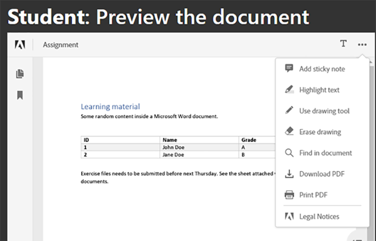

# 학생 및 교사 공동 작업


교육기관에서는 학습자료를 학생들과 공유하기 위해 PDF 문서를 활용한다. PDF은 교사를 위한 상호 교환 가능한 문서 형식을 제공합니다.

[Adobe PDF Services API](https://developer.adobe.com/document-services/apis/pdf-services) 및 [Adobe PDF Embed API](https://developer.adobe.com/document-services/apis/pdf-embed)를 앱에 통합하면 교사와 학생이 단일 플랫폼을 사용하여 가르치고 배울 수 있습니다. 예를 들어 앱에서 학생들이 과제 및 보고서 카드에 대해 질문하고 그룹 과제에 대해 공동 작업을 수행할 수 있도록 할 수 있습니다.

PDF 서비스 API에 액세스하기 위한 Node.js 애플리케이션용 공식 SDK가 있습니다. 이를 통해 Microsoft Word 또는 Microsoft Excel과 같은 문서를 다음으로 변환할 수 있습니다
PDF. 또한 여러 보고서 결합, 페이지 재정렬, PDF 보호 등의 고급 작업을 수행할 수 있습니다. 자세한 내용은 [제품 설명서](https://developer.adobe.com/document-services/homepage/)를 확인하십시오.

## 학습 내용

이 실습형 튜토리얼에서는 [교사와 학생이 PDF에서 리소스를 쉽게 공유](https://developer.adobe.com/document-services/use-cases/collaboration/student-teacher-collaboration)할 수 있는 온라인 학습 플랫폼을 만드는 방법을 배웁니다. 이 자습서는 Node.js JavaScript 런타임(Node.js) 및 PDF 서비스를 사용하여 만든 [학습 포털](https://github.com/afzaal-ahmad-zeeshan/adobe-pdf-tools-for-teachers)을 사용합니다.

학습 포털에는 다음과 같은 기능이 있습니다.

* 교사가 리소스를 업로드할 수 있습니다.

* 여러 문서를 선택하여 PDF으로 변환할 수 있습니다.

* 문서를 PDF으로 변환할 수 있습니다.

* 웹 브라우저에서 학생을 위한 PDF 미리보기를 제공하고 추가 소프트웨어 없이 문서에 주석을 달 수 있도록 합니다

* 학생들이 주석을 달고 컴퓨터에 다운로드할 수 있도록 합니다.

[!DNL Adobe Acrobat Services]이(가) PDF을 보유한 학생들에게 다양한 경험을 제공하는 방법을 알아봅니다. [!DNL Acrobat Services] API는 기존 응용 프로그램에 원활하게 통합되므로 현재 설정 내에서 학생들이 파일을 업로드, 변환 및 보고, 댓글을 작성하고 저장할 수 있습니다.

## 관련 API 및 리소스

* [PDF Embed API](https://www.adobe.com/devnet-docs/dcsdk_io/viewSDK/index.html)

* [PDF 서비스 API](https://opensource.adobe.com/pdftools-sdk-docs/release/latest/index.html)

* [프로젝트 코드](https://github.com/afzaal-ahmad-zeeshan/adobe-pdf-tools-for-teachers)

## 학습 포털에 리소스 업로드 중

학습 포털의 교사 섹션에서 교사는 과제, 시험 등의 문서를 업로드할 수 있다. 문서는 Microsoft Word, Microsoft Excel, HTML, 다양한 이미지 형식 등 모든 형식으로 제공됩니다.

학습 포털의 

업로드된 문서는 학생들이 자신의 웹페이지를 열 때 저장해 두고 이를 제시해 준다.

응용 프로그램에서 파일을 업로드하는 방법을 알아보려면 [프로젝트 코드](https://github.com/afzaal-ahmad-zeeshan/adobe-pdf-tools-for-teachers)를 참조하세요.

## 문서를 PDF으로 변환

학생들은 모든 유형의 단일 또는 여러 문서를 Microsoft Word, Excel, PowerPoint뿐만 아니라 기타 인기 있는 텍스트 및 이미지 파일 유형과 같은 PDF으로 변환할 수 있습니다. 학습 포털은 PDF 서비스를 사용하여 파일을 PDF으로 변환합니다.

자신만의 학습 포털을 만들려면 먼저 자신만의 자격 증명을 만들어야 합니다. [등록](https://www.adobe.io/apis/documentcloud/dcsdk/gettingstarted.html) 대상
PDF 서비스 API를 6개월 동안 무료로 사용하고 최대 1,000건의 문서 트랜잭션을 사용할 수 있습니다. 이후 클래스가 할당량을 늘림에 따라 문서 트랜잭션당 단 \$0.05의 [종량제](https://developer.adobe.com/document-services/pricing/main)가 제공됩니다.

학생이 대시보드에서 문서를 선택하면 다음 항목이 표시됩니다.


학습자는 변환할 문서를 선택하고 **보고서 받기**&#x200B;를 클릭하기만 하면 됩니다.

학습 포털에서는 문서를 PDF으로 변환하고 PDF 파일 미리 보기와 함께 보고서 페이지를 표시합니다.

다음은 이 단계의 샘플 코드입니다.

```
async function createPdf(rawFile, outputPdf) {
    try {
            // configurations
            const credentials =  adobe.Credentials
            .serviceAccountCredentialsBuilder()
            .fromFile("./src/pdftools-api-credentials.json")
            .build();
 
            // Capture the credential from app and show create the context
            const executionContext = adobe.ExecutionContext.create(credentials),
            operation = adobe.CreatePDF.Operation.createNew();
 
            // Pass the content as input (stream)
            const input = adobe.FileRef.createFromLocalFile(rawFile);
            operation.setInput(input);
 
            // Async create the PDF
            let result = await operation.execute(executionContext);
            await result.saveAsFile(outputPdf);
    } catch (err) {
            console.log('Exception encountered while executing operation', err);
    }
}
```

샘플 코드에서는 Express 경로 처리기 내의 `createPdf` 메서드를 호출하여 PDF을 생성합니다.

이 메서드를 호출하는 방법을 알아보려면 [프로젝트 코드](https://github.com/afzaal-ahmad-zeeshan/adobe-pdf-tools-for-teachers/blob/master/src/helpers/pdf.js)를 참조하세요.

## 학습 리소스 미리 보기

사용자 인터페이스는 PDF Embed API를 사용하여 웹 브라우저에서 PDF을 렌더링합니다. 이 API는 무료로 사용할 수 있습니다.

PDF 포함 API가 PDF 서비스 API와 다른 자격 증명을 사용하므로 [자격 증명을 만들어야](https://www.adobe.io/apis/documentcloud/dcsdk/gettingstarted.html)
사용하기 전에. 그런 다음 PDF 임베드 를 완전히 무료로 사용할 수 있습니다.

토큰에 올바른 웹 사이트 URL을 입력해야 합니다. 그렇지 않으면 토큰을 사용하여 PDF을 렌더링하지 못할 수 있습니다.

사용자 인터페이스는 [핸들 모음](https://handlebarsjs.com/) 템플릿 언어를 사용합니다. 그러면 웹 브라우저에 PDF이 표시됩니다.

이 단계에 대한 코드는 다음과 같습니다.

```
<div id="adobe-dc-view" style="height: 750px; width: 700px;"></div>
<script src="https://documentcloud.adobe.com/view-sdk/main.js"></script>
<script type="text/javascript">
    document.addEventListener("adobe_dc_view_sdk.ready", function () {
        var adobeDCView = new AdobeDC.View({ clientId: "<your-credentials-here>", divId: "adobe-dc-view" });
        adobeDCView.previewFile(
            {
                content: {
                    location: { url: "<file-url>" }
                },
                    metaData: { fileName: "<file-name>" }
            },
           );
    });
</script>
 
<p>Material has been generated, <a href="/students/download/{{filename}}" target="_blank">click here</a> to download it.
</p>
```

이 코드에는 아래 화면 캡처와 같이 PDF 출력 및 PDF 보고서 다운로드 링크가 표시됩니다.


학생들은 여기서 보고서를 다운로드하거나 자료를 다룰 수 있어야 한다.

## PDF 문서에 주석 달기

학습 플랫폼은 PDF 내 기본 주석, 주석 및 토론을 지원해야 합니다. PDF 임베드 API는 이러한 모든 기능을 제공합니다. `showAnnotationTools`을(를) 사용하여 주석 지원을 활성화하여 교사와 학생이 문서에 주석을 달고 PDF의 일부로 주석을 보관할 수 있도록 합니다.

PDF 문서에서 주석을 사용하려면 인수 `showAnnotationTools` : true를 `previewFile` 메서드에 전달하기만 하면 됩니다. 그러면 PDF 미리 보기에 주석 도구가 표시됩니다. 미리 보기의 오른쪽 위 모서리에 있는 세 점 메뉴에서 이 도구에 액세스합니다.



교사가 업로드한 문서에서 학생들은 텍스트를 강조 표시하고 댓글을 추가하는 등의 작업을 할 수 있다.


위의 화면 캡처에서 사용자는 &quot;게스트&quot;라는 레이블이 지정되지만 학생 및 교사와 같은 사용자에 대한 프로필을 구성할 수 있습니다.

학생이 주석을 적용하면 PDF 포함 API는 상단 배너를 따라 **저장** 단추를 표시합니다. 저장하면 파일에 주석이 추가됩니다. **저장**&#x200B;을 클릭하여 파일에 포함된 주석이 어떻게 저장되는지 확인합니다.

학생들은 주석을 이용하여 학습 자료에 대해 질문하거나 의견을 공유할 수 있습니다.

## 문서 사용 추적

학생들이 온라인 플랫폼을 어떻게 활용하고 있는지 교사와 학교가 확인하는 것이 중요하다. 이는 교사가 학생들이 과제를 더 잘 수행할 수 있도록 돕는 자원을 학생들에게 지원하는 데 도움이 된다. PDF 임베드 API는 사용자가 문서를 열고 읽고 닫는 경우 등 발생하는 모든 이벤트를 측정하는 데 사용할 수 있는 분석과 통합됩니다. 교사는 PDF 서비스 API를 사용하여 인쇄, 다운로드 및 파일 수정을 비활성화하여 학업 무결성을 유지할 수도 있습니다.

[Adobe Analytics](https://developer.adobe.com/analytics-apis/docs/2.0/) 라이선스가 있으면 [즉시 사용 가능한 통합](https://experienceleague.adobe.com/ko/docs/acrobat-services-learn/tutorials/pdfembed/controlpdfexperience#adobe-analytics)을 사용할 수 있습니다. 그렇지 않으면 콜백을 사용하여 PDF 서비스를 [Google](https://experienceleague.adobe.com/ko/docs/acrobat-services-learn/tutorials/pdfembed/controlpdfexperience#google-analytics)과 같은 다른 분석 공급자와 통합합니다.

문서 이벤트 측정을 사용하려면 Adobe DC View 인스턴스와 함께 `registerCallback` 메서드를 사용하여 이벤트 처리기를 연결합니다. 문서를 열거나 페이지를 읽는 등의 기본 측정 단위를 콘솔에 표시할 수 있습니다. 메트릭을 로그에 저장하거나 다른 분석 저장소에 게시할 수도 있습니다.

다음은 이벤트 처리기를 연결하는 샘플 코드입니다.

```
adobeDCView.registerCallback(
    AdobeDC.View.Enum.CallbackType.EVENT_LISTENER,
    function(event) {
           console.log(event);
    },
    {
           enablePDFAnalytics: true
    }
);
```

교사들은 얼마나 많은 학생들이 과제를 보았는지, 얼마나 많은 학생들이 그들의 노트에 있는 모든 페이지를 다 읽었는지, 그리고 다른 귀중한 세부 사항을 볼 수 있다.

다음은 웹 브라우저 콘솔의 화면 캡처입니다.


이 화면 캡처는 학생이 할당 파일을 열고 첫 페이지를 읽었으며(추가 페이지로 스크롤하지 않았거나 문서에 한 페이지만 있는 경우) 파일을 다운로드했음을 나타냅니다. 이러한 측정 단위를 수집하여 분석을 수행하고 학생들의 행동을 연구할 수 있습니다.

또한 [Adobe Analytics](https://business.adobe.com/kr/products/adobe-analytics.html)은(는) PDF 포함 API와 통합되므로 Adobe Analytics 제품군에 대한 구독이 있는 경우 구독에 메트릭을 게시할 수 있습니다. Adobe Analytics에 측정 단위를 게시하려면 Embed API 생성자에 PDF ID를 전달하기만 하면 됩니다. (PDF 서비스 API 자격 증명이 아닌 PDF Embed API 자격 증명을 사용해야 합니다.)

다음은 PDF Embed API 생성자로 suite ID를 전달하는 방법을 보여 주는 샘플 코드입니다.

```
var adobeDCView = new AdobeDC.View({
    clientId: "<your-adobe-dc-credential>",
    divId: "<#element>"
    reportSuiteId: <your-id-here>,
}); 
```

## 다음 단계

이 실습용 튜토리얼에서는 PDF 서비스 API 및 PDF 포함 API를 사용하여 학습 포털을 만들어 [학생과 교사 간의 효율적인 공동 작업](https://developer.adobe.com/document-services/use-cases/collaboration/student-teacher-collaboration)을 촉진하는 방법을 검토했습니다. 교사는 이 포털을 통해 학습 자료를 모든 형식으로 업로드하고 PDF 서비스 API를 사용하여 PDF으로 변환할 수 있습니다. 그런 다음 학생들은 PDF Embed API를 사용하여 이러한 PDF을 미리 볼 수 있습니다.

이제 PDF 보고서에 주석을 달고, 주석을 보관하고, PDF 보고서 사용을 추적하는 방법을 이해하셨다면 이제 프로젝트에 이러한 솔루션을 직접 구현할 수 있습니다.

[!DNL Adobe Acrobat Services] API를 사용하여 웹 사이트에서 사용자 친화적이고 인터랙티브한 PDF 경험을 만들 수 있습니다. 6개월 동안 Adobe PDF Services API를 무료로 사용한 다음 AWS 또는 직접 계약을 통해 [종량제](https://developer.adobe.com/document-services/pricing/main)만 문서 트랜잭션당 \$0.05에 사용할 수 있습니다. 제한 시간 없이 Adobe PDF 임베드 무료 사용. 지금 [시작](https://www.adobe.com/go/dcsdks_credentials)하려면 무료 계정을 만드세요.
