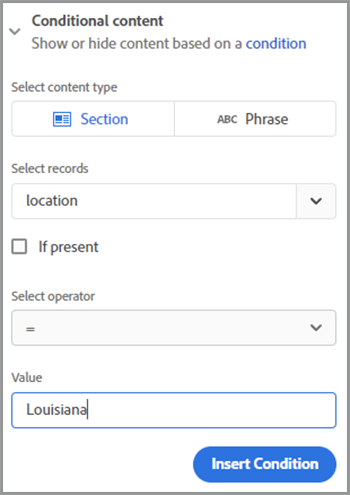

# 직원 온보딩 혁신


대규모 조직에서는 직원 입사 절차가 느리고 대규모로 진행될 수 있습니다. 일반적으로 새로운 직원이 제공하고 서명해야 하는 중요한 자료와 함께 사용자 정의된 문서가 혼합되어 있습니다. 맞춤형으로 구성된 재료와 상용구를 혼합하기 위해서는 여러 단계가 필요하며, 작업 과정에 참여하는 사람들로부터 귀중한 시간을 빼앗아갑니다. [!DNL Adobe Acrobat Services] Acrobat Sign은 이러한 접근 방식을 혁신하고 자동화하므로 HR 담당자의 업무 부담을 덜게 됩니다. 이것이 어떻게 이루어지는지 살펴보자.

## 소개 [!DNL Adobe Acrobat Services]?

[[!DNL Adobe Acrobat Services]](https://developer.adobe.com/document-services/homepage) PDF이 아닌 문서 작업과 관련된 API 집합입니다. 대체로 이 서비스 제품군은 세 가지 주요 범주로 분류됩니다.

* 첫 번째는 [PDF 서비스](https://developer.adobe.com/document-services/apis/pdf-services/) 툴 세트 PDF 및 기타 문서 작업을 위한 &quot;유틸리티&quot; 방법입니다. 이러한 서비스에는 PDF 변환, PDF 변환, OCR 및 최적화 수행, 병합 및 분할 등과 같은 것들이 포함됩니다. 문서 처리 기능의 도구 상자입니다.
* [PDF 추출 API](https://developer.adobe.com/document-services/apis/pdf-extract/) 강력한 AI/ML 기술을 사용하여 PDF을 분석하고 콘텐츠에 대한 엄청난 양의 세부 정보를 반환합니다. 여기에는 텍스트, 스타일 및 위치 정보가 포함되며 이미지를 검색할 뿐만 아니라 CSV/XLS 형식의 표 형식 데이터를 반환할 수도 있습니다.
* 마지막으로 [문서 생성 API](https://developer.adobe.com/document-services/apis/doc-generation/) 개발자는 Microsoft Word를 &quot;템플릿&quot;으로 사용하고, 모든 소스의 데이터와 혼합하고, 동적으로 개인화된 문서(PDF 및 Word)를 생성할 수 있습니다.

개발자는 [등록하기](https://documentcloud.adobe.com/dc-integration-creation-app-cdn/main.html) 무료 체험판을 통해 이러한 모든 서비스를 이용해 보십시오. 추가 [!DNL Acrobat Services] platform은 REST 기반 API를 사용하지만 Node, Java, .NET 및 Python용 SDK도 지원합니다(현재는 Extract만 해당).

API는 아니지만 개발자는 무료 [PDF 포함 API](https://developer.adobe.com/document-services/apis/pdf-embed/)을 사용하여 웹 페이지에서 일관되고 유연한 문서 보기 환경을 제공할 수 있습니다.

##  Acrobat Sign이란 무엇입니까?

[Acrobat Sign](https://www.adobe.com/kr/sign.html) 전자 서명 서비스 분야의 선두 기업입니다. 여러 서명을 포함한 다양한 작업 과정을 사용하여 서명을 위해 문서를 보낼 수 있습니다. Acrobat Sign은 서명 및 추가 정보가 필요한 워크플로우도 지원합니다. 이러한 모든 기능은 유연한 제작 시스템을 갖춘 강력한 대시보드에서 지원됩니다.

과 마찬가지로 [!DNL Acrobat Services], Acrobat Sign에 [무료 체험판](https://www.adobe.com/sign.html#sign_free_trial) 이를 통해 개발자는 대시보드와 사용하기 쉬운 REST 기반 API를 통해 서명 프로세스를 테스트할 수 있습니다.

## 온보딩 시나리오

Adobe의 서비스가 어떻게 도움이 될 수 있는지를 보여주는 실제 시나리오를 생각해 보자. 신입 사원이 입사할 때는 역할에 맞는 맞춤형 정보가 필요하다. 또한 회사 전체의 자료도 필요합니다. 마지막으로 기업의 정책을 수용하는 모습을 보여주어야 한다. 이제 이를 구체적으로 살펴보겠습니다.

* 먼저 신입사원을 이름으로 맞이하는 맞춤형 자기소개서가 필요하다. 편지에는 직원의 이름, 역할, 급여 및 위치에 대한 정보가 포함되어야 합니다.
* 맞춤형 서신은 기본적인 기업 차원의 정보(다양한 인사 정책, 혜택 등을 고려함)를 포함하는 PDF과 결합해야 한다
* 직원의 서명 및 날짜를 요청하는 최종 문서가 포함되어야 합니다.
* 위의 모든 것은 서명을 위해 직원에게 보내는 하나의 문서로 제시되어야 합니다.

이 작업을 수행하는 방법에 대해 자세히 살펴보겠습니다.

## 동적 문서 생성하기

Adobe [문서 생성](https://developer.adobe.com/document-services/apis/doc-generation/) 개발자는 API를 사용하여 Microsoft Word와 간단한 템플릿 언어를 PDF 및 Word 문서 생성의 기초로 사용하여 동적 문서를 만들 수 있습니다. 다음은 작동 방식의 예입니다.

먼저 하드 코딩된 값을 갖는 Word 문서로 시작하겠습니다. 그래픽, 표 등 원하는 방식으로 문서의 스타일을 지정할 수 있습니다. 여기 초기 문서가 있습니다.


문서 생성은 데이터로 대체된 Word 문서에 &quot;토큰&quot;을 추가하는 방식으로 작동합니다. 이러한 토큰은 수동으로 입력할 수 있지만 [Microsoft Word 추가 기능](https://developer.adobe.com/document-services/docs/overview/document-generation-api/wordaddin/) 이 작업이 더욱 쉬워졌습니다. 문서를 열면 문서에서 사용할 수 있는 태그 또는 데이터 세트를 작성자가 정의할 수 있는 도구가 있습니다.


로컬 파일에서 JSON 정보를 업로드하거나, JSON 텍스트를 복사하거나, 초기 데이터로 계속 진행하도록 선택할 수 있습니다. 이렇게 하면 특정 요구 사항에 따라 임시로 태그를 정의할 수 있습니다. 이 예에서는 이름, 역할, 급여 및 위치에 대한 태그만 필요합니다. 이 작업은 **태그 만들기** 단추:


첫 번째 태그를 정의한 후 필요한 만큼 계속 정의할 수 있습니다.


태그가 정의된 상태에서 문서의 텍스트를 선택하고 적절한 경우 태그로 바꿉니다. 이 예에서는 이름, 역할 및 급여에 대한 태그가 추가됩니다.


문서 생성은 단순 태그뿐만 아니라 논리적 표현식도 지원합니다. 문서의 두 번째 단락에는 루이지애나주의 사람들에게만 적용되는 텍스트가 있다. [문서 태거]의 [고급] 탭으로 이동하여 조건을 정의하여 조건식을 추가할 수 있습니다. 다음은 간단한 항등 조건을 정의하는 방법이지만 숫자 비교 및 기타 비교 유형도 지원됩니다.



그런 다음 단락 주위에 이 요소를 삽입하고 감쌀 수 있습니다.


작동 방식을 테스트하려면 **문서 생성**. 처음으로 로그인하려면 Adobe ID으로 로그인해야 합니다. 로그인 후 수동으로 편집할 수 있는 기본 JSON이 표시됩니다.


보거나 다운로드할 수 있는 PDF이 생성됩니다.


문서 태거를 사용하면 디자인 및 테스트를 빠르게 수행할 수 있지만 완료된 후 프로덕션 중에 SDK 중 하나를 사용하여 이 프로세스를 자동화할 수 있습니다. 실제 코드는 특정 요구 사항에 따라 다르지만 Node.js에서 이 코드가 어떻게 표시되는지 보여 주는 예는 다음과 같습니다.

```js
 const PDFServicesSdk = require('@adobe/pdfservices-node-sdk');

const credentials =  PDFServicesSdk.Credentials
    .serviceAccountCredentialsBuilder()
    .fromFile("pdfservices-api-credentials.json")
    .build();

// Data would be dynamic...
let data = {
    "name":"Raymond Camden",
    "role":"Lead Developer",
    "salary":9000,
    "location":"Louisiana"
}

// Create an ExecutionContext using credentials.
const executionContext = PDFServicesSdk.ExecutionContext.create(credentials);

// Create a new DocumentMerge options instance.
const documentMerge = PDFServicesSdk.DocumentMerge,
    documentMergeOptions = documentMerge.options,
    options = new documentMergeOptions.DocumentMergeOptions(jsonDataForMerge, documentMergeOptions.OutputFormat.PDF);

// Create a new operation instance using the options instance.
const documentMergeOperation = documentMerge.Operation.createNew(options);

// Set operation input document template from a source file.
const input = PDFServicesSdk.FileRef.createFromLocalFile('documentMergeTemplate.docx');
documentMergeOperation.setInput(input);

// Execute the operation and Save the result to the specified location.
documentMergeOperation.execute(executionContext)
    .then(result => result.saveAsFile('documentOutput.pdf'))
    .catch(err => {
        if(err instanceof PDFServicesSdk.Error.ServiceApiError
            || err instanceof PDFServicesSdk.Error.ServiceUsageError) {
            console.log('Exception encountered while executing operation', err);
        } else {
            console.log('Exception encountered while executing operation', err);
        }
    });
```

간단히 말해 이 코드는 자격 증명을 설정하고 작업 개체를 만들고 입력 및 옵션을 설정한 다음 작업을 호출합니다. 마지막으로 PDF으로 결과를 저장합니다. 결과는 Word로도 출력할 수 있습니다.

문서 생성은 완전히 동적인 표 및 이미지를 가질 수 있는 기능을 포함하여 훨씬 더 복잡한 사용 사례를 지원합니다. 자세한 내용은 [설명서](https://developer.adobe.com/document-services/docs/overview/document-generation-api/) 를 참조하십시오.

## PDF 작업 수행

추가 [PDF 서비스 API](https://developer.adobe.com/document-services/apis/pdf-services/) PDF 작업을 위한 대규모 &quot;유틸리티&quot; 작업 세트를 제공합니다. 이러한 작업에는 다음이 포함됩니다.

* Office 문서에서 PDF 만들기
* Office 문서로 PDF 내보내기
* PDF 결합 및 분할
* PDF에 OCR 적용
* PDF에 대한 보호 설정, 제거 및 수정
* 페이지 삭제, 삽입, 재정렬 및 회전
* 압축 또는 선형화를 통해 PDF 최적화
* PDF 속성 가져오기

이 시나리오의 경우 문서 생성 호출 결과를 표준 PDF과 병합해야 합니다. SDK를 사용하면 이 작업이 매우 간단합니다. 다음은 Node.js의 예입니다.

```js
const PDFServicesSdk = require('@adobe/pdfservices-node-sdk');
 
// Initial setup, create credentials instance.
const credentials = PDFServicesSdk.Credentials
    .serviceAccountCredentialsBuilder()
    .fromFile("pdfservices-api-credentials.json")
    .build();
 
// Create an ExecutionContext using credentials and create a new operation instance.
const executionContext = PDFServicesSdk.ExecutionContext.create(credentials),
    combineFilesOperation = PDFServicesSdk.CombineFiles.Operation.createNew();
 
// Set operation input from a source file.
const combineSource1 = PDFServicesSdk.FileRef.createFromLocalFile('documentOutput.pdf'),
      combineSource2 = PDFServicesSdk.FileRef.createFromLocalFile('standardCorporate.pdf');

combineFilesOperation.addInput(combineSource1);
combineFilesOperation.addInput(combineSource2);
 
// Execute the operation and Save the result to the specified location.
combineFilesOperation.execute(executionContext)
    .then(result => result.saveAsFile('combineFilesOutput.pdf'))
    .catch(err => {
        if (err instanceof PDFServicesSdk.Error.ServiceApiError
            || err instanceof PDFServicesSdk.Error.ServiceUsageError) {
            console.log('Exception encountered while executing operation', err);
        } else {
            console.log('Exception encountered while executing operation', err);
        }
    });
```

이 코드는 두 PDF을 가져와 병합하고 결과를 새 PDF에 저장합니다. 간단합니다! 자세한 내용은 [문서](https://developer.adobe.com/document-services/docs/overview/pdf-services-api/) 예를 들면 다음과 같습니다.

## 서명 프로세스

온보딩 프로세스의 최종 중지에서 직원은 자신이 읽었으며 내에 정의된 모든 정책에 동의한다는 계약에 서명해야 합니다. [Acrobat Sign](https://www.adobe.com/kr/sign.html) 에서는 [API](https://opensource.adobe.com/acrobat-sign/developer_guide/index.html). 크게 말하자면, 시나리오의 마지막 부분은 다음과 같이 완료될 수 있습니다.

먼저 서명이 필요한 양식이 포함된 문서를 디자인합니다. 이를 수행하는 방법에는 Adobe Sign 사용자 대시보드에서 시각적으로 디자인하는 방법 등 여러 가지가 있습니다. 또 다른 옵션은 문서 생성 Word 추가 기능을 사용하여 태그를 삽입하는 것입니다. 이 예에서는 서명 및 날짜를 요청합니다.


이 문서는 PDF으로 저장할 수 있으며 위에서 설명한 것과 동일한 방법을 사용하여 모든 문서와 함께 결합할 수 있습니다. 이 프로세스는 개인화된 인사말, 표준 회사 설명서 및 서명에 적합한 최종 페이지가 포함된 일관된 패키지를 생성합니다.

템플릿을 Acrobat Sign 대시보드에 업로드한 다음 새 계약에 사용할 수 있습니다. REST API를 사용하면 잠재 직원에게 이 문서를 보내 서명을 요청할 수 있습니다.


## 직접 사용해 보기

이 문서에 설명된 모든 내용은 지금 테스트할 수 있습니다. 추가 [!DNL Adobe Acrobat Services] API [무료 체험판](https://documentcloud.adobe.com/dc-integration-creation-app-cdn/main.html) 현재 6개월 동안 1,000개의 무료 요청을 제공합니다. Acrobat Sign [무료 체험판](https://www.adobe.com/sign.html#sign_free_trial) 테스트 목적으로 워터마크가 표시된 계약을 보낼 수 있습니다.

궁금한 점이 있으십니까? 추가 [지원 포럼](https://community.adobe.com/t5/document-services-apis/ct-p/ct-Document-Cloud-SDK) Adobe 개발자와 지원 담당자가 매일 모니터링합니다. 더 많은 영감을 얻으려면 다음 장면을 꼭 포착하세요 [종이 클립](https://www.youtube.com/playlist?list=PLcVEYUqU7VRe4sT-Bf8flvRz1XXUyGmtF) 에피소드. 뉴스, 데모, 고객과의 대화가 있는 라이브 미팅이 정기적으로 진행됩니다.
