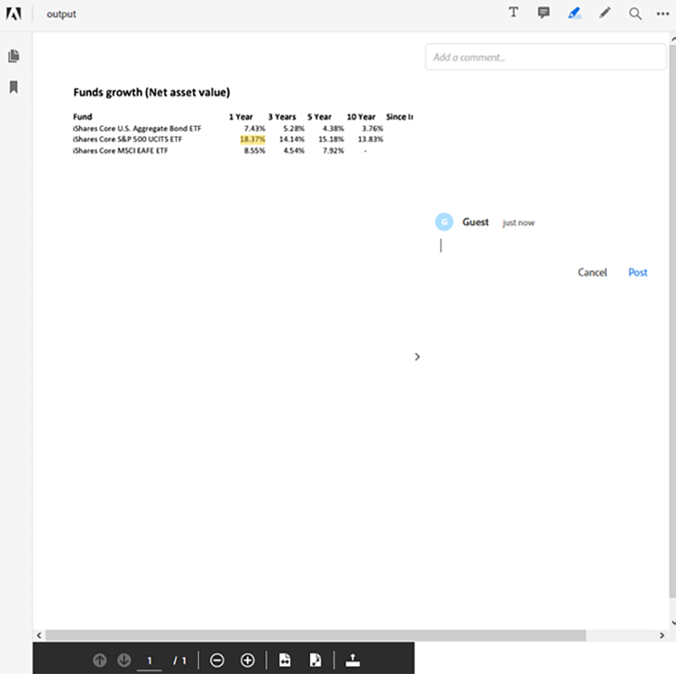

# Java에서 재무 문서 워크플로우 관리


금융 산업에서는 PDF 파일을 광범위하게 사용하여 데이터를 교환합니다. 문서 형식, 디자인 및 구조를 유지하는 데 도움이 되기 때문입니다. 이 강력한 형식은 재무 분석가와 자문가가 고객의 올바른 의사 결정을 도울 수 있도록 해줍니다.

그러나 PDF 형식은 특히 여러 데이터 소스를 결합하는 경우 처리 및 자동화가 어려울 수 있습니다. 이는 금융 업계에서 흔히 사용되는 사례입니다. PDF 문서를 처리할 수 있는 맞춤형 솔루션을 구축하는 것도 하나의 옵션이지만 소프트웨어와 인프라에 많은 시간과 비용을 투자할 필요가 없습니다. [!DNL Adobe Acrobat Services]은(는) PDF 문서에서 데이터를 처리하고 추출하는 데 필요한 모든 도구, 서비스 및 기능을 제공합니다.

## 학습 내용

이 실습용 튜토리얼에서는 [!DNL Java Spring Boot]개 응용 프로그램에 대해 [!DNL Adobe Acrobat Services]개의 API를 사용하는 방법을 알아봅니다. PDF 문서에서 콘텐츠를 추출하고 Excel과 같은 다른 데이터 형식으로 변환하며 여러 PDF을 결합하고 암호를 통해 리소스를 보호하는 MVC(model-view-controller) 앱을 빌드할 수 있습니다. 이 자습서에서는 [PDF 포함 API](https://www.adobe.io/apis/documentcloud/dcsdk/pdf-embed.html) Adobe을 사용하여 PDF 문서를 처리하고 웹 사이트에 표시하는 방법을 설명합니다.

## 관련 API 및 리소스

* [PDF 서비스 API](https://opensource.adobe.com/pdftools-sdk-docs/release/latest/index.html)

* [PDF Embed API](https://www.adobe.com/devnet-docs/dcsdk_io/viewSDK/index.html)

* [프로젝트 샘플](https://github.com/adobe/pdftools-java-sdk-samples)

## 설정

[!DNL Adobe Acrobat Services]은(는) 인증 시스템을 사용하여 리소스 액세스를 제어합니다. 서비스에 액세스하려면 조직 또는 애플리케이션에 대한 Adobe에서 API 키를 요청해야 합니다. API 키가 있는 경우 다음 섹션으로 계속합니다. 새 API 키를 만들려면 [!DNL Acrobat Services] 사이트에서 [시작하기](https://www.adobe.io/apis/documentcloud/dcsdk/gettingstarted.html)를 방문하세요. 최대 6개월 동안 사용할 수 있는 1,000개의 문서 트랜잭션을 제공하는 무료 평가판을 사용하여 키를 만들 수 있습니다.

이 튜토리얼을 따라 하려면 두 가지 API 키 세트가 필요합니다.

* Adobe PDF Services - PDF 문서를 처리하는 데 사용됨

* Adobe PDF 포함 API

자격 증명을 만든 후 PDF 서비스 API 자격 증명과 개인 키를 리소스 섹션 내의 [!DNL Spring Boot] 응용 프로그램에 복사합니다. [!DNL Adobe Acrobat Services] 웹 사이트에서 [Maven 및 Gradle 라이브러리 및 종속성](https://www.adobe.io/apis/documentcloud/dcsdk/docs.html?view=services)에 대해 자세히 알아보십시오. 계속하기 전에 필요한 모든 패키지 및 라이브러리를 설정했는지 확인하십시오.

PDF 서비스 API 자격 증명에 대한 

로깅 서비스를 구성하려면 [Adobe 설명서](https://www.adobe.io/apis/documentcloud/dcsdk/docs.html?view=services)를 방문하고 로깅 섹션으로 스크롤합니다.

>[!NOTE]
>
> 프로덕션 환경에서는 버전 제어에 개인 키를 저장하지 마십시오. 자격 증명의 무단 사용을 방지하기 위해 항상 보안 저장소 또는 키 삽입 서비스를 사용합니다.

이제 [!DNL Spring Boot] 응용 프로그램이 구성되었으므로 PDF을 처리하고 고객을 위한 보고서를 생성할 수 있습니다.

## 보고서 데이터 제출

Adobe PDF Services API를 사용하려면 먼저 제공한 자격 증명을 사용하는 `ExecutionContext`을(를) 설정하십시오. 응용 프로그램 내에 자격 증명이 있으므로 파일에서 자격 증명을 읽고 다음과 같이 컨텍스트를 만들 수 있습니다.

```
Credentials credentials = Credentials.serviceAccountCredentialsBuilder()
    .fromFile(AUTH_FILE_PATH)
    .build();

ExecutionContext executionContext = ExecutionContext.create(credentials);
```

그런 다음 컨텍스트를 가져와서 PDF 문서를 처리합니다. 수행할 수 있는 작업은 다음과 같습니다.

* PDF 문서 변환(Excel, Word 또는 그래픽 유형으로)

* PDF 문서 만들기(HTML, Excel, Word 등에서)

* 여러 PDF 문서 결합

* Protect 및 PDF 문서 보호 해제(암호가 있어야 함)

* 네트워크 전송을 위한 PDF 문서 최적화

이러한 모든 샘플은 [GitHub 샘플](https://github.com/adobe/pdfservices-java-sdk-samples/tree/master/src/main/java/com/adobe/pdfservices/operation/samples) 리포지토리에서 사용할 수 있습니다.

다음으로 [!DNL Spring Boot]에서 파일이 업로드되는 문자열 경로 또는 스트림을 사용하여 파일을 가져올 수 있습니다. 수행하는 모든 작업을 초기화해야 하며 입력 파일 경로를 설정해야 합니다. 이 튜토리얼에서는 [Blackrock](https://www.blackrock.com/us/individual/products/investment-funds)에서 공개적으로 사용 가능한 PDF 보고서를 사용합니다. 자체 보고서를 포함하여 다른 모든 소스를 사용할 수 있습니다.

먼저 파일에서 FileRef 개체를 캡처합니다. 간소화를 위해 문자열 경로별로 파일에 초점을 맞춥니다. 아래에서는 경로에 있는 파일을 PDF에서 Excel로 변환하는 작업을 만듭니다.

```
ExecutionContext executionContext = ExecutionContext.create(credentials);
ExportPDFOperation exportOperation = ExportPDFOperation.createNew(ExportPDFTargetFormat.XLSX);

// Create the input source
FileRef inputPdf = FileRef.createFromLocalFile(INPUT_PDF);
exportOperation.setInput(inputPdf);
```

이 단계 후에는 프로그램이 PDF에서 첫 번째 작업을 실행할 준비가 됩니다. 그런 다음 작업을 실행하고 Excel 시트에서 결과를 가져옵니다.

```
try {
    FileRef output = exportOperation.execute(executionContext);
    output.saveAs(OUTPUT_EXCEL);
} catch (ServiceApiException e) {
    e.printStackTrace();
}
```

이 시나리오에서는 하나의 PDF 파일만 처리합니다. 여러 PDF 파일로 시작하여 이들을 단일 파일로 결합할 수도 있습니다. 종합적인 보고서를 제공하려면 여러 출처의 자금을 처리해야 하므로 재무 데이터 보고에서는 여러 파일을 사용하는 것이 일반적입니다.

## 보고서 생성

[!DNL Adobe Acrobat Services]은(는) 즉시 Excel 문서 처리를 지원하지 않지만 커뮤니티 프레임워크 및 라이브러리를 사용하여 콘텐츠를 처리할 수 있습니다.

예를 들어 [Apache POI](https://poi.apache.org/)를 사용하여 [!DNL Java Spring Boot] 앱에서 Excel(또는 다른 Microsoft 문서)을 처리하거나 Excel 파일에서 다른 수동 또는 자동화된 작업을 수행할 수 있습니다.

이 예에서는 PDF 문서에서 시작하여 세 가지 기금에 대한 순 자산 값을 추출하여 테이블에 표시합니다. 또한 요구 사항과 사용 가능한 데이터에 따라 차트 및 표와 같은 다른 정보도 가져올 수 있습니다. 다른 소스에서 데이터를 가져올 수도 있습니다.

보고서가 생성된 후(이 예에서는 Excel 형식) Adobe PDF Services 작업을 사용하여 보고서를 PDF 문서로 다시 변환하고 보호할 수 있습니다.

Excel 형식의 보고서를 PDF 문서로 변환하려면 다음 작업을 수행하십시오.

```
ExecutionContext executionContext = ExecutionContext.create(credentials);
CreatePDFOperation exportOperation = CreatePDFOperation.createNew();

// Create the input source
FileRef inputPdf = FileRef.createFromLocalFile(INPUT_EXCEL);
exportOperation.setInput(inputPdf);

try {
    FileRef output = exportOperation.execute(executionContext);
    output.saveAs(OUTPUT_PDF);
} catch (ServiceApiException e) {
    e.printStackTrace();
}
```

>[!TIP]
>
> 요청이 올 때마다 개체를 다시 만들지 않으려면 Spring의 종속성 삽입을 사용하여 `ExecutionContext` 개체를 삽입합니다.

이 코드는 보고서에서 Excel 형식으로 PDF 문서를 생성합니다.

이 PDF을 고객에게 제공하기 전에 암호로 보호할 수 있습니다. 이 보호를 처리하는 다른 작업 ProtectPDFOoperation을 만든 다음 ProtectPDFOptions를 사용하여 문서에 암호를 추가합니다.

```
ProtectPDFOptions options = ProtectPDFOptions.passwordProtectOptionsBuilder()
                    .setUserPassword("p@55w0rd")
                    .setEncryptionAlgorithm(EncryptionAlgorithm.AES_256)
                    .build();
ProtectPDFOperation operation = ProtectPDFOperation.createNew(options);
```

그런 다음 입력을 지정하고 작업을 실행합니다. 무단 액세스를 방지하려면 결과 파일에 암호가 있어야 합니다.

## 보고서 표시

이제 PDF 보고서가 생성되었으므로 Adobe PDF Embed API를 사용하여 웹 사이트에 보고서를 표시할 수 있습니다. 이 JavaScript API를 사용하면 웹 개발자가 웹 브라우저에서 기본적으로 PDF 문서를 로드하고 렌더링할 수 있습니다.

>[!NOTE]
>
> 이때 두 번째 자격 증명 토큰인 클라이언트 ID가 필요합니다.

[!DNL Spring Boot] 응용 프로그램에서 PDF 보고서를 렌더링할 위치에 다음 HTML 스니펫을 추가합니다.

```
<div id="pdf-viewer"></div>
<script src="https://documentcloud.adobe.com/view-sdk/main.js"></script>
<script type="text/javascript">
    document.addEventListener("adobe_dc_view_sdk.ready", function()
    {
        var adobeDCView = new AdobeDC.View({ clientId: "<your-client-id-here>", divId: "pdf-viewer" });
        adobeDCView.previewFile(
        {
            content: {
                location: {
                    url: "<your-document.pdf>"
                }
            },
            metaData: {
                fileName: "<document-name.pdf>"
            }
        });
    });
</script>
```

이 스크립트는 PDF 문서를 로드하고 사용자가 문서에 주석을 달고 주석을 달 수 있도록 합니다. 다음은 Firefox에 표시된 이 Embed API의 보기입니다.

Firefox에서 PDF 문서의 

PDF 임베드 API 는 PDF을 미리 볼 수 있을 뿐만 아니라 보고서에 주석을 달 수 있도록 필요한 모든 도구를 제공합니다.

## 다음 단계

이 실습형 튜토리얼에서는 [[!DNL Adobe Acrobat Services]](https://www.adobe.io/apis/documentcloud/dcsdk/) API를 살펴보고 이러한 서비스를 사용하여 PDF 데이터를 처리하고 재무 결정을 위한 보고서를 생성하는 방법에 대해 논의했습니다. [!DNL Java Spring Boot]을(를) 예제 프레임워크로 사용하여 API를 시스템에 통합하는 방법을 시연하여 PDF 문서를 빠르게 처리하는 방법을 보여 주었습니다.

[[!DNL Adobe Acrobat Services]](https://www.adobe.io/apis/documentcloud/dcsdk/)을(를) 살펴보고 Adobe PDF Services가 비즈니스에 어떤 역할을 하는지 확인하십시오. SDK에서 사용할 수 있는 더 많은 기능에 대해 알아보려면 [GitHub 저장소](https://github.com/adobe/pdftools-java-sdk-samples)에서 샘플을 참조하고 [PDF 포함 API](https://www.adobe.io/apis/documentcloud/dcsdk/pdf-embed.html)를 사용하여 응용 프로그램 내에 PDF을 빠르게 표시하는 방법을 살펴보세요.

문서를 쉽게 결합하고 조작하고 금융 고객을 위한 유용한 PDF 보고서를 만들려면 지금 무료 [Adobe 개발자 계정](https://www.adobe.io/apis/documentcloud/dcsdk/)에 등록하여 시작하십시오.
