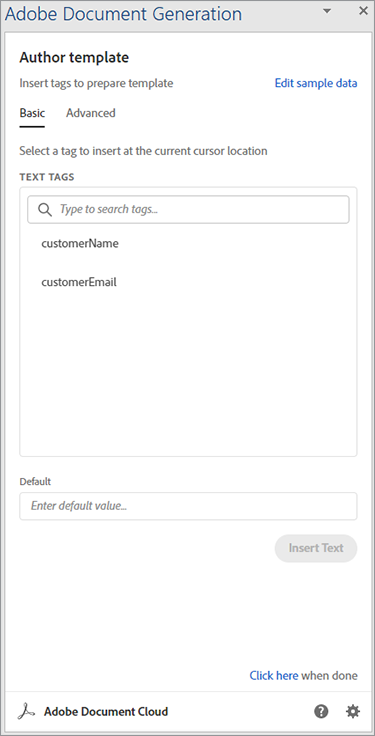
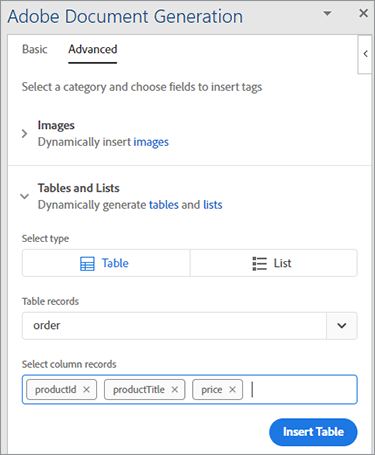

# 인보이스 처리


사업이 호황일 때는 좋지만 그 모든 송장을 준비할 때가 되면 생산성이 떨어집니다. 수동으로 송장을 생성하는 것은 시간이 많이 소요되고, 오류를 만들거나 잠재적으로 손실을 입히거나 잘못된 금액으로 고객을 화나게 할 위험이 있습니다.

예를 들어 Danielle은 의료 공급 회사의 [회계 부서](https://developer.adobe.com/document-services/use-cases/financial/invoices) [에서 근무합니다](https://developer.adobe.com/document-services/use-cases/financial/invoices). 월말이라 여러 시스템에서 정보를 빼내 정확성을 다시 점검하고 청구서에 서식을 지정하는 일을 하고 있습니다. 이러한 모든 작업이 끝난 후 그녀는 마침내 문서를 PDF으로 변환하고(따라서 특정 소프트웨어를 구매하지 않고도 누구나 볼 수 있음) 각 고객에게 개별적으로 발행된 송장을 보낼 준비가 되었습니다.

월별 인보이스 발행이 완료되더라도 Danielle은 해당 인보이스를 피할 수 없습니다. 일부 고객은 비월간 결제 주기를 사용하고 있으므로 항상 누군가를 위한 인보이스를 만들고 있습니다. 때때로 고객이 송장을 편집하고 부족하게 지불합니다. Danielle은 이 인보이스 불일치 문제를 해결하는 데 시간을 보냅니다. 이대로라면 그녀는 모든 일을 따라잡기 위해 조수를 고용해야 한다!

Danielle에게 필요한 것은 월말에 일괄 처리하고 다른 시간에는 임시로 송장을 빠르고 정확하게 생성할 수 있는 방법입니다. 이상적으로, 만일 그녀가 이러한 송장들을 편집으로부터 보호할 수 있다면, 그녀는 일치하지 않는 금액들을 해결하는 것에 대해 걱정할 필요가 없을 것이다.

## 학습 내용

이 실습 튜토리얼에서는 Adobe 문서 생성 API를 사용하여 자동으로 송장을 생성하고, PDF을 암호로 보호하고, 각 고객에게 송장을 전달하는 방법을 알아봅니다. Node.js, JavaScript, Express.js, HTML 및 CSS에 대한 약간의 지식만 있으면 됩니다.

이 프로젝트의 전체 코드는 [GitHub에서 사용 가능](https://github.com/afzaal-ahmad-zeeshan/adobe-pdf-invoice-generation)입니다. 템플릿과 원시 데이터 폴더를 사용하여 공용 디렉토리를 설정해야 합니다. 프로덕션에서 외부 API에서 데이터를 가져와야 합니다. 템플릿 리소스가 포함된 이 보관된 버전의 응용 프로그램도 탐색할 수 있습니다.

## 관련 API 및 리소스

* [PDF 서비스 API](https://opensource.adobe.com/pdftools-sdk-docs/release/latest/index.html)

* [Adobe 문서 생성 API](https://developer.adobe.com/document-services/apis/doc-generation)

* [Adobe Sign API](https://developer.adobe.com/adobesign-api/)

* [프로젝트 코드](https://github.com/afzaal-ahmad-zeeshan/adobe-pdf-invoice-generation)

## 데이터 준비

이 튜토리얼에서는 데이터 웨어하우스에서 데이터를 가져오는 방법에 대해서는 다루지 않습니다. 고객 주문이 데이터베이스, 외부 API 또는 사용자 정의 소프트웨어에 있을 수 있습니다. Adobe 문서 생성 API에는 CRM(고객 관계 관리) 또는 eCommerce 플랫폼의 정보와 같은 인보이스 발행 데이터가 포함된 JSON 문서가 필요합니다. 이 튜토리얼에서는 데이터가 이미 JSON 형식으로 되어 있다고 가정합니다.

간소화를 위해 송장 발행에 다음의 JSON 구조를 사용합니다.

```
{ 
    "customerName": "John Doe", 
    "customerEmail": "john-doe@example.com", 
    "order": [ 
        { 
            "productId": 26, 
            "productTitle": "Bandages", 
            "price": 15.82 
        }, 
        { 
            "productId": 54, 
            "productTitle": "Masks", 
            "price": 25 
        }, 
        { 
            "productId": 76, 
            "productTitle": "Gloves", 
            "price": 7.59 
        } 
    ] 
} 
```

JSON 문서에는 고객 세부 정보와 주문 정보가 포함됩니다. 이 구조화된 문서를 사용하여 송장을 작성하고 요소를 PDF 형식으로 표시할 수 있습니다.

## 인보이스 템플릿 작성

Adobe 문서 생성 API에서는 Microsoft Word 기반 템플릿과 JSON 문서가 동적 PDF 또는 Word 문서를 만들어야 합니다. 인보이스 작성 응용 프로그램용 Microsoft Word 템플릿을 만들고 [무료 문서 생성 Tagger 추가 기능](https://opensource.adobe.com/pdftools-sdk-docs/docgen/latest/wordaddin.html#add-in-demo)을 사용하여 템플릿 태그를 생성합니다. Microsoft Word에서 추가 기능을 설치하고 탭을 엽니다.

문서 생성 Tagger 추가 기능의 

위와 같이 JSON 콘텐츠를 추가 기능에 붙여넣은 후 [태그 생성]을 클릭합니다. 이제 이 플러그인은 오브젝트의 형식을 표시합니다. 기본 템플릿은 고객 이름과 이메일을 사용할 수 있지만 주문 정보를 표시하지 않습니다. 주문 정보에 대해서는 이 자습서의 뒷부분에서 설명합니다.

문서 생성 Tagger 작성자 템플릿의 

Microsoft Word 문서에서 인보이스 템플릿 작성을 시작합니다. 동적 데이터를 삽입해야 하는 위치에 커서를 두고 Adobe 추가 기능 창에서 태그를 선택합니다. **텍스트 삽입**&#x200B;을 클릭하면 Adobe 문서 생성 Tagger 추가 기능에서 태그를 생성하고 삽입할 수 있습니다. 개인 맞춤화를 위해 고객 이름과 이메일을 삽입해 보겠습니다.

이제 각 새 인보이스에 따라 변경되는 데이터로 이동합니다. 추가 기능의 **고급** 탭을 선택합니다. 고객이 주문한 제품을 기반으로 동적 테이블을 생성하는 사용 가능한 옵션을 보려면 **테이블 및 목록** 을 클릭하십시오.

첫 번째 드롭다운에서 **순서**&#x200B;를 선택합니다. 두 번째 드롭다운에서 이 테이블의 열을 선택합니다. 이 튜토리얼에서는 표를 렌더링할 개체의 세 열을 모두 선택합니다.

문서 생성 Tagger 고급 탭의 

문서 생성 API는 배열 내의 요소를 집계하는 것과 같은 복잡한 작업을 수행할 수도 있습니다. **고급** 탭에서 **숫자 계산**&#x200B;을 선택하고 **집계** 탭에서 계산을 적용할 필드를 선택합니다.


**계산 삽입** 단추를 클릭하여 문서 내에서 필요한 위치에 이 태그를 삽입합니다. 이제 다음 텍스트가 Microsoft Word 파일에 나타납니다.

Microsoft Word 문서의 

이 인보이스 샘플에는 고객 정보, 주문 제품 및 총 미수 금액이 포함되어 있습니다.

## Adobe 문서 생성 API를 사용하여 송장 생성

Adobe PDF Services Node.js SDK(software development kit)를 사용하여 Microsoft Word 및 JSON 문서를 결합합니다. 문서 생성 API를 사용하여 송장을 생성하려면 Node.js 애플리케이션을 구축하십시오.

PDF 서비스 API에는 문서 생성 서비스가 포함되어 있으므로 두 서비스에 동일한 자격 증명을 사용할 수 있습니다. [6개월 무료 체험판](https://developer.adobe.com/document-services/pricing/main)을 즐기고 문서 트랜잭션당 $0.05만 지불하십시오.

다음은 PDF 병합 코드입니다.

```
async function compileDocFile(json, inputFile, outputPdf) { 
    try { 
        // configurations 
        const credentials =  adobe.Credentials 
            .serviceAccountCredentialsBuilder() 
            .fromFile("./src/pdftools-api-credentials.json") 
            .build(); 

        // Capture the credential from app and show create the context 
        const executionContext = adobe.ExecutionContext.create(credentials); 
  
        // create the operation 
        const documentMerge = adobe.DocumentMerge, 
            documentMergeOptions = documentMerge.options, 
            options = new documentMergeOptions.DocumentMergeOptions(json, documentMergeOptions.OutputFormat.PDF);

        const operation = documentMerge.Operation.createNew(options); 
  
        // Pass the content as input (stream) 
        const input = adobe.FileRef.createFromLocalFile(inputFile); 
        operation.setInput(input); 
  
        // Async create the PDF 
        let result = await operation.execute(executionContext); 
        await result.saveAsFile(outputPdf); 
    } catch (err) { 
        console.log('Exception encountered while executing operation', err); 
    } 
} 
```

이 코드는 입력 JSON 문서와 입력 템플릿 파일에서 정보를 가져옵니다. 그런 다음 문서 병합 작업을 만들어 파일을 단일 PDF 보고서로 결합합니다. 마지막으로 API 자격 증명으로 작업을 실행합니다. 이러한 자격 증명이 없는 경우 [자격 증명 만들기](https://opensource.adobe.com/pdftools-sdk-docs/release/latest/index.html#getting-credentials)&#x200B;(문서 생성 및 PDF 서비스 API는 동일한 자격 증명을 사용함).

Express 라우터 내에서 이 코드를 사용하여 문서 요청을 처리합니다.

```
// Create one report and send it back
try {
    console.log(\`[INFO] generating the report...\`);
    const fileContent = fs.readFileSync(\`./public/documents/raw/\${vendor}\`,
    'utf-8');
    const parsedObject = JSON.parse(fileContent);

    await pdf.compileDocFile(parsedObject,
    \`./public/documents/template/Adobe-Invoice-Sample.docx\`,
    \`./public/documents/processed/output.pdf\`);

    await pdf.applyPassword("p@55w0rd", './public/documents/processed/output.pdf',
    './public/documents/processed/output-secured.pdf');

    console.log(\`[INFO] sending the report...\`);
    res.status(200).render("preview", { page: 'invoice', filename: 'output.pdf' });
} catch(error) {
    console.log(\`[ERROR] \${JSON.stringify(error)}\`);
    res.status(500).render("crash", { error: error });
}
```

이 코드가 실행되면 제공된 데이터를 기반으로 동적으로 생성된 인보이스가 포함된 PDF 문서를 제공합니다. 샘플 JSON 데이터(위에 제공됨)와 함께 이 코드의 출력은 다음과 같습니다.


이 인보이스에는 JSON 문서의 동적 데이터가 포함됩니다.

## 인보이스를 암호로 보호

Danielle 회계사는 고객이 송장을 변경하는 것을 걱정하므로, 암호를 적용하여 편집을 제한합니다. [PDF 서비스 API](https://opensource.adobe.com/pdftools-sdk-docs/release/latest/index.html)는 문서에 암호를 자동으로 적용할 수 있습니다. 여기에서는 Adobe PDF Services SDK를 사용하여 암호로 문서를 보호합니다. 코드는 다음과 같습니다.

```
async function applyPassword(password, inputFile, outputFile) {
    try {
        // Initial setup, create credentials instance.
        const credentials = adobe.Credentials
        .serviceAccountCredentialsBuilder()
        .fromFile("./src/pdftools-api-credentials.json")
        .build();

        // Create an ExecutionContext using credentials
        const executionContext = adobe.ExecutionContext.create(credentials);
        // Create new permissions instance and add the required permissions
        const protectPDF = adobe.ProtectPDF,
        protectPDFOptions = protectPDF.options;
        // Build ProtectPDF options by setting an Owner/Permissions Password, Permissions,
        // Encryption Algorithm (used for encrypting the PDF file) and specifying the type of content to encrypt.
        const options = new protectPDFOptions.PasswordProtectOptions.Builder()
        .setOwnerPassword(password)
        .setEncryptionAlgorithm(protectPDFOptions.EncryptionAlgorithm.AES_256)
        .build();

        // Create a new operation instance.
        const protectPDFOperation = protectPDF.Operation.createNew(options);

        // Set operation input from a source file.
        const input = adobe.FileRef.createFromLocalFile(inputFile);
        protectPDFOperation.setInput(input);

        // Execute the operation and Save the result to the specified location.
        let result = await protectPDFOperation.execute(executionContext);

        result.saveAsFile(outputFile);
    } catch (err) {
        console.log('Exception encountered while executing operation', err);
    }
}
```

이 코드를 사용하면 암호로 문서를 보호하고 새 인보이스를 시스템에 업로드합니다. 이 코드를 사용하는 방법 또는 사용해보는 방법에 대한 자세한 내용은 [코드 샘플](https://github.com/afzaal-ahmad-zeeshan/adobe-pdf-invoice-generation)을 참조하세요.

인보이스가 완료되면 자동으로 고객에게 이메일로 전송할 수 있습니다. 고객에게 이메일을 자동으로 전송하는 몇 가지 방법이 있습니다. 가장 빠른 방법은 [sendgrid-nodejs](https://github.com/sendgrid/sendgrid-nodejs)와 같은 도우미 라이브러리와 함께 서드파티 이메일 API를 사용하는 것입니다. 또는 이미 SMTP 서버에 액세스할 수 있는 경우 [nodemailer](https://www.npmjs.com/package/nodemailer)를 사용하여 SMTP를 통해 전자 메일을 보낼 수 있습니다.

## 다음 단계

이 실습용 튜토리얼에서는 [인보이스 작성](https://developer.adobe.com/document-services/use-cases/financial/invoices)을 통해 Danielle이 계정을 관리하는 데 도움이 되는 간단한 앱을 만들었습니다. PDF 서비스 API 및 문서 생성 SDK를 사용하여 Microsoft Word 템플릿을 JSON 문서의 고객 주문 정보로 채우고 PDF 송장을 만들었습니다. 그런 다음 [PDF 서비스 API](https://opensource.adobe.com/pdftools-sdk-docs/release/latest/index.html)에서 암호 보호 서비스를 사용하여 각 문서를 암호로 보호했습니다.

Danielle은 자동으로 인보이스를 생성할 수 있으며 인보이스를 편집하는 고객에 대해 걱정할 필요가 없으므로 모든 수동 작업을 지원하는 도우미를 고용할 필요가 없습니다. 그녀는 여분의 시간을 사용하여 지불 계정 파일에서 비용 절감을 찾을 수 있습니다.

지금까지 이 기능이 얼마나 간단한지 살펴보았으므로 다른 Adobe 도구를 사용하여 이 간단한 앱을 확장하여 웹 사이트에 인보이스를 임베드할 수 있습니다. 예를 들어 고객은 언제든지 송장 또는 잔액을 볼 수 있습니다. [Adobe PDF Embed API](https://developer.adobe.com/document-services/apis/pdf-embed)는 무료로 사용할 수 있습니다. 인사부 또는 영업부로 이동하여 계약을 자동화하고 전자 서명을 수집할 수도 있습니다.

모든 가능성을 탐색하고 나만의 편리한 응용 프로그램을 빌드하려면 지금 바로 시작할 수 있는 무료 [[!DNL Adobe Acrobat Services]](https://www.adobe.io/apis/documentcloud/dcsdk/gettingstarted.html) 계정을 만드세요. 6개월 무료 체험 후 [선불 결제](https://developer.adobe.com/document-services/pricing/main)
비즈니스 규모에 따라 문서 트랜잭션당 단 $0.05에 불과합니다.
