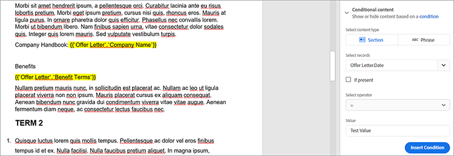
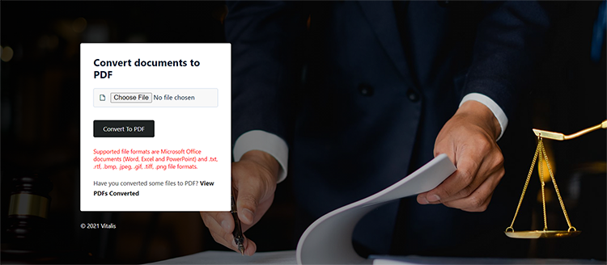

# 법률 계약서 관리


디지털화에는 어려움이 있습니다. 오늘날 대부분의 조직은 [법률 계약](https://www.adobe.io/apis/documentcloud/dcsdk/legal-contracts.html) 다른 당사자가 만들고, 편집하고, 승인하고 서명해야 합니다. 이러한 법률 계약에는 종종 고유한 사용자 정의 및 브랜딩이 필요합니다. 조직이 보안을 유지하기 위해 서명하고 나면 보호된 형식으로 저장해야 할 수도 있습니다. 이를 위해서는 강력한 문서 생성 및 관리 솔루션이 필요합니다.

대부분의 솔루션은 일부 문서 생성을 제공하지만 특정 시나리오에만 적용되는 절과 같은 데이터 입력 및 조건부 논리를 사용자 정의할 수 없습니다. 문서의 크기가 커짐에 따라 법률 템플릿을 수동으로 업데이트하는 작업은 까다롭고 오류가 발생하기 쉽습니다. 이러한 프로세스를 자동화해야 할 필요성이 매우 큽니다.

## 학습 내용

실습 튜토리얼에서는 [[!DNL Adobe Acrobat Services] API](https://www.adobe.io/apis/documentcloud/dcsdk/doc-generation.html) 문서에 사용자 정의 입력 필드를 생성할 때. 또한 생성된 문서를 보호된 휴대용 문서 형식(PDF)으로 손쉽게 변환하여 데이터를 조작하지 않도록 하는 방법을 살펴봅니다.

이 튜토리얼에서는 계약을 PDF으로 변환하는 방법을 살펴볼 때 프로그래밍을 사용하는 방법을 살펴봅니다. 효과적으로 따라가려면 [Microsoft Word](https://www.microsoft.com/en-us/download/office.aspx) 및 [Node.js](https://nodejs.org/) PC에 설치해야 합니다. Node.js 및 [ES6 구문](https://www.w3schools.com/js/js_es6.asp) 이(가) 권장됩니다.

## 관련 API 및 리소스

* [Adobe 문서 생성 API](https://www.adobe.io/apis/documentcloud/dcsdk/doc-generation.html)

* [PDF 포함 API](https://www.adobe.com/devnet-docs/dcsdk_io/viewSDK/index.html)

* [Adobe Sign API](https://www.adobe.io/apis/documentcloud/sign.html)

* [프로젝트 코드](https://github.com/agavitalis/adobe_legal_contracts.git)

## 템플릿 문서 만들기

Microsoft Word 응용 프로그램을 사용하거나 Adobe의 [샘플 Word 템플릿](https://www.adobe.io/apis/documentcloud/dcsdk/doc-generation.html#sample-blade). 하지만 다음과 같은 보조 도구를 사용하지 않고서는 입력을 사용자 정의하고 이러한 문서에 디지털 서명하기가 쉽지 않습니다 [Adobe 문서 생성 태거 추가 기능](https://www.adobe.io/apis/documentcloud/dcsdk/docs.html?view=docgen-addin) Microsoft Word의 경우

문서 생성 태거는 Microsoft Word 추가 기능으로, 태그를 사용하여 문서를 원활하게 사용자 정의할 수 있도록 만들어졌습니다. JSON 데이터를 사용하여 동적으로 채워지는 문서 템플릿에서 동적 필드를 만들 수 있습니다.


문서 생성 태거의 사용을 예시하려면 이 추가 기능을 설치한 다음 간단한 법적 계약 문서의 태깅에 사용되는 JSON 데이터 모델을 만드십시오.

Word에서 문서 생성 태그기를 설치하려면 **삽입** 추가 기능 그룹에서 **내 추가 기능**. Office 추가 기능 메뉴에서 &quot;Adobe 문서 생성&quot;을 검색한 다음 **추가** 과정을 따르십시오. 위의 화면 캡처에서 이러한 단계를 볼 수 있습니다.

Word 추가 기능용 문서 생성 태거를 설치한 후, 간단한 JSON 데이터 모델을 만들어 법적 문서에 태그를 지정합니다.

계속하려면 원하는 편집기를 열고 Agreement.json이라는 파일을 만든 다음, 만든 JSON 파일에 코드 스니펫을 붙여넣습니다.

```
{
"Agreement": {
"Date": "1/24/2021",
"Prime Contractor Name": "Ogbonna Vitalis Corp",
"Prime State": "Lagos",
"Address": "Maryland Ave, Lagos State, Ng",
"Sub Contractor Name": "Vivvaa Soln",
"Sub Contractor State": "California",
"Sub Contractor Address": "Molusi Avenue, Dallas Texas, CA",
"Agreement Date": "1/24/2021",
"Length": 5
}
}
```

이 JSON 문서를 저장한 후 문서 생성 태거 추가 기능으로 가져옵니다. 을 클릭하여 문서를 가져옵니다. **문서 생성** 를 클릭합니다.


안내할 비디오가 표시됩니다. 아이콘을 클릭하거나 태그 지정 필드로 바로 이동할 수 있습니다. **시작하기**. 클릭 후 **시작하기**, 업로드 양식이 나타납니다. 클릭 **JSON 파일 업로드** 방금 만든 JSON 파일을 선택합니다. 가져오기가 완료되면 **태그 생성** 태그를 생성합니다.

태그를 가져오고 생성한 후 문서에 이러한 태그를 추가할 수 있습니다. 태그를 추가하려면 태그를 표시할 정확한 지점에 커서를 놓습니다. 그런 다음 문서 생성 API에서 태그를 선택하고 **텍스트 삽입**. 아래 화면 캡처에서는 이 절차를 간략하게 설명합니다.


가져온 JSON 데이터 모델을 사용하여 만든 기본 태그 외에도 이미지, 조건부 논리, 연산, 반복 요소, 조건부 구문 등의 고급 기능을 사용할 수 있습니다. 를 클릭하여 이러한 기능에 액세스할 수 있습니다. **고급** 를 클릭합니다. 아래 화면 캡처에서 이를 확인할 수 있습니다.


이러한 고급 기능은 기본 태그와 다르지 않습니다. 조건부 논리를 포함하려면 문서에서 채울 부분을 선택합니다. 그런 다음 태그의 삽입을 결정하는 규칙을 구성합니다.

더 자세히 설명하려면 계약서에 조건으로만 포함할 섹션이 있습니다. 콘텐츠 유형 선택 필드에서 **섹션을 참조하십시오.** 레코드 선택 필드에서 조건부 섹션의 표시 여부를 결정하는 옵션을 선택합니다. 원하는 조건부 연산자를 선택하고 값 필드에서 테스트하려는 값을 설정합니다. 그런 다음 **조건을 삽입합니다.** 아래 화면 캡처에서는 이 프로세스를 보여 줍니다.



계산의 경우 산술 또는 합계를 선택한 다음 사용할 수 있는 템플릿 태그를 기반으로 관련 첫 번째 레코드, 연산자 및 사용할 두 번째 레코드를 포함합니다. 그런 다음 **계산 삽입**.

또한 법률 계약에는 관련 당사자의 서명이 필요한 경우가 많습니다. &quot;숫자 계산&quot; 섹션 바로 아래에 있는 Adobe Sign 텍스트 태그를 사용하여 전자 서명을 삽입할 수 있습니다. 전자 서명을 포함하려면 수신자 수를 지정하고 **서명자**&#x200B;와 함께 드롭다운 목록의 필드 유형이 나열됩니다. 완료되면 **Adobe Sign 텍스트 태그 삽입** 을 눌러 프로세스를 완료합니다.

데이터 무결성을 보장하려면 법률 문서를 보호된 형식으로 저장하십시오. 포함 [!DNL Acrobat Services] API를 통해 문서를 PDF 형식으로 빠르게 변환할 수 있습니다. 간단한 익스프레스 Node.js 애플리케이션을 구축하고, 문서 생성 API를 통합하고, 이 간단한 애플리케이션을 사용하여 태그 있는 문서를 Word에서 PDF 형식으로 변환할 수 있습니다.

## 프로젝트 설정

먼저 Node.js 응용 프로그램에 대한 폴더 구조를 설정합니다. 이 예제에서는 이 간단한 응용 프로그램 AdobeLegalContractAPI를 호출합니다. 소스 코드를 검색할 수 있습니다 [여기](https://github.com/agavitalis/adobe_legal_contracts.git).

### 디렉토리 구조

AdobeLegalContractAPI라는 폴더를 만들고 원하는 편집기에서 엽니다. 기본 Node.js 응용 프로그램 만들기 ```npm init``` 명령을 실행할 수 없습니다.

```
###Directory Structure
AdobeLegalContractAPI
-----config
----------default.json
-----controllers
----------createPDFController.js
----------previewController.js
-----models
----------document.js
-----routes
----------web.js
-----services
-----------upload.js
-----uploads
-----views
-----index.js
```

위의 내용은 응용 프로그램에 대한 간단한 Node.js 응용 프로그램 구조입니다. 이제 필요한 npm 패키지의 설치를 진행합니다.

### 패키지 설치

아래 코드 조각에 표시된 대로 npm install 명령을 사용하여 필요한 패키지를 설치합니다.

```
npm install express body-parser morgan multer hbs path config mongoose
```

패키지를 설치한 후 package.json 파일의 내용이 아래 코드 조각과 같은지 확인하십시오.

```
###package.json
{
"name": "adobelegalcontractapi",
"version": "1.0.0",
"description": "",
"main": "index.js",
"directories": {
"test": "test"
},
"dependencies": {
"body-parser": "^1.19.0",
"config": "^3.3.6",
"express": "^4.17.1",
"hbs": "^4.1.1",
"mongoose": "^5.12.1",
"morgan": "^1.10.0",
"multer": "^1.4.2",
"path": "^0.12.7"
},
"devDependencies": {},
"scripts": {
"start": "node index.js"
},
"repository": {
"type": "git",
"url": "https://github.com/agavitalis/adobe_legal_contracts.git"
},
"author": "Ogbonna Vitalis",
"license": "ISC",
"bugs": {
"url": "https://github.com/agavitalis/adobe_legal_contracts/issues"
},
"homepage": "https://github.com/agavitalis/adobe_legal_contracts#readme"
}
```

이러한 코드 조각에서는 보기에 대한 핸들 템플릿 엔진을 비롯하여 응용 프로그램 종속성을 설치했습니다.

이 튜토리얼의 주요 내용은 [[!DNL Acrobat Services] API](https://www.adobe.io/apis/documentcloud/dcsdk/) 문서를 PDF으로 변환 따라서 이 Node.js 응용 프로그램을 구축하는 단계별 프로세스는 없습니다. 그러나, [GitHub](https://github.com/agavitalis/adobe_legal_contracts.git).

## 통합 [!DNL Adobe Acrobat Services] Node.js 애플리케이션에 API 추가

[!DNL Adobe Acrobat Services] API는 문서를 원활하게 조작하도록 설계된 클라우드 기반의 신뢰할 수 있는 서비스입니다. 세 가지 API를 제공합니다.

* Adobe PDF 서비스 API

* Adobe PDF 임베드 API

* Adobe 문서 생성 API

사용할 자격 증명이 필요합니다. [!DNL Acrobat Services] API(PDF 포함 API 자격 증명과 다름). 유효한 자격 증명이 없으면 [레지스터](https://www.adobe.com/go/dcsdks_credentials?ref=getStartedWithServicesSDK) 아래 화면 캡처에 설명된 대로 워크플로를 완료합니다. 즐거운 시간 [6개월 무료 체험판 후 사용한 만큼 지불](https://www.adobe.io/apis/documentcloud/dcsdk/pdf-pricing.html), 문서 트랜잭션당 $0.05입니다.


등록 프로세스가 완료되면 코드 샘플이 자동으로 PC에 다운로드되어 시작하는 데 도움이 됩니다. 이 코드 샘플을 추출하고 따라 할 수 있습니다. 추출된 코드 샘플에서 pdftools-api-credentials.json 및 private.key 파일을 Node.js 프로젝트의 루트 디렉터리로 복사하는 것을 잊지 마십시오. 액세스하려면 자격 증명이 필요합니다. [!DNL Acrobat Services] API 끝점. 개인 설정된 자격 증명으로 SDK 샘플을 다운로드할 수도 있으므로 샘플 코드에서 키를 업데이트할 필요가 없습니다.

이제 다음을 실행하여 Adobe PDF 서비스 노드 SDK를 설치합니다. ```npm install \--save @adobe/documentservices-pdftools-node-sdk``` 명령입니다. 성공적으로 설치되면 [!DNL Acrobat Services] 응용 프로그램에서 문서를 조작하는 API.

## PDF 문서 만들기

[!DNL Acrobat Services] API는 Microsoft Office 문서(Word, Excel 및 PowerPoint) 및 기타 문서에서 PDF 생성을 지원합니다 [지원되는 파일 형식](https://opensource.adobe.com/pdftools-sdk-docs/release/latest/howtos.html#create-a-pdf) .txt, .rtf, .bmp, .jpeg, gif, .tiff, .png와 같은 형식입니다. Acrobat 서비스 API를 사용하면 법률 계약서를 다른 파일 형식에서 PDF으로 손쉽게 변환할 수 있습니다.

Adobe 문서 생성 API를 사용하면 Word 파일 또는 PDF으로 변환할 수 있습니다. 예를 들어, Word 템플릿을 사용하여 편집된 텍스트를 표시하는 교정 등 계약을 생성할 수 있습니다. 그런 다음 암호로 변환하고 PDF 서비스 API를 사용하여 암호로 문서를 보호하고 서명을 위해 문서를 보내는 등의 작업을 수행합니다.

지원되는 파일 형식에서 PDF 문서 만들기를 구현하려면 [!DNL Acrobat Services].

디자인된 업로드 양식은 아래 화면 캡처에 표시되며, 사용자는 [GitHub](https://github.com/agavitalis/adobe_legal_contracts.git).



이제 컨트롤러 /createPDFController.js 파일에 다음 코드 조각을 추가합니다. 이 코드는 업로드된 문서를 검색하여 PDF으로 변환합니다. [!DNL Acrobat Services] 업로드된 원본 파일과 변형된 파일을 다른 폴더에 저장합니다.

```
###controllers/createPDFController.js
const PDFToolsSdk = require('@adobe/documentservices-pdftools-node-sdk');
const Document = require('../models/document');
/*
* GET / route to show the createPDF form.
*/
function createPDF(req, res) {
//catch any response on the url
let response = req.query.response
res.render('index', { response })
}
/*
* POST /createPDF to create a new PDF File.
*/
function createPDFPost(req, res) {
let filePath = req.file.path;
let fileName = req.file.filename;
try {
// Initial setup, create credentials instance.
const credentials = PDFToolsSdk.Credentials
.serviceAccountCredentialsBuilder()
.fromFile("pdftools-api-credentials.json")
.build();
// Create an ExecutionContext using credentials and create a new operation instance.
const executionContext = PDFToolsSdk.ExecutionContext.create(credentials),
createPdfOperation = PDFToolsSdk.CreatePDF.Operation.createNew();
// Set operation input from a source file.
const input = PDFToolsSdk.FileRef.createFromLocalFile(filePath);
createPdfOperation.setInput(input);
// Execute the operation and Save the result to the specified location.
createPdfOperation.execute(executionContext)
.then(async(result) => {
let newFileName = `createPDFFromDOCX-${Math.random() * 171}.pdf`
let newFilePath = require('path').resolve('./') + `\\output\\${newFileName}`
await result.saveAsFile(`views/output/${newFileName}`)
//Creates a new document
let newDocument = new Document({
documentName: newFileName,
url: newFilePath
});
//Save it into the DB.
newDocument.save((err, docs) => {
if (err) {
res.send(err);
}
else {
res.redirect('/?response=PDF Successfully created')
}
});
})
.catch(err => {
if (err instanceof PDFToolsSdk.Error.ServiceApiError
|| err instanceof PDFToolsSdk.Error.ServiceUsageError) {
console.log('Exception encountered while executing operation', err);
} else {
console.log('Exception encountered while executing operation', err);
}
});
} catch (err) {
console.log('Exception encountered while executing operation', err);
}
}
//export all the functions
module.exports = { createPDF, createPDFPost };
```

위의 코드 조각에는 문서 모델 및 [!DNL Acrobat Services] 이전에 설치한 노드 SDK 다음과 같은 두 가지 기능이 있습니다.

* createPDF에 업로드 문서 양식이 표시됩니다.

* createPDFPost는 업로드된 문서를 PDF으로 변환합니다.

이러한 함수는 변환된 PDF 문서를 PC에 다운로드할 수 있는 views/output 디렉토리에 저장합니다.

무료 PDF 포함 API를 사용하여 변형된 PDF 파일을 미리 볼 수도 있습니다. PDF 포함 API를 사용하여 Adobe 자격 증명을 생성할 수 있습니다 [여기](https://www.adobe.com/go/dcsdks_credentials) (다른 [!DNL Acrobat Services] 자격 증명)을 설정하고 API에 액세스할 수 있도록 허용된 도메인을 등록합니다. 절차에 따라 응용 프로그램의 PDF 포함 API 자격 증명을 생성합니다. 데모를 확인할 수도 있습니다 [여기](https://documentcloud.adobe.com/view-sdk-demo/index.html#/view/FULL_WINDOW/Bodea%20Brochure.pdf)에서 코드를 생성하여 빠르게 시작할 수 있습니다.

응용 프로그램으로 다시 돌아가 응용 프로그램의 view 폴더에서 list.hbs 및 preview.hbs 파일을 만들고 아래 코드 조각을 list.hbs 및 preview.hbs 파일에 각각 붙여넣습니다.

```
###views/list.hbs
<!DOCTYPE html>
<html lang="en">
<head>
<title>Adobe Legal Contract</title>
<!-- Meta tags -->
<meta charset="UTF-8">
<meta name="viewport" content="width=device-width,
initial-scale=1.0">
<meta http-equiv="X-UA-Compatible" content="ie=edge">
<!-- //Meta tags -->
<link
href=".min.css" rel="stylesheet" integrity="sha384-eOJMYsd53ii+scO/
bJGFsiCZc+5NDVN2yr8+0RDqr0Ql0h+rP48ckxlpbzKgwra6" crossorigin="anonymous">
<link rel="stylesheet" href="css/style.css" type="text/css"
media="all" /><!-- Style-CSS -->
<link href="css/font-awesome.css" rel="stylesheet" /><!--
font-awesome-icons -->
</head>
<body>
<section>
<div class="form-36-mian section-gap">
<div class="wrapper">
<div class="container">
<div class="row">
{{#each documents}}
<div class="col-md-4 mb-2">
<div class="card" style="width:
18rem;">

<div class="card-body">
<h5
class="card-title">{{documentName}}</h5>
<a
href="/downloadPDF/{{_id}}" class="btn btn-primary"><i class="fa
fa-download" aria-hidden="true"></i> Download</a>
<a
href="/previewPDF/{{_id}}" class="btn btn-info"><i class="fa fa-eye"
aria-hidden="true"></i> Preview</a>
</div>
</div>
</div>
{{/each}}
</div>
</div>
<!-- copyright -->
<div class="copy-right">
<p>(c) 2021 Vitalis</p>
</div>
<!-- //copyright -->
</div>
</div>
</section>
</body>
</html>
###views/preview.hbs
<!DOCTYPE html>
<html lang="en">
<head>
<title>[!DNL Adobe Acrobat Services] PDF Embed API</title>
<meta charset="utf-8" />
<meta http-equiv="X-UA-Compatible" content="IE=edge,chrome=1" />
<meta id="viewport" name="viewport" content="width=device-width,
initial-scale=1" />
</head>
<body style="margin: 0px">
<input type="hidden" id="pdfDocumentName"
value={{document.documentName}} />
<input type="hidden" id="pdfDocumentUrl" value={{document.url}} />
<div id="adobe-dc-view"></div>
<script
src="https://documentcloud.adobe.com/view-sdk/main.js"></script>
<script type="text/javascript">
let pdfDocumentName =
document.getElementById("pdfDocumentName").value;
let pdfDocumentUrl =
document.getElementById("pdfDocumentUrl").value;
document.addEventListener("adobe_dc_view_sdk.ready", function
() {
var adobeDCView = new AdobeDC.View({ clientId:
"XXXXXXXXXXXXXXXX", divId: "adobe-dc-view" });
adobeDCView.previewFile({
content: { location: { url:
`http://localhost:5000/output/${pdfDocumentName}` } },
metaData: { fileName: pdfDocumentName }
}, {});
});
</script>
</body>
</html>
```

또한 controller/previewController.js 파일을 만들고 그 아래에 코드 조각을 붙여 넣습니다.

```
const Document = require('../models/document');
/*
* GET /listFiles route to show PDF file lists.
*/
async function listFiles(req, res) {
let documents = await Document.find({});
res.render('lists', { documents })
}
/*
* GET /previewPDF route to show PDF file in AdobeEmbedAPI.
*/
async function previewPDF(req, res) {
//catch any response on the url
let documentId = req.params.documentId
let document = await Document.findOne({_id:documentId});
res.render('preview', { document })
}
/*
* GET /downloadPDF To Download PDF Documents.
*/
async function downloadPDF(req, res) {
let documentId = req.params.documentId
let document = await Document.findOne({_id:documentId});
res.download(document.url);
}
//export all the functions
module.exports = {listFiles, previewPDF, downloadPDF };
```

위의 컨트롤러 파일에는 listFiles, previewPDF, downloadPDF의 세 가지 기능이 있습니다. listFiles 함수는 지금까지 생성된 모든 PDF 파일을 [!DNL Acrobat Services] API previewPDF 함수를 사용하면 PDF 포함 API를 사용하여 PDF 파일을 미리 볼 수 있으며 downloadPDF 함수를 사용하면 생성된 PDF 파일을 PC에 다운로드할 수 있습니다. 아래 화면 캡처에서는 PDF 포함 API를 사용한 PDF 미리 보기의 샘플을 보여 줍니다.


## 요약

이 실습 튜토리얼에서는 문서 생성 태거 Microsoft Word 추가 기능을 사용하여 문서에 태그를 지정했습니다. 통합 [!DNL Acrobat Services] API를 Node.js 애플리케이션으로 변환하고 태그 있는 문서를 다운로드 가능한 PDF 형식으로 변환했습니다. 단, PDF에 대한 법적 계약서도 직접 만들 수 있습니다. 마지막으로 Adobe PDF 임베드 API 를 사용하여 확인 및 서명을 위해 생성된 PDF을 미리 봅니다.

완료된 응용 프로그램을 사용하면 태그를 더 쉽게 지정할 수 있습니다 [법률 계약 템플릿](https://www.adobe.io/apis/documentcloud/dcsdk/legal-contracts.html) 동적 필드를 사용하여 PDF으로 변환하고 미리 본 다음 [!DNL Acrobat Services] API 팀은 고유한 계약서를 만드는 데 시간을 허비하지 않고 각 고객에게 적합한 계약서를 자동으로 전달한 다음 비즈니스 성장에 더 많은 시간을 할애할 수 있습니다.

조직 사용 [!DNL Adobe Acrobat Services] API를 통해 API를 간편하게 사용할 수 있습니다. 무엇보다도 [6개월 무료 체험판 후 사용한 만큼 지불](https://www.adobe.io/apis/documentcloud/dcsdk/pdf-pricing.html). 사용한 만큼만 지불하시면 됩니다 또한 PDF 포함 API는 항상 무료입니다.

문서 흐름을 개선하여 생산성을 향상시킬 준비가 되셨습니까? [시작하기](https://www.adobe.io/apis/documentcloud/dcsdk/gettingstarted.html) 미래
