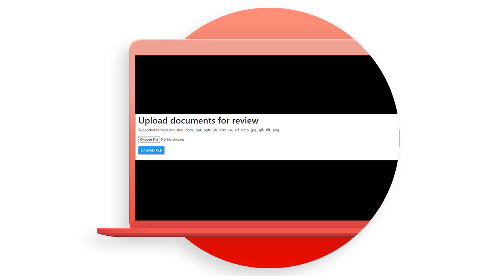

# API 사용 사례 [!DNL Adobe Acrobat Services]개

## [!DNL Adobe Acrobat Services] API로 무엇을 할 수 있습니까?

이러한 실습형 사용 사례를 통해 [!DNL Adobe Acrobat Services] API로 비즈니스를 변경하는 방법에 대해 알아봅니다.

### API [!DNL Acrobat Services]개

<table style="table-layout:fixed">
<tr>
  <td>
    
    

    <a href="automatelegalworkflows.md"><strong>법적 작업 과정 자동화</strong></a>
    

    <em>조건부 콘텐츠로 법적 작업 과정을 자동화하는 방법에 대해 알아보세요</em>
     
  </td>
  <td>
      
      

      <a href="employeeonboarding.md"><strong>직원 온보딩 현대화</strong></a>
      

      <em>직원 온보딩을 현대화하는 방법 알아보기</em>
       
  </td>
  <td>
      
      

      <a href="acceleratesales.md"><strong>판매 프로세스 가속화</strong></a>
      

      <em>문서 경험을 통합하여 판매를 가속화하는 방법 알아보기</em>
       
    </td>
    <td>
      
      

      <a href="sales.md"><strong>판매 제안 및 계약 관리</strong></a>
      

      <em>영업 제안을 자동화하고 단순화하기 위한 효율적인 워크플로우를 구축하는 방법에 대해 알아봅니다.</em>
       
    </td>
</tr>
<tr>
  <td>
    
    

    <a href="nda.md"><strong>NDA 만들기</strong></a>
    

    <em>공동 작업을 위한 동적 NDA PDF을 만드는 방법</em>
     
  </td>
  <td>
    
    

    <a href="legal.md"><strong>법률 계약 관리</strong></a>
    

    <em>사용자 지정 데이터 입력으로 법적 문서를 자동으로 생성하고 보호하는 방법을 알아봅니다.</em>
     
  </td>
  <td>
    
    

    <a href="offer.md"><strong>직원 제안서 관리</strong></a>
    

    <em>서명을 위해 신입 사원에게 전달할 수 있는 오퍼 레터를 생성하는 방법에 대해 알아보십시오</em>
     
  </td>
  <td>
    
    

    <a href="searching.md"><strong>검색 및 인덱싱</strong></a>
    

    <em>스캔한 문서에서 검색 가능한 PDF 파일을 만드는 방법</em>
     
  </td>
</tr>
<tr>
  <td>
    
    

    <a href="reviews.md"><strong>검토 및 승인</strong></a>
    

    <em>팀 간 공동 작업을 위한 문서 검토 및 승인 워크플로를 빌드하는 방법에 대해 알아보세요</em>
     
  </td>
  <td>
    
    

    <a href="reportcreation.md"><strong>보고서 작성 및 편집</strong></a>
    

    <em>고객을 위해 웹 사이트에서 PDF 보고서를 생성하는 방법을 알아보세요</em>
     
  </td>
  <td>
    
    

    <a href="jobposting.md"><strong>채용 공고</strong></a>
    

    <em>구직자와 고용주를 위한 부드럽고 일관된 웹 환경을 개발하는 방법에 대해 알아보세요</em>
     
  </td>
  <td>
    
    

    <a href="educationcollab.md"><strong>학생-교사 공동 작업</strong></a>
    

    <em>교사와 학생이 PDF에서 리소스를 쉽게 공유할 수 있는 온라인 학습 플랫폼을 만드는 방법</em>을 살펴보세요.
     
  </td>
</tr>
<tr>
  <td>
    
    

    <a href="agreementworkflowsnodejs.md"><strong>Node.js의 계약 워크플로</strong></a>
    

    <em>[!DNL Adobe Acrobat Services] API는 웹 응용 프로그램에 PDF 기능을 쉽게 통합합니다.</em>
     
  </td>
  <td>
    
    

    Java의 <a href="hragreementworkflowsjava.md"><strong>HR 문서 워크플로</strong></a>
    

    <em>[!DNL Adobe Acrobat Services]개의 API가 HR 웹 응용 프로그램에 PDF 기능을 쉽게 통합합니다.</em>
     
  </td>
  <td>
    
    

    <a href="financeworkflowsjava.md"><strong>Java에서 재무 문서 작업 과정 관리</strong></a>
    

    <em>[!DNL Adobe Acrobat Services]은(는) PDF 재무 문서에서 데이터를 처리하고 추출하는 데 필요한 모든 도구, 서비스 및 기능을 제공합니다</em>
     
  </td>
  <td>
    
    

     
  </td>
</tr>
</table>

### 문서 생성 API

<table style="table-layout:fixed">
<tr>
  <td>
    
    

    <a href="invoices.md"><strong>인보이스 처리</strong></a>
    

    <em>고객 송장을 자동으로 생성, 암호로 보호 및 제공하는 방법에 대해 알아보십시오</em>
     
  </td>
  <td>
    
    

     
  </td>
  <td>
    
    

     
  </td>
  <td>
    
    

     
  </td>
</tr>
</table>

### PDF 포함 API

<table style="table-layout:fixed">
<tr>
   <td>
    
    

    <a href="ddppdfembedapi.md"><strong>디지털 문서 게시</strong></a>
    

    <em>Adobe PDF Embed API를 사용하여 웹 페이지에 포함된 PDF 문서를 표시하는 방법을 알아봅니다.</em>
     
  </td>
  <td>
    
    

     
  </td>
  <td>
    
    

     
  </td>
  <td>
    
    

     
  </td>
</tr>
</table>