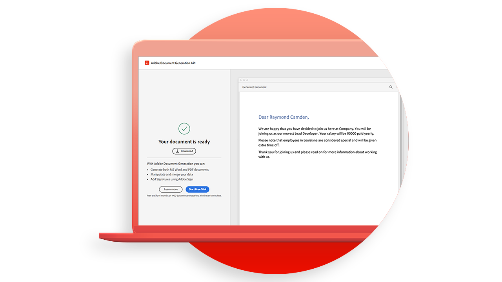

# [!DNL Adobe Acrobat Services] API 사용 사례

![[!DNL Acrobat Services] API 사용 사례 배너](../assets/usecaseshero.jpg)

## 어떤 [!DNL Adobe Acrobat Services] API가 있습니까?

자세한 내용은 [!DNL Adobe Acrobat Services] API는 이러한 실습 활용 사례를 통해 비즈니스를 혁신할 수 있습니다.

### [!DNL Acrobat Services] API

<table style="table-layout:fixed">
<tr>
  <td>
    
    

    <a href="automatelegalworkflows.md"><strong>법률 워크플로우 자동화</strong></a>
    

    <em>조건부 콘텐츠로 법적 워크플로우를 자동화하는 방법에 대해 알아봅니다.</em>
     
  </td>
  <td>
      
      

      <a href="employeeonboarding.md"><strong>직원 온보딩 혁신</strong></a>
      

      <em>직원 온보딩 현대화 방법 살펴보기</em>
       
  </td>
  <td>
      
      

      <a href="acceleratesales.md"><strong>세일즈 프로세스 가속화</strong></a>
      

      <em>문서 경험을 통합하여 세일즈 가속화하는 방법 살펴보기</em>
       
    </td>
    <td>
      
      

      <a href="sales.md"><strong>판매 제안서 및 계약서 관리</strong></a>
      

      <em>효율적인 워크플로우를 구축하여 세일즈 제안서를 자동화하고 간소화하는 방법을 살펴볼 수 있습니다</em>
       
    </td>
</tr>
<tr>
  <td>
    
    

    <a href="nda.md"><strong>NDA 작성</strong></a>
    

    <em>공동 작업을 위한 다이내믹한 NDA PDF을 제작하는 방법에 대해 알아봅니다.</em>
     
  </td>
  <td>
    
    

    <a href="legal.md"><strong>법률 계약서 관리</strong></a>
    

    <em>맞춤 데이터 입력을 통해 법률 문서를 자동으로 생성하고 보호하는 방법</em>
     
  </td>
  <td>
    
    

    <a href="offer.md"><strong>직원 고용 제안서 관리</strong></a>
    

    <em>서명을 받기 위해 새 직원에게 전달할 수 있는 제안서를 생성하는 방법에 대해 알아봅니다.</em>
     
  </td>
  <td>
    
    

    <a href="searching.md"><strong>검색 및 인덱싱</strong></a>
    

    <em>스캔한 문서에서 검색 가능한 PDF 파일을 만드는 방법 알아보기</em>
     
  </td>
</tr>
<tr>
  <td>
    
    

    <a href="reviews.md"><strong>검토 및 승인</strong></a>
    

    <em>팀 간 공동 작업을 위한 문서 검토 및 승인 워크플로우를 구축하는 방법에 대해 알아봅니다</em>
     
  </td>
  <td>
    
    

    <a href="reportcreation.md"><strong>보고서 작성 및 편집</strong></a>
    

    <em>웹 사이트에서 고객을 위한 PDF 보고서를 생성하는 방법 알아보기</em>
     
  </td>
  <td>
    
    

    <a href="jobposting.md"><strong>채용 공고</strong></a>
    

    <em>구직자와 고용주를 위한 원활하고 일관된 웹 경험을 개발하는 방법에 대해 알아봅니다</em>
     
  </td>
  <td>
    
    

    <a href="educationcollab.md"><strong>학생-교사 공동 작업</strong></a>
    

    <em>교사와 학생이 PDF에서 리소스를 손쉽게 공유할 수 있는 온라인 학습 플랫폼을 만드는 방법에 대해 알아봅니다</em>
     
  </td>
</tr>
<tr>
  <td>
    
    

    <a href="AgreementWorkflowsNodejs.md"><strong>Node.js의 계약 작업 과정</strong></a>
    

    <em>[!DNL Adobe Acrobat Services] API는 PDF 기능을 웹 애플리케이션에 쉽게 통합합니다</em>
     
  </td>
  <td>
    
    

    <a href="HRAgreementWorkflowsJava.md"><strong>Java의 HR 문서 워크플로우</strong></a>
    

    <em>[!DNL Adobe Acrobat Services] API를 통해 PDF 기능을 HR 웹 애플리케이션에 간편하게 통합</em>
     
  </td>
  <td>
    
    

    <a href="FinanceWorkflowsJava.md"><strong>Java에서 재무 문서 워크플로우 관리</strong></a>
    

    <em>[!DNL Adobe Acrobat Services] PDF 재무 문서에서 데이터를 처리하고 추출하는 데 필요한 모든 도구, 서비스 및 기능을 제공합니다.</em>
     
  </td>
  <td>
    
    

     
  </td>
</tr>
</table>

### 문서 생성 API

<table style="table-layout:fixed">
<tr>
  <td>
    
    

    <a href="invoices.md"><strong>송장 처리</strong></a>
    

    <em>고객 송장을 자동으로 생성, 암호로 보호 및 전달하는 방법 알아보기</em>
     
  </td>
  <td>
    
    

     
  </td>
  <td>
    
    

     
  </td>
  <td>
    
    

     
  </td>
</tr>
</table>

### PDF 포함 API

<table style="table-layout:fixed">
<tr>
   <td>
    
    

    <a href="ddppdfembedapi.md"><strong>디지털 문서 퍼블리싱</strong></a>
    

    <em>Adobe PDF Embed API를 사용하여 웹 페이지 내에 포함된 PDF 문서를 표시하는 방법을 알아봅니다.</em>
     
  </td>
  <td>
    
    

     
  </td>
  <td>
    
    

     
  </td>
  <td>
    
    

     
  </td>
</tr>
</table>