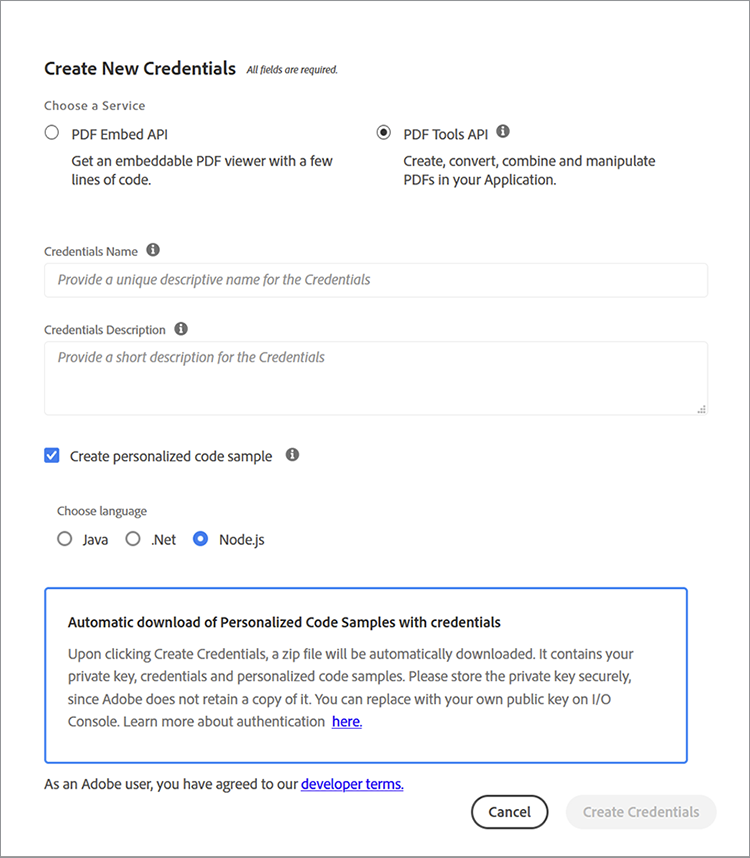

# 판매 제안서 및 계약서 관리


세일즈 제안서는 고객 확보를 위한 비즈니스 여정의 첫 단계입니다. 모든 것과 마찬가지로 첫인상은 지속됩니다. 따라서 고객과의 첫 상호 작용이 고객의 비즈니스 기대에 부응합니다. 당신의 제안은 간결하고 정확하고 편리해야 합니다.

계약서 및 제안서에는 문서 구조 내에 다양한 유형의 데이터가 포함되어 있습니다. 여기에는 동적 데이터(클라이언트 이름, 견적 금액 등)와 정적 데이터(확정 기능, 팀 프로필, 표준 SOW 약관 등 상용구 텍스트)가 모두 포함됩니다. 판매 제안서와 같은 템플릿 문서를 만들려면 상용 템플릿에서 프로젝트 세부 사항을 수동으로 바꾸는 등 단조로운 작업이 수반되는 경우가 많습니다. 이 자습서에서는 동적 데이터 및 작업 과정을 사용하여 [판매 제안 생성](https://www.adobe.io/apis/documentcloud/dcsdk/sales-proposals-and-contracts.html).

## 학습 내용

이 실습 튜토리얼에서는 여러 툴을 사용하여 동적 데이터와 워크플로우를 구현하는 방법을 살펴봅니다. 이 중 가장 중요한 툴은 다음과 같습니다 [!DNL Adobe Acrobat Services] API 이러한 API를 사용하면 귀하와 귀하의 비즈니스가 보다 편리하게 세일즈 제안서와 계약서를 작성할 수 있습니다. 이 튜토리얼에서는 PDF 문서를 자동으로 만들고, 병합하고, 표시하는 방법을 보여 주는 실습 기법을 살펴봅니다. 이러한 작업을 수동으로 수행하는 작업은 시간이 많이 소요되고 번거롭습니다. 의 이익을 이용해서 [!DNL Acrobat Services] API를 통해 이러한 작업에 소요되는 시간을 줄일 수 있습니다.

## 관련 API 및 리소스

* [Microsoft Word](https://www.office.com/)

* [Node.js](https://nodejs.org/en/)

* [npm](https://www.npmjs.com/get-npm)

* [[!DNL Acrobat Services] API](https://www.adobe.io/apis/documentcloud/dcsdk/)

* [Adobe 문서 생성 API](https://www.adobe.io/apis/documentcloud/dcsdk/doc-generation.html)

* [Adobe Sign API](https://www.adobe.io/apis/documentcloud/sign.html)

* [Adobe 문서 생성 태거](https://opensource.adobe.com/pdftools-sdk-docs/docgen/latest/wordaddin.html#add-in-demo)

## 문제 해결

툴을 설치했다면 이제 문제 해결을 시작할 수 있습니다. 제안서에는 각 클라이언트마다 고유한 정적 콘텐츠와 동적 콘텐츠가 있습니다. 두 가지 유형의 데이터가 제안을 할 때마다 필요하기 때문에 병목 현상이 발생합니다. 정적 텍스트를 입력하는 데 시간이 오래 걸리므로 자동화하고 각 클라이언트의 동적 데이터만 수동으로 처리하게 됩니다.

먼저 [Microsoft Forms](https://www.office.com/launch/forms?auth=1) (또는 선호하는 양식 작성기). 이 양식은 판매 제안서에 추가된 클라이언트의 동적 데이터를 위한 것입니다. 이 양식을 질문으로 작성하여 고객으로부터 필요한 세부 정보(예: 회사 이름, 날짜, 주소, 프로젝트 범위, 가격 및 추가 주석)를 얻으십시오. 직접 만들려면 이 옵션을 사용하십시오. [양식](https://forms.office.com/Pages/ShareFormPage.aspx id=DQSIkWdsW0yxEjajBLZtrQAAAAAAAAAN__rtiGj5UNElTR0pCQ09ZNkJRUlowSjVQWDNYUEg2RC4u&amp;sharetoken=1AJeMavBAzxuISRKmUy). 목표는 잠재 클라이언트가 양식을 작성한 다음 응답을 JSON 파일로 내보내는 것입니다. JSON 파일은 워크플로우의 다음 부분으로 전달됩니다.

일부 양식 작성자는 데이터를 CSV 파일로만 내보낼 수 있습니다. 따라서 다음과 같은 이점이 있습니다 [변환](http://csvjson.com/csv2json) 생성된 CSV 파일을 JSON 파일로 변환합니다.

모든 판매 제안서에는 정적 데이터가 재사용됩니다. 따라서 Microsoft Word의 판매 제안서 템플릿을 사용하여 정적 텍스트를 제공할 수 있습니다. 이걸 사용하시면 됩니다 [템플릿](https://1drv.ms/w/s!AiqaN2pp7giKkmhVu2_2pId9MiPa?e=oeqoQ2)직접 만들거나 [Adobe 템플릿](https://www.adobe.io/apis/documentcloud/dcsdk/doc-generation.html).

JSON 포맷의 경우 클라이언트의 동적 데이터를, Microsoft Word 템플릿의 경우 정적 텍스트를 모두 가져와 고객에게 독특한 세일즈 제안서를 작성해야 합니다. 추가 [!DNL Acrobat Services] API는 두 항목을 병합하고 서명할 수 있는 PDF을 생성하는 데 사용됩니다.

이 작업을 수행하려면 태그를 사용합니다. 태그는 숫자, 단어, 배열 또는 복잡한 객체를 나타낼 수 있는 사용하기 쉬운 문자열입니다. 태그는 동적 데이터의 자리 표시자 역할을 합니다. 이 경우에는 양식에 입력된 클라이언트 데이터입니다. 템플릿에 태그를 삽입하면 JSON 파일의 양식 필드를 Word 템플릿에 매핑할 수 있습니다.

## 태그 사용

판매 제안 템플릿을 열고 **삽입** 탭합니다. 에 **추가 기능** 그룹, 선택 **추가 기능 다운로드**. 그런 다음 **Adobe 문서 생성 추가 기능** 추가합니다. 추가되고 나면 **홈** 탭 **Adobe** 그룹입니다.

에 **홈** 탭 **Adobe** 그룹, 선택 **문서 생성** 문서에 태그를 지정하는 작업을 시작합니다. 유용한 데모 비디오가 창 오른쪽에 있는 패널에 표시됩니다.


선택 **시작하기**. 그러면 샘플 데이터를 제공하라는 메시지가 표시됩니다. 아래와 같이 양식 응답 JSON 파일을 붙여넣거나 업로드합니다.


선택 **태그 생성** 붙여넣거나 업로드한 JSON 파일에서 필드 목록을 가져옵니다. 태그는 오른쪽 사이드바에 아래에 표시되어 있습니다.


태그를 생성한 후 문서에 삽입할 수 있습니다. 태그는 커서 위치에 있는 문서에 추가됩니다. 위에 표시된 것처럼 **프로젝트 범위** 태그 바로 아래 **프로젝트 범위** 자막. 이렇게 하면 클라이언트가 양식에 프로젝트의 범위를 입력할 때 응답은 **프로젝트 범위** subtitle, 방금 추가한 태그 바꾸기. 태그 추가를 완료하면 문서의 일부가 아래 화면 캡처와 같이 표시됩니다.


## API 사용

다음으로 이동 [!DNL Acrobat Services] API [홈페이지](https://www.adobe.io/apis/documentcloud/dcsdk/doc-generation.html). 사용하기 [!DNL Acrobat Services] API, 응용 프로그램에 대한 자격 증명이 필요합니다. 아래로 스크롤하고 **무료 체험판** 자격 증명을 만들려면 다음 서비스를 사용할 수 있습니다 [6개월 무료 후 종량제](https://www.adobe.io/apis/documentcloud/dcsdk/pdf-pricing.html) 문서 트랜잭션당 $0.05에 불과하므로 필요한 만큼만 비용을 지불하면 됩니다.

선택 **PDF 서비스 API** 선택하신 서비스로, 아래와 같이 다른 세부 사항을 작성하십시오.



자격 증명을 만들면 몇 가지 코드 샘플이 제공됩니다. 기본 언어를 선택합니다(이 자습서에서는 Node.js 사용). API 자격 증명은 zip 파일로 되어 있습니다. PDFToolsSDK-Node.jsSamples에 파일을 추출합니다.

시작하려면 auto-doc\*\*라는 빈 폴더를 만듭니다.\*\* 폴더에서 다음 명령을 실행하여 Node.js 프로젝트를 초기화합니다. `npm init`. 프로젝트 이름을 &quot;auto-doc&quot;로 지정합니다.*.*

폴더에 있습니다 ./PDFToolsSDK-Node.jsSamples/adobe-dc-pdf-tools-sdk-node-samples, pdftools-api-credentials.json이라는 파일이 있습니다. 이 대화 상자와 private.key를 auto-doc 폴더로 이동합니다. 여기에는 API 자격 증명이 포함됩니다. 또한 auto-doc 폴더에 &quot;resources&quot;라는 하위 폴더를 만듭니다. 판매 제안서를 작성할 때마다 클라이언트로부터 받은 JSON 형식의 데이터가 보관됩니다. 같은 폴더에 Microsoft Word의 판매 제안 템플릿을 저장합니다.

이제 마법을 만들 준비가 되었습니다! 이 튜토리얼에서는 Node.js를 사용하므로 Node.js를 설치해야 합니다 [!DNL Acrobat Services] SDK. 이렇게 하려면 auto-doc 폴더에서 yarn add @adobe/documentservices-pdftools-node-sdk를 실행합니다.

이제 merge.js라는 파일을 만들고 다음 코드를 붙여넣습니다.

```
javascript
const PDFToolsSdk = require('@adobe/documentservices-pdftools-node-sdk'),
fs = require('fs');
try {
// Initial setup, create credentials instance.
const credentials = PDFToolsSdk.Credentials
.serviceAccountCredentialsBuilder()
.fromFile("pdftools-api-credentials.json")
.build();
// Setup input data for the document merge process
const jsonString = fs.readFileSync('resources/Proposal.json'),
jsonDataForMerge = JSON.parse(jsonString);
// Create an ExecutionContext using credentials
const executionContext = PDFToolsSdk.ExecutionContext.create(credentials);
// Create a new DocumentMerge options instance
const documentMerge = PDFToolsSdk.DocumentMerge,
documentMergeOptions = documentMerge.options,
options = new documentMergeOptions.DocumentMergeOptions(jsonDataForMerge, documentMergeOptions.OutputFormat.PDF);
// Create a new operation instance using the options instance
const documentMergeOperation = documentMerge.Operation.createNew(options)
// Set operation input document template from a source file.
const input = PDFToolsSdk.FileRef.createFromLocalFile('resources/Proposal.docx');
documentMergeOperation.setInput(input);
// Execute the operation and Save the result to the specified location.
documentMergeOperation.execute(executionContext)
.then(result => result.saveAsFile('output/Proposal.pdf'))
.catch(err => {
if (err instanceof PDFToolsSdk.Error.ServiceApiError
|| err instanceof PDFToolsSdk.Error.ServiceUsageError) {
console.log('Exception encountered while executing operation', err);
} else {
console.log('Exception encountered while executing operation', err);
}
});
} catch (err) {
console.log('Exception encountered while executing operation', err);
}
```

이 코드는 다음을 사용하여 만든 태그의 도움으로 Microsoft 양식에서 JSON 파일을 가져옵니다 [!DNL Acrobat Services]. 그런 다음 Microsoft Word에서 작성한 판매 제안 PDF과 데이터를 병합하여 새로운 템플릿을 생성합니다. PDF이 새로 만든 파일에 저장됩니다./output 폴더.

또한 코드에서 [Adobe Sign API](https://www.adobe.io/apis/documentcloud/sign.html) 생성된 판매 제안서에 두 회사가 모두 서명하도록 합니다. 이 API에 대한 자세한 설명은 이 블로그 게시물을 참조하십시오.

## 다음 단계

자동화가 필요한 비효율적이고 지루한 프로세스를 시작하게 됩니다. 모든 클라이언트에게 적합한 문서를 수동으로 제작하는 것에서부터 자동화 및 간소화를 위한 간소화된 워크플로우를 만드는 것에 이르기까지 모든 작업을 수월하게 진행했습니다 [판매 제안 프로세스](https://www.adobe.io/apis/documentcloud/dcsdk/sales-proposals-and-contracts.html).

Microsoft Forms을 사용하면 고객으로부터 고유한 제안서에 포함된 중요한 데이터를 받게 됩니다. Microsoft Word에서 영업 제안서 템플릿을 만들어 매번 다시 만들지 않으려는 정적 텍스트를 제공했습니다. 그런 다음 [!DNL Acrobat Services] 양식과 PDF의 데이터를 병합하는 API를 통해 보다 효율적으로 고객을 위한 세일즈 제안서 템플릿을 만들 수 있습니다.

이 실습 튜토리얼은 이러한 API로 가능한 작업을 엿볼 수 있습니다. 자세한 해결 방법은 [[!DNL Adobe Acrobat Services]](https://www.adobe.io/apis/documentcloud/dcsdk/gettingstarted.html) API 페이지 이 도구들은 모두 6개월 동안 무료로 사용할 수 있습니다. 그런 다음 [사용한 만큼 지불](https://www.adobe.io/apis/documentcloud/dcsdk/pdf-pricing.html) 계획을 수립하면 세일즈 파이프라인에 더 많은 잠재 고객을 추가할 때 비용을 지불하게 됩니다.
