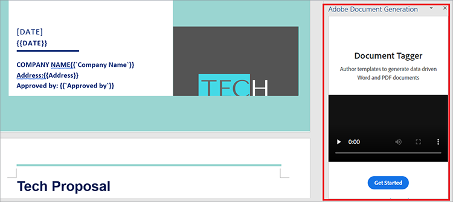

# 판매 제안 및 계약 관리


영업 제안은 고객 인수를 위한 비즈니스 여정의 첫 번째 단계입니다. 모든 것이 그렇듯, 첫인상은 계속된다. 따라서 고객과의 첫 번째 상호 작용은 비즈니스에 대한 기대치를 설정합니다. 당신의 제안은 간결하고 정확하며 편리해야 합니다.

계약서와 제안서는 문서 구조 내에 서로 다른 유형의 데이터를 포함하고 있다. 동적 데이터(클라이언트 이름, 견적 금액 등)와 정적 데이터(확정 기능, 팀 프로필 및 표준 SOW 약관과 같은 비대화형 텍스트)가 모두 포함됩니다. 영업 제안과 같은 템플릿 문서를 작성할 때는 대개 비대화형 템플릿의 프로젝트 세부 정보를 수동으로 바꾸는 것과 같은 단조로운 작업이 수반됩니다. 이 튜토리얼에서는 동적 데이터와 워크플로우를 사용하여 [영업 제안을 작성](https://developer.adobe.com/document-services/use-cases/agreements-and-contracts/sales-proposals-and-contracts)하기 위한 효율적인 프로세스를 만듭니다.

## 학습 내용

이 실습용 튜토리얼에서는 [!DNL Adobe Acrobat Services]개의 API가 가장 중요한 여러 도구를 사용하여 동적 데이터 및 작업 과정을 구현하는 방법에 대해 알아봅니다. 이러한 API는 귀하와 귀하의 비즈니스에 보다 편리한 판매 제안과 계약을 제공하기 위해 사용됩니다. 이 튜토리얼에서는 PDF 문서를 자동으로 만들고 병합하고 표시하는 방법을 보여 주는 실습 기술을 소개합니다. 이러한 작업을 수동으로 수행하는 것은 시간이 많이 소요되고 지루한 작업입니다. [!DNL Acrobat Services] API를 사용하면 이러한 작업에 소요되는 시간을 단축할 수 있습니다.

## 관련 API 및 리소스

* [Microsoft Word](https://www.office.com/)

* [Node.js](https://nodejs.org/en/)

* [npm](https://www.npmjs.com/get-npm)

* [[!DNL Acrobat Services] API](https://developer.adobe.com/document-services/homepage/)

* [Adobe 문서 생성 API](https://developer.adobe.com/document-services/apis/doc-generation)

* [Adobe Sign API](https://developer.adobe.com/adobesign-api/)

* [Adobe 문서 생성 Tagger](https://opensource.adobe.com/pdftools-sdk-docs/docgen/latest/wordaddin.html#add-in-demo)

## 문제 해결

이제 도구가 설치되었으므로 문제 해결을 시작할 수 있습니다. 제안서에는 각 클라이언트에 고유한 정적 콘텐츠와 동적 콘텐츠가 모두 있습니다. 제안할 때마다 두 가지 유형의 데이터가 모두 필요하기 때문에 병목 현상이 발생합니다. 정적 텍스트를 입력하는 데 시간이 많이 소요되므로 이를 자동화하고 각 클라이언트의 동적 데이터만 수동으로 처리합니다.

먼저 [Microsoft Forms](https://www.office.com/launch/forms?auth=1)&#x200B;(또는 선호하는 양식 작성기)에서 데이터 캡처 양식을 만듭니다. 이 양식은 영업 제안에 추가된 클라이언트의 동적 데이터를 위한 것입니다. 이 양식을 질문으로 채워 회사 이름, 날짜, 주소, 프로젝트 범위, 가격 및 추가 설명과 같이 고객에게 필요한 세부 정보를 가져옵니다. 자신의 양식을 작성하려면 이 [form]&#x200B;(https://forms.office.com/Pages/ShareFormPage.aspx id=DQSIkWdsW0yxEjazjBLZtrQAAAAAAAAAAAAAAN__rtiGj5UNElTR0pCQ09ZNkJRUlowSjVQWDNYUEg2RC4u&amp;sharetoken=1AJeMavBAzzxuISRKmUy)을 사용하십시오. 목표는 잠재적 클라이언트가 양식을 작성한 다음 응답을 JSON 파일로 내보내어 워크플로우의 다음 부분으로 전달되는 것입니다.

일부 양식 작성자는 데이터를 CSV 파일로만 내보낼 수 있도록 합니다. 따라서 생성된 CSV 파일을 JSON 파일로 [변환](http://csvjson.com/csv2json)하는 것이 유용할 수 있습니다.

정적 데이터는 모든 영업 제안서에서 재사용됩니다. 따라서 Microsoft Word의 판매 제안 템플릿을 사용하여 정적 텍스트를 제공할 수 있습니다. 이 [템플릿](https://1drv.ms/w/s!AiqaN2pp7giKkmhVu2_2pId9MiPa?e=oeqoQ2)을 사용할 수 있지만 직접 만들거나 [Adobe 템플릿](https://developer.adobe.com/document-services/apis/doc-generation)을 사용할 수 있습니다.

이제 클라이언트에 대한 고유한 판매 제안을 만들려면 JSON 형식의 클라이언트의 동적 데이터와 Microsoft Word 템플릿의 정적 텍스트를 모두 사용하는 것이 필요합니다. [!DNL Acrobat Services] API는 두 API를 병합하고 서명할 수 있는 PDF을 생성하는 데 사용됩니다.

이 작업을 수행하려면 태그를 사용합니다. 태그는 숫자, 단어, 배열 또는 복잡한 오브젝트를 나타낼 수 있는 사용하기 쉬운 문자열입니다. 태그는 동적 데이터의 자리 표시자 역할을 하며, 이 경우 양식에 입력된 클라이언트 데이터입니다. 템플릿에 태그를 삽입하면 JSON 파일의 양식 필드를 Word 템플릿으로 매핑할 수 있습니다.

## 태그 사용

판매 제안 템플릿을 열고 **삽입** 탭을 선택합니다. **추가 기능** 그룹에서 **추가 기능 가져오기**&#x200B;를 선택합니다. 그런 다음 **Adobe 문서 생성 추가 기능**&#x200B;을 선택하여 추가합니다. 추가하면 **Adobe** 그룹의 **홈** 탭에 문서 생성 Tagger가 표시됩니다.

**Adobe** 그룹의 **홈** 탭에서 **문서 생성**&#x200B;을 선택하여 문서 태그를 시작합니다. 창 오른쪽의 패널에 유용한 데모 비디오가 나타납니다.

Word에서 Document Tagger 추가 기능의 

**시작하기**&#x200B;를 선택합니다. 그러면 샘플 데이터를 입력하라는 메시지가 표시됩니다. 아래와 같이 양식 응답 JSON 파일을 붙여넣거나 업로드합니다.


**태그 생성**&#x200B;을 선택하여 붙여넣거나 업로드한 JSON 파일에서 필드 목록을 가져옵니다. 태그는 아래 오른쪽 사이드바에 표시됩니다.


태그를 생성한 후 문서에 삽입할 수 있습니다. 커서 위치에서 문서에 태그가 추가됩니다. 위와 같이 **프로젝트 범위** 자막 바로 아래에 **프로젝트 범위** 태그를 추가해야 합니다. 이렇게 하면 클라이언트가 양식에서 프로젝트의 범위를 입력하면 해당 응답이 **프로젝트 범위** 부제 아래로 내려가 방금 추가한 태그를 대체합니다. 태그 추가가 완료되면 문서의 일부가 아래 화면 캡처와 같이 표시됩니다.

Word 문서에 태그를 추가하는 

## API 사용

[!DNL Acrobat Services] API [홈페이지](https://developer.adobe.com/document-services/apis/doc-generation)&#x200B;(으)로 이동합니다. [!DNL Acrobat Services] API를 사용하려면 응용 프로그램에 대한 자격 증명이 필요합니다. 아래로 스크롤하고 **무료 체험판 시작**&#x200B;을 선택하여 자격 증명을 만듭니다. 이러한 서비스는 6개월 동안 [무료로 사용한 다음 문서 트랜잭션당 $0.05만 지불하면 ](https://developer.adobe.com/document-services/pricing/main) 바로 사용할 수 있으므로 필요한 만큼만 지불하면 됩니다.

**PDF 서비스 API**&#x200B;를 선택한 서비스로 선택하고 아래와 같이 다른 세부 정보를 입력합니다.


자격 증명을 만들면 코드 샘플이 표시됩니다. 원하는 언어를 선택합니다(이 튜토리얼에서는 Node.js 사용). API 자격 증명은 zip 파일에 있습니다. 파일을 PDFToolsSDK-Node.jsSamples로 추출합니다.

시작하려면 auto-doc\*\*라는 빈 폴더를 만듭니다.\*\* 폴더에서 다음 명령을 실행하여 Node.js 프로젝트를 초기화합니다. `npm init`. 프로젝트 이름을 &quot;auto-doc&quot;*.*(으)로 지정

폴더에서 ./PDFToolsSDK-Node.jsSamples/adobe-dc-pdf-tools-sdk-node-samples, pdftools-api-credentials.json 파일이 있습니다. and private.key를 auto-doc 폴더로 이동합니다. 여기에는 API 자격 증명이 포함됩니다. 또한 auto-doc 폴더에 &quot;resources&quot;라는 하위 폴더를 만듭니다. 판매 제안을 생성할 때마다 클라이언트로부터 받은 JSON 형식의 데이터를 보관합니다. 동일한 폴더에 Microsoft Word의 판매 제안 템플릿을 저장합니다.

이제 마법을 만들 준비가 되었습니다! 이 자습서에서 Node.js를 사용하고 있으므로 Node.js [!DNL Acrobat Services] SDK를 설치해야 합니다. 이렇게 하려면 auto-doc 폴더에서 yarn add @adobe/documentservices-pdftools-node-sdk를 실행합니다.

이제 merge.js라는 파일을 만들고 여기에 다음 코드를 붙여 넣습니다.

```
javascript
const PDFToolsSdk = require('@adobe/documentservices-pdftools-node-sdk'),
fs = require('fs');
try {
// Initial setup, create credentials instance.
const credentials = PDFToolsSdk.Credentials
.serviceAccountCredentialsBuilder()
.fromFile("pdftools-api-credentials.json")
.build();
// Setup input data for the document merge process
const jsonString = fs.readFileSync('resources/Proposal.json'),
jsonDataForMerge = JSON.parse(jsonString);
// Create an ExecutionContext using credentials
const executionContext = PDFToolsSdk.ExecutionContext.create(credentials);
// Create a new DocumentMerge options instance
const documentMerge = PDFToolsSdk.DocumentMerge,
documentMergeOptions = documentMerge.options,
options = new documentMergeOptions.DocumentMergeOptions(jsonDataForMerge, documentMergeOptions.OutputFormat.PDF);
// Create a new operation instance using the options instance
const documentMergeOperation = documentMerge.Operation.createNew(options)
// Set operation input document template from a source file.
const input = PDFToolsSdk.FileRef.createFromLocalFile('resources/Proposal.docx');
documentMergeOperation.setInput(input);
// Execute the operation and Save the result to the specified location.
documentMergeOperation.execute(executionContext)
.then(result => result.saveAsFile('output/Proposal.pdf'))
.catch(err => {
if (err instanceof PDFToolsSdk.Error.ServiceApiError
|| err instanceof PDFToolsSdk.Error.ServiceUsageError) {
console.log('Exception encountered while executing operation', err);
} else {
console.log('Exception encountered while executing operation', err);
}
});
} catch (err) {
console.log('Exception encountered while executing operation', err);
}
```

이 코드는 [!DNL Acrobat Services]을(를) 사용하여 만든 태그를 사용하여 Microsoft 양식에서 JSON 파일을 가져옵니다. 그런 다음 Microsoft Word에서 만든 영업 제안 템플릿에 데이터를 병합하여 새로운 PDF을 생성합니다. PDF은 새로 생성된 파일에 저장됩니다./output 폴더입니다.

또한 이 코드는 [Adobe Sign API](https://developer.adobe.com/adobesign-api/)를 사용하여 두 회사가 생성된 판매 제안에 서명하도록 합니다. 이 API에 대한 자세한 설명은 이 블로그 게시물 을 참조하십시오.

## 다음 단계

자동화가 필요한 비효율적이고 지루한 프로세스를 시작했습니다. 모든 클라이언트에 대한 문서를 수동으로 만드는 것부터 [판매 제안 프로세스](https://developer.adobe.com/document-services/use-cases/agreements-and-contracts/sales-proposals-and-contracts)를 자동화하고 단순화하는 능률적인 워크플로를 만드는 것으로 바뀌었습니다.

Microsoft Forms을 사용하면 클라이언트에서 고유한 제안에 사용할 중요한 데이터를 얻을 수 있습니다. Microsoft Word에서 영업 제안 템플릿을 만들어 매번 다시 만들지 않을 정적 텍스트를 제공했습니다. 그런 다음 [!DNL Acrobat Services]개의 API를 사용하여 양식과 템플릿의 데이터를 병합하고 더 효율적인 방식으로 고객을 위한 판매 제안 PDF을 만들었습니다.

이 실습형 튜토리얼에서는 이러한 API로 가능한 것을 간단히 훑어볼 뿐입니다. 더 많은 솔루션을 찾으려면 [[!DNL Adobe Acrobat Services]](https://www.adobe.io/apis/documentcloud/dcsdk/gettingstarted.html) API 페이지를 방문하세요. 이 도구들은 모두 6개월 동안 무료로 사용할 수 있습니다. 그런 다음 [종량제](https://developer.adobe.com/document-services/pricing/main) 플랜에서 문서 트랜잭션당 $0.05만 지불하면 팀이 판매 파이프라인에 더 많은 잠재 고객을 추가하는 경우에만 지불합니다.
