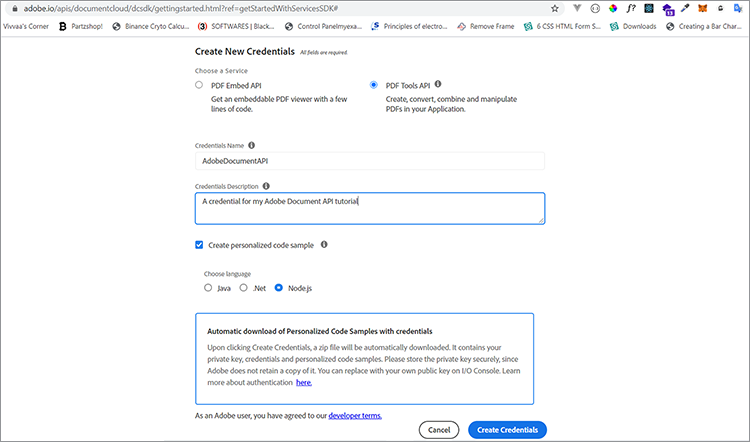

# 검색 및 색인 지정


조직은 종종 하드 카피 문서와 스캔한 파일을 디지털화해야 합니다. 이 [시나리오](https://docs.google.com/document/d/11jZdVQAw-3fyE3Y-sIqFFTlZ4m02LsCC/edit)를 고려하세요. 한 법률 회사는 디지털 파일을 만들기 위해 스캔한 수천 건의 법률 계약을 보유하고 있습니다. 그들은 그 법적 계약들 중 어떤 것이 특정한 조항을 가지고 있는지 또는 그들이 수정해야 하는 보완을 가지고 있는지 결정하기를 원합니다. 규정 준수를 위해서는 정확성이 필요합니다. 해결책은 디지털 문서의 인벤토리를 가져와 텍스트를 검색할 수 있게 만들고 색인을 만들어 이 정보를 찾는 것입니다.

편집 또는 다운스트림 작업을 위해 정보를 검색하기 위한 디지털 아카이브를 만드는 것은 대부분의 기업에게 악몽과 같습니다.

## 학습 내용

이 실습형 튜토리얼에서는 [!DNL Adobe Acrobat Services] API의 기능을 살펴보고 문서를 보관하고 디지털화하는 데 쉽게 사용할 수 있는 방법에 대해 알아봅니다. Express NodeJS 애플리케이션을 빌드한 다음 보관, 디지털화 및 문서 변형을 위해 [!DNL Acrobat Services] API를 통합하여 이러한 기능을 살펴봅니다.

팔로우하려면 [Node.js](https://nodejs.org/)이(가) 설치되어 있어야 하며 Node.js 및 [ES6 구문](https://www.w3schools.com/js/js_es6.asp)에 대한 기본적인 이해가 필요합니다.

## 관련 API 및 리소스

* [PDF 서비스 API](https://opensource.adobe.com/pdftools-sdk-docs/release/latest/index.html)

* [프로젝트 코드](https://github.com/agavitalis/AdobeDocumentServicesAPIs.git)

## 프로젝트 설정

먼저 애플리케이션의 폴더 구조를 설정합니다. 소스 코드 [여기](https://github.com/agavitalis/AdobeDocumentAPI.git)를 검색할 수 있습니다.

## 디렉토리 구조

AdobeDocumentServicesAPI라는 폴더를 만들고 원하는 편집기에서 엽니다. 이 폴더 구조를 사용하여 `npm init` 명령으로 기본 NodeJS 응용 프로그램을 만듭니다.

```
AdobeDocumentServicesAPIs
config
default.json
controllers
createPDFController.js
makeOCRController.js
searchController.js
models
document.js
output
.gitkeep
routes
web.js
services
upload.js
views
index.hbs
ocr.hbs
search.hbs
index.js
```

MongoDB를 이 응용 프로그램의 데이터베이스로 사용하고 있습니다. 따라서 구성하려면 기본 데이터베이스 구성을 config/ 폴더에 배치하고 아래의 코드 스니펫을 이 폴더의 default.json 파일에 붙여넣은 다음 데이터베이스의 URL을 추가하십시오.

```
### config/default.json and config/dev.json
{ "DBHost": "YOUR_DB_URI" }
```

## 패키지 설치

이제 아래 코드 조각과 같이 npm install 명령을 사용하여 일부 패키지를 설치합니다.

```
{
    "name": "adobedocumentservicesapis",
    "version": "1.0.0",
    "description": "",
    "main": "index.js",
    "directories": {
    "test": "test"
    },
    "dependencies": {
    "body-parser": "^1.19.0",
    "config": "^3.3.6",
    "express": "^4.17.1",
    "hbs": "^4.1.1",
    "mongoose": "^5.12.1",
    "morgan": "^1.10.0",
    "multer": "^1.4.2",
    "path": "^0.12.7"
    },
    "devDependencies": {},
    "scripts": {
    "start": "set NODE_ENV=dev && node index.js"
    },
    "repository": {
    "type": "git",
    "url": "git+https://github.com/agavitalis/AdobeDocumentServicesAPIs.git"
    },
    "author": "Ogbonna Vitalis",
    "license": "ISC",
    "bugs": {
    "url": "https://github.com/agavitalis/AdobeDocumentServicesAPIs/issues"
    },
    "homepage": "https://github.com/agavitalis/AdobeDocumentServicesAPIs#readme"
}
```

```
###bash
npm install express mongoose config body-parser morgan multer hbs path pdf-parse
Ensure that the content of your package.json file is similar to this code snippet:
###package.json
{
```

이러한 코드 조각은 보기에 대한 핸들 템플릿 엔진을 포함하여 응용 프로그램 종속성을 설치합니다. scripts 태그에서 응용 프로그램의 런타임 매개 변수를 구성합니다.

## [!DNL Acrobat Services] API 통합 중

[!DNL Acrobat Services]에는 세 개의 API가 포함되어 있습니다.

* Adobe PDF Services API

* Adobe PDF 포함 API

* Adobe 문서 생성 API

이러한 API는 클라우드 기반 웹 서비스 세트를 통해 PDF 콘텐츠의 생성, 조작 및 변형을 자동화합니다.

자격 증명을 얻으려면 [등록](https://www.adobe.com/go/dcsdks_credentials?ref=getStartedWithServicesSDK)하고 워크플로를 완료해야 합니다. PDF Embed API는 무료로 사용할 수 있습니다. PDF 서비스 API 및 문서 생성 API는 6개월간 무료입니다. 체험 기간이 종료되면 문서 트랜잭션당 단 $0.05의 비용으로 [종량제](https://www.adobe.io/apis/documentcloud/dcsdk/pdf-pricing.html)를 사용할 수 있습니다. 회사가 성장하고 더 많은 계약을 처리할 때만 비용을 지불합니다.



가입을 완료하면 API 자격 증명이 포함된 코드 샘플이 PC에 다운로드됩니다. 이 코드 샘플을 추출하고 private.key 및 pdftools-api-credentials.json 파일을 응용 프로그램의 루트 디렉터리에 배치합니다.

이제 응용 프로그램의 루트 디렉터리에서 터미널을 사용하여 ` npm install --save @adobe/documentservices-pdftools-node-sdk ` 명령을 실행하여 [PDF 서비스 Node.js SDK](https://www.npmjs.com/package/@adobe/documentservices-pdftools-node-sdk)을(를) 설치합니다.

## PDF 만들기

[!DNL Acrobat Services]은(는) Microsoft Office 문서(Word, Excel, PowerPoint)와 .txt, .rtf, .bmp, .jpg, .gif, .tiff, .png와 같은 [지원되는 파일 형식](https://opensource.adobe.com/pdftools-sdk-docs/release/latest/howtos.html#create-a-pdf)에서 PDF 만들기를 지원합니다.

지원되는 파일 형식에서 PDF 문서를 만들려면 이 양식을 사용하여 문서를 업로드합니다. [GitHub](https://github.com/agavitalis/AdobeDocumentServicesAPIs.git)에서 양식의 HTML 및 CSS 파일에 액세스할 수 있습니다.


이제 controllers/createPDFController.js 파일에 다음 코드 조각을 추가합니다. 이 코드는 문서를 검색하고 이를 PDF으로 변환합니다.

원본 파일과 변형된 파일은 응용 프로그램 내의 폴더에 저장됩니다.

```
const PDFToolsSdk = require('@adobe/documentservices-pdftools-node-sdk');
/*
* GET / route to show the createPDF form.
*/
function createPDF(req, res) {
//catch any response on the url
let response = req.query.response
res.render('index', { response })
}
/*
* POST /createPDF to create a new PDF File.
*/
function createPDFPost(req, res) {
let filePath = req.file.path;
let fileName = req.file.filename;
try {
// Initial setup, create credentials instance.
const credentials = PDFToolsSdk.Credentials
.serviceAccountCredentialsBuilder()
.fromFile("pdftools-api-credentials.json")
.build();
// Create an ExecutionContext using credentials and create a new operation
instance.
const executionContext = PDFToolsSdk.ExecutionContext.create(credentials),
createPdfOperation = PDFToolsSdk.CreatePDF.Operation.createNew();
// Set operation input from a source file.
const input = PDFToolsSdk.FileRef.createFromLocalFile(filePath);
createPdfOperation.setInput(input);
// Execute the operation and Save the result to the specified location.
createPdfOperation.execute(executionContext)
.then((result) => {
result.saveAsFile('output/createPDFFromDOCX.pdf')
//download the file
res.redirect('/?response=PDF Successfully created')
})
.catch(err => {
if (err instanceof PDFToolsSdk.Error.ServiceApiError
|| err instanceof PDFToolsSdk.Error.ServiceUsageError) {
console.log('Exception encountered while executing operation',
err);
} else {
console.log('Exception encountered while executing operation',
err);
}
});
} catch (err) {
console.log('Exception encountered while executing operation', err);
}
}
//export all the functions
module.exports = { createPDF, createPDFPost };
```

이 코드 조각에는 [PDF 서비스 Node.js SDK](https://www.npmjs.com/package/@adobe/documentservices-pdftools-node-sdk)가 필요합니다. 다음 기능을 사용합니다.

* createPDF - 문서 업로드 양식 표시

* createPDFPost - 업로드된 문서를 PDF으로 변환합니다.

변형된 PDF 문서는 출력 디렉토리에 저장되고 원본 파일은 업로드 디렉토리에 저장됩니다.

## 텍스트 인식 사용

광학 문자 인식(OCR)은 이미지 및 스캔한 문서를 검색 가능한 파일로 변환합니다. [!DNL Acrobat Services]개의 API, 이미지 및 스캔한 문서를 검색 가능한 PDF으로 변환할 수 있습니다. OCR 작업을 수행하면 파일을 편집할 수 있고 검색할 수 있게 됩니다. 인덱싱 및 기타 용도로 파일 내용을 데이터 저장소에 저장할 수 있습니다.

스캔 문서의 검색 및 색인은 파일 관리 및 정보 처리가 필수적인 많은 조직에서 매우 중요합니다. OCR 기능은 이러한 문제를 제거합니다.

이 기능을 구현하려면 위의 것과 유사한 업로드 양식을 디자인해야 합니다. 이번에는 PDF 문서에서만 OCR 기능을 사용할 수 있으므로 양식을 파일 PDF으로 제한합니다.

다음은 이 예제의 업로드 양식입니다.


이제 업로드된 PDF을 조작하고 일부 OCR 작업을 수행하려면 아래의 코드 스니펫을 controllers/makeOCRController.js 파일에 추가하십시오. 이 코드는 업로드된 파일에 OCR 프로세스를 구현한 다음 해당 파일을 응용 프로그램의 파일 시스템에 저장합니다.

```
const fs = require('fs')
const pdf = require('pdf-parse');
const mongoose = require('mongoose');
const Document = require('../models/document');
const PDFToolsSdk = require('@adobe/documentservices-pdftools-node-sdk');
/*
* GET /makeOCR route to show the makeOCR form.
*/
function makeOCR(req, res) {
//catch any response on the url
let response = req.query.response
res.render('ocr', { response })
}
/*
* POST /makeOCRPost to create a new PDF File.
*/
function makeOCRPost(req, res) {
let filePath = req.file.path;
let fileName = req.file.filename;
try {
// Initial setup, create credentials instance.
const credentials = PDFToolsSdk.Credentials
.serviceAccountCredentialsBuilder()
.fromFile("pdftools-api-credentials.json")
.build();
// Create an ExecutionContext using credentials and create a new operation
instance.
const executionContext = PDFToolsSdk.ExecutionContext.create(credentials),
ocrOperation = PDFToolsSdk.OCR.Operation.createNew();
// Set operation input from a source file.
const input = PDFToolsSdk.FileRef.createFromLocalFile(filePath);
ocrOperation.setInput(input);
// Execute the operation and Save the result to the specified location.
ocrOperation.execute(executionContext)
.then(async (result) => {
let newFileName = `createPDFFromDOCX-${Math.random() * 171}.pdf`;
await result.saveAsFile(`output/${newFileName}`);
let documentContent = fs.readFileSync(
require("path").resolve("./") + `\\output\\${newFileName}`
);
pdf(documentContent)
.then(function (data) {
//Creates a new document
var newDocument = new Document({
documentName: fileName,
documentDescription: description,
documentContent: data.text,
url: require("path").resolve("./") + `\\output\\${newFileName}`
});
//Save it into the DB.
newDocument.save((err, docs) => {
if (err) {
res.send(err);
} else {
//If no errors, send it back to the client
res.redirect(
"/makeOCR?response=OCR Operation Successfully performed on
the PDF File"
);
}
});
})
.catch(function (error) {
// handle exceptions
console.log(error);
});
})
.catch(err => {
if (err instanceof PDFToolsSdk.Error.ServiceApiError
|| err instanceof PDFToolsSdk.Error.ServiceUsageError) {
console.log('Exception encountered while executing operation',
err);
} else {
console.log('Exception encountered while executing operation',
err);
}
});
} catch (err) {
console.log('Exception encountered while executing operation', err);
}
}
//export all the functions
module.exports = { makeOCR, makeOCRPost };
```

[!DNL Acrobat Services] 노드 SDK, mongoose, pdf-parse 및 fs 모듈과 문서 모델 스키마가 필요합니다. 이러한 모듈은 변환된 파일의 내용을 MongoDB 데이터베이스에 저장하는 데 필요합니다.

이제 두 가지 함수, 즉 업로드된 양식을 표시하는 makeOCR과 업로드된 문서를 처리하는 makeOCRost를 만듭니다. 원본 양식을 데이터베이스에 저장한 다음 변환된 양식을 응용 프로그램의 출력 폴더에 저장합니다.

pdftools-api-credentials.json 파일의 Adobe 제공 자격 증명은 파일을 변형하기 전에 각 경우에 로드됩니다.

>[!NOTE]
>
>OCR 기능은 PDF 문서만 지원합니다.

또한 아래의 코드 조각을 응용 프로그램의 Modes/Document.js 파일에 추가합니다.

코드 조각에서 몽구스 모델을 정의한 다음 데이터베이스에 저장할 문서 속성을 설명합니다. 또한 documentContent 필드를 색인화하여 텍스트를 쉽고 효율적으로 검색할 수 있습니다.

```
const mongoose = require("mongoose");
const Schema = mongoose.Schema;
//Document schema definition
var DocumentSchema = new Schema(
{
documentName: { type: String, required: false },
documentDescription: { type: String, required: false },
documentContent: { type: String, required: false },
url: { type: String, required: false },
status: {
type: String,
enum : ["active","inactive"],
default: "active"
}
},
{ timestamps: true }
);
//for text search
DocumentSchema.index({
documentContent: "text",
});
//Exports the DocumentSchema for use elsewhere.
module.exports = mongoose.model("document", DocumentSchema);
```

## 텍스트 검색

이제 간단한 검색 기능을 구현하여 사용자가 몇 가지 간단한 텍스트 검색을 수행할 수 있습니다. 또한 다운로드 기능을 추가하여 PDF 파일 다운로드를 활성화할 수 있습니다.

이 기능을 사용하려면 검색 결과를 표시할 수 있는 간단한 양식과 카드가 필요합니다. [GitHub](https://github.com/agavitalis/AdobeDocumentServicesAPIs.git)에서 양식과 카드의 디자인을 찾을 수 있습니다.

아래 스크린샷은 검색 기능 및 검색 결과를 보여줍니다. 모든 검색 결과를 다운로드할 수 있습니다.


검색 기능을 구현하려면 응용 프로그램의 controller 폴더 내에 searchController.js 파일을 만들고 아래의 코드 조각을 붙여넣습니다.

```
const fs = require('fs')
const mongoose = require('mongoose');
const Document = require('../models/document');
/*
* GET / route to show the search form.
*/
function search(req, res) {
//catch any response on the url
let response = req.query.response
res.render('search', { response })
}
/*
* POST /searchPost to search the contents of your saved file.
*/
function searchPost(req, res) {
let searchString = req.body.searchString;
Document.aggregate([
{ $match: { $text: { $search: searchString } } },
{ $sort: { score: { $meta: "textScore" } } },
])
.then(function (documents) {
res.render('search', { documents })
})
.catch(function (error) {
let response = error
res.render('search', { response })
});
}
//export all the functions
module.exports = { search, searchPost, downloadPDF };
```

이제 다운로드 기능을 구현하여 사용자의 검색에서 반환된 문서를 다운로드할 수 있습니다.

## 문서 다운로드 중

다운로드 기능 구현은 이미 수행한 것과 유사합니다. controllers/earchController.js 파일에서 searchPost 함수 다음에 다음 코드 조각을 추가합니다.

```
/*
* POST /downloadPDF To Download PDF Documents.
*/
async function downloadPDF(req, res) {
console.log("here")
let documentId = req.params.documentId
let document = await Document.findOne({_id:documentId});
res.download(download.link);
}
```

## 다음 단계

이 실습 튜토리얼에서는 [!DNL Acrobat Services]개의 API를 Node.js 애플리케이션에 통합하고 API를 사용하여 파일을 PDF으로 변환하는 문서 변환을 구현했습니다. 사진과 스캔한 파일을 검색 가능하게 만드는 OCR 기능을 추가했습니다. 그런 다음 파일을 다운로드할 수 있도록 폴더에 저장했습니다.

다음으로 검색 기능을 추가하여 OCR로 텍스트로 변환된 문서를 검색했습니다. 마지막으로 이러한 파일을 쉽게 다운로드할 수 있도록 다운로드 기능을 구현했습니다. 완료된 애플리케이션을 사용하면 법률 회사에서 특정 텍스트를 쉽게 찾아서 처리할 수 있습니다.

문서 변형에 [!DNL Acrobat Services]을(를) 사용하는 것은 다른 서비스에 비해 견고하고 사용하기 쉽기 때문에 적극 권장됩니다. 신속하게 계정을 만들어 문서 변환 및 관리를 위한 [!DNL Acrobat Services] API의 기능을 사용할 수 있습니다.

[!DNL Acrobat Services] API를 사용하는 방법을 잘 이해하셨으므로 연습으로 기술을 향상할 수 있습니다. 이 자습서에 사용된 리포지토리를 복제하고 방금 배운 몇 가지 기술을 시험해 볼 수 있습니다. 더 나은 방법은 [!DNL Acrobat Services] API의 무제한 가능성을 탐색하면서 이 응용 프로그램을 다시 빌드하는 것입니다.

내 앱에서 문서 공유 및 검토를 활성화할 준비가 되셨습니까? [[!DNL Adobe Acrobat Services]](https://www.adobe.io/apis/documentcloud/dcsdk/gettingstarted.html)에 등록
개발자 계정. 6개월 무료 체험 기간 및 비즈니스가 성장함에 따라 문서 트랜잭션당 \$0.05만 지불하면 [종량제](https://www.adobe.io/apis/documentcloud/dcsdk/pdf-pricing.html)를 받을 수 있습니다.
